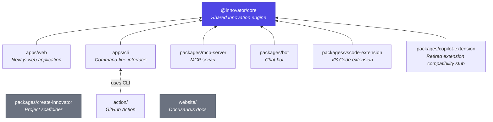
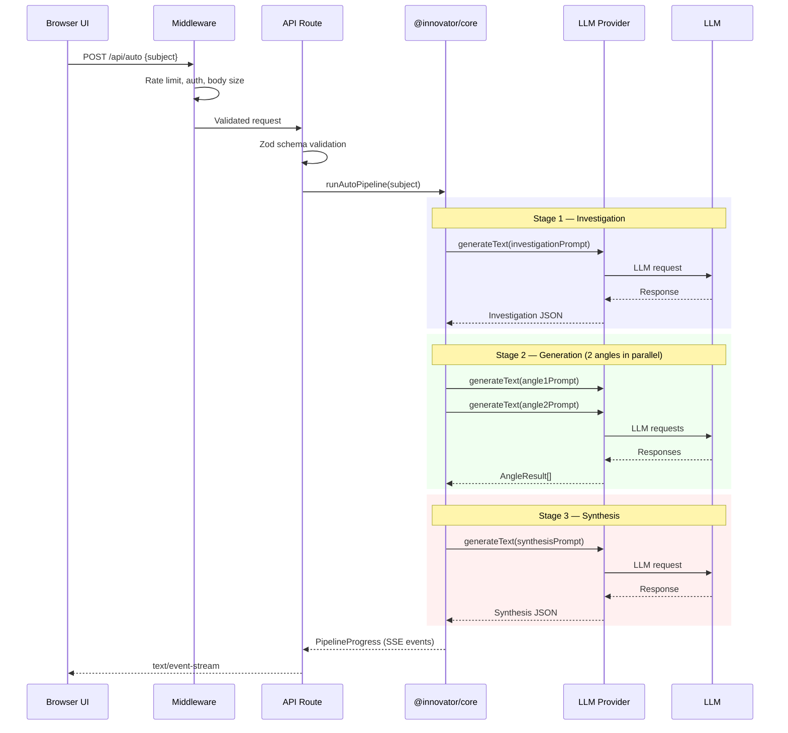
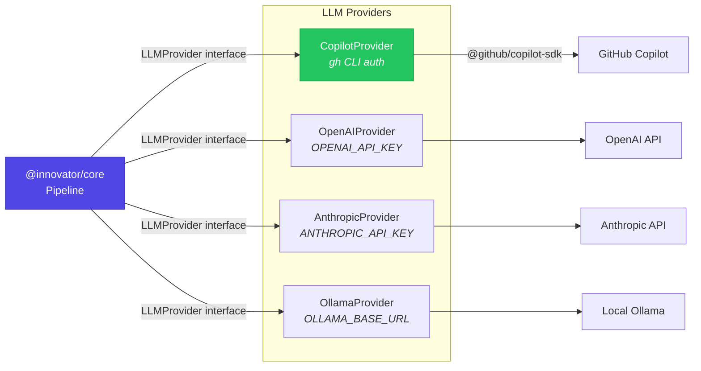
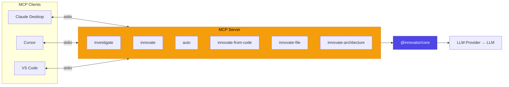
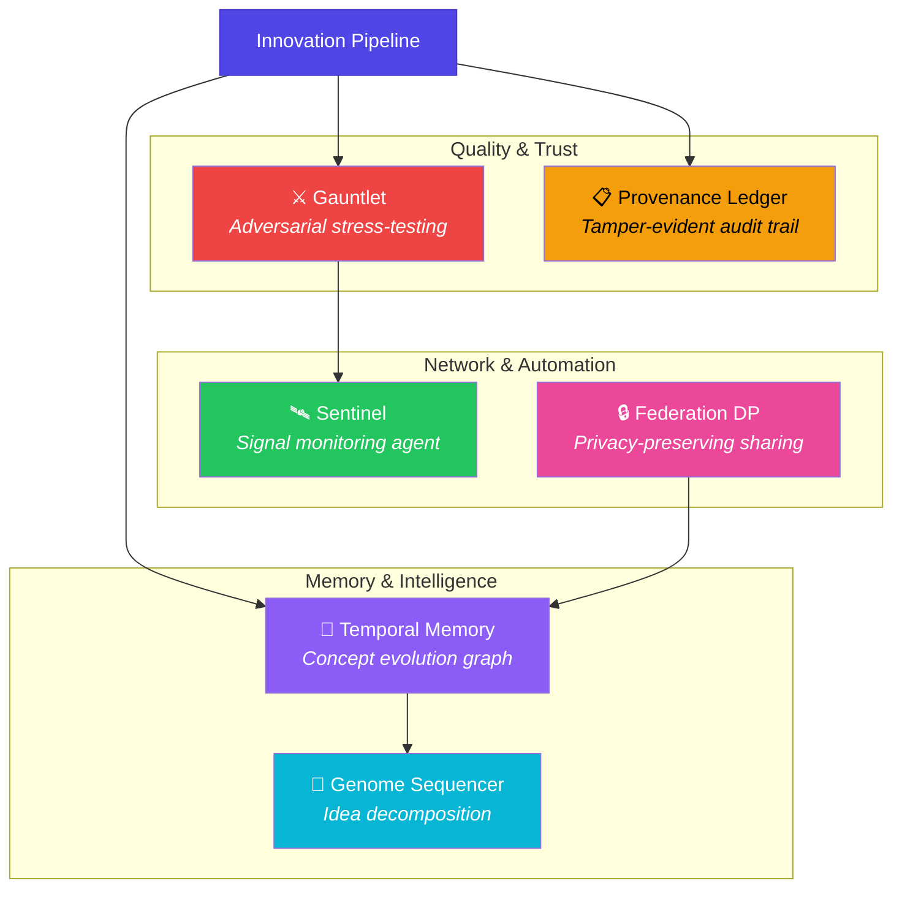
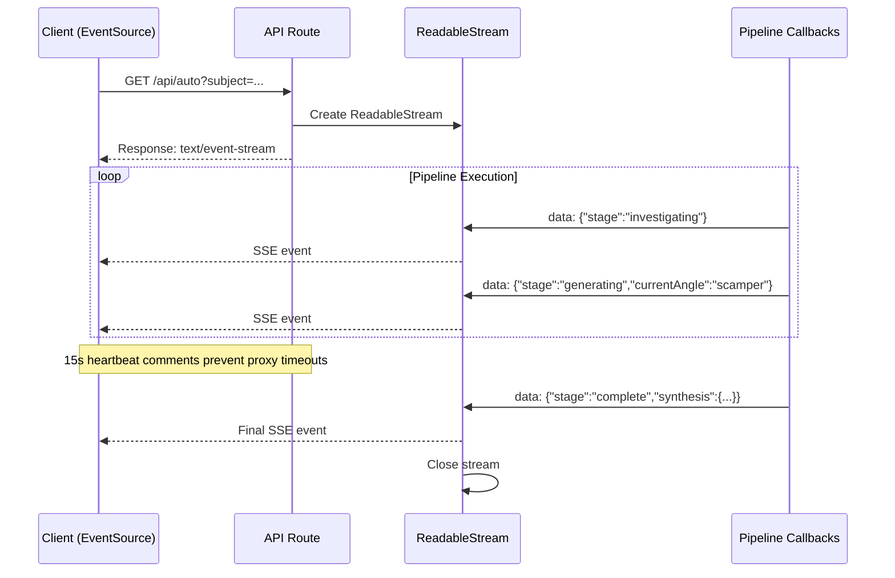
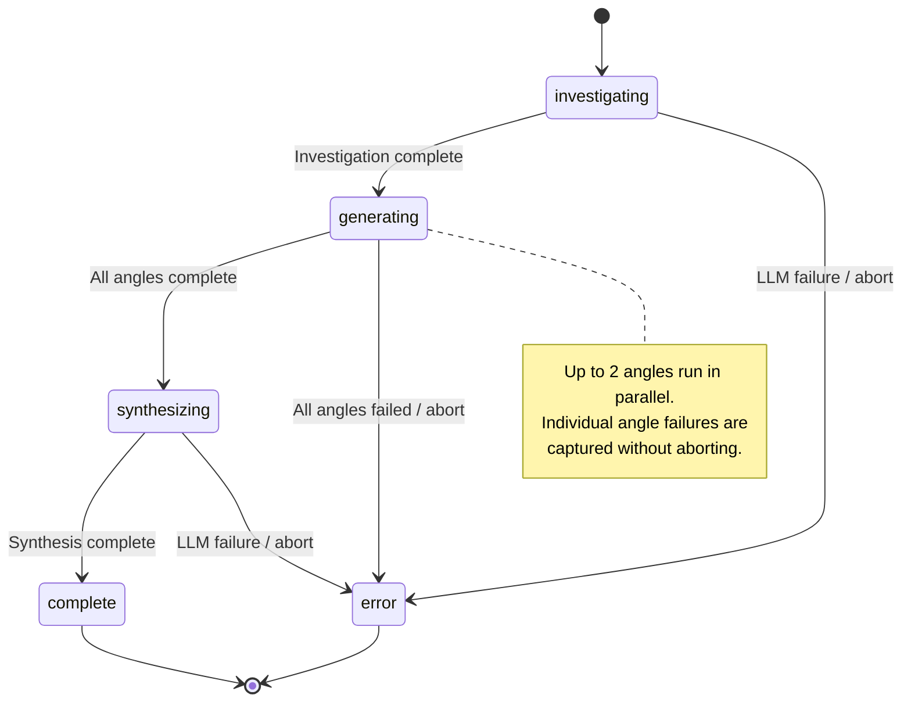
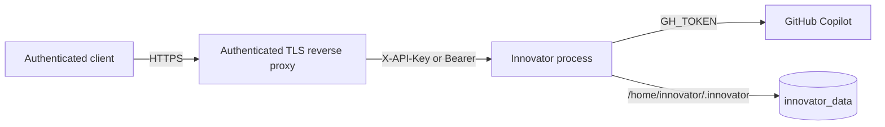

# Architecture

Innovator is a monorepo with eight workspaces and a documentation site.

## Workspace Dependency Graph



`@innovator/core` is the shared engine: types, prompt templates, LLM provider abstraction, and the innovation pipeline. All consumers (`web`, `cli`, `mcp-server`, `bot`) depend on it — none contain business logic directly.

## Request Flow (Development Web UI)

The browser flow below is development-only. Production clients call the allowlisted API routes directly through the TLS reverse proxy.



1. **UI** (`apps/web/src/app/page.tsx`) — collects subject, drives stage transitions
2. **API routes** (`apps/web/src/app/api/`) — validate input with Zod, delegate to core
3. **Core pipeline** (`packages/core/src/`) — investigation, angle generation, synthesis
4. **LLM Provider** — routes requests through the configured provider (see below)

## LLM Provider Abstraction

Innovator supports multiple LLM providers through a unified `LLMProvider` interface (`packages/core/src/providers/`). Each provider implements `generateText()`, `generateStream()`, and `listModels()`.



| Provider      | Env Variable                                            | Default                  | Notes                                        |
| ------------- | ------------------------------------------------------- | ------------------------ | -------------------------------------------- |
| **Copilot**   | `GH_TOKEN` in production; `gh` during local development | —                        | Required provider for the production profile |
| **OpenAI**    | `OPENAI_API_KEY`                                        | —                        | Development/experimental direct access       |
| **Anthropic** | `ANTHROPIC_API_KEY`                                     | —                        | Development/experimental direct access       |
| **Ollama**    | `OLLAMA_BASE_URL`                                       | `http://localhost:11434` | Development/experimental local inference     |

The Copilot provider is required for the first production profile and receives an explicit `GH_TOKEN`. Interactive development can instead use `gh auth login`; alternative providers remain development/experimental.

## MCP Server

The MCP (Model Context Protocol) server (`packages/mcp-server/`) exposes Innovator as tools for AI clients.



**Architecture:**

- `src/index.ts` — Process entry point
- `src/server.ts` — Tool/resource registration and stdio transport
- `src/handlers.ts` — Tool implementations, validation, and filesystem boundary checks
- `src/schemas.ts` — Zod validation schemas for tool inputs

The legacy `--sse` flag fails closed. Filesystem tools are limited to `MCP_ALLOWED_ROOT` (the current working directory by default), and `innovate-from-code.maxFiles` is capped at `1000`.

## Key Directories

| Path                                   | Purpose                                                       |
| -------------------------------------- | ------------------------------------------------------------- |
| `packages/core/src/prompts/`           | Prompt templates for each innovation angle                    |
| `packages/core/src/innovation/`        | Pipeline orchestration (investigate → generate → synthesize)  |
| `packages/core/src/copilot/`           | Copilot SDK client wrapper                                    |
| `packages/core/src/providers/`         | LLM provider abstraction (Copilot, OpenAI, Anthropic, Ollama) |
| `packages/core/src/artifacts/`         | Structured artifact generation (PRD, tech spec, user story)   |
| `packages/core/src/collaboration/`     | Collaborative sessions with voting and commenting             |
| `packages/core/src/research/`          | Deep research agent for extended investigations               |
| `packages/core/src/debate/`            | Structured multi-perspective debate engine                    |
| `packages/core/src/evolution/`         | Genetic-algorithm idea evolution                              |
| `packages/core/src/rag/`               | RAG knowledge grounding module                                |
| `packages/core/src/analytics/`         | Innovation analytics and insights                             |
| `packages/core/src/pipeline-builder/`  | Natural language pipeline builder                             |
| `packages/core/src/knowledge-graph/`   | Persistent concept knowledge graph                            |
| `packages/core/src/events/`            | Event bus and webhook delivery system                         |
| `packages/core/src/cost/`              | LLM cost tracking and budget management                       |
| `packages/core/src/storage/`           | Pluggable storage abstraction (memory, SQLite backends)       |
| `packages/core/src/validation/`        | Input validation and sanitization utilities                   |
| `packages/core/src/models/`            | Model allowlist and configuration                             |
| `packages/core/src/chaining/`          | Multi-step prompt chaining                                    |
| `packages/core/src/embeddings/`        | Vector embedding generation and similarity                    |
| `packages/core/src/orchestration/`     | High-level workflow orchestration                             |
| `packages/core/src/rbac/`              | Role-based access control                                     |
| `packages/core/src/plugins/`           | Plugin system for extensibility                               |
| `packages/core/src/presets/`           | Pipeline presets and templates                                |
| `packages/core/src/gauntlet/`          | Adversarial idea stress-testing (Survivability Index)         |
| `packages/core/src/provenance-ledger/` | Tamper-evident hash-chained audit trail                       |
| `packages/core/src/temporal-memory/`   | Temporal knowledge graph for innovation memory                |
| `packages/core/src/sentinel/`          | Always-on signal monitoring and opportunity generation        |
| `packages/core/src/genome-sequencer/`  | Idea decomposition, similarity search, and recombination      |
| `packages/core/src/federation-dp/`     | Differential privacy for federated pattern sharing            |

#### Analysis & Intelligence

| Path                                  | Purpose                              |
| ------------------------------------- | ------------------------------------ |
| `packages/core/src/scoring/`          | Idea scoring and ranking             |
| `packages/core/src/benchmark/`        | Multi-model performance comparison   |
| `packages/core/src/hypothesis/`       | Hypothesis-driven innovation framing |
| `packages/core/src/redteam/`          | Adversarial perspective analysis     |
| `packages/core/src/competitive/`      | Competitive landscape analysis       |
| `packages/core/src/impact-simulator/` | Potential impact simulation          |
| `packages/core/src/quality-gate/`     | Automated LLM output quality checks  |
| `packages/core/src/swarm/`            | Multi-agent blackboard-pattern swarm |

#### Data & Knowledge

| Path                               | Purpose                                       |
| ---------------------------------- | --------------------------------------------- |
| `packages/core/src/memory/`        | Cross-session persistent memory               |
| `packages/core/src/serendipity/`   | Cross-session unexpected connection discovery |
| `packages/core/src/diff/`          | Investigation snapshot comparison             |
| `packages/core/src/hybrid-search/` | Combined TF-IDF and graph-based search        |
| `packages/core/src/ontology/`      | Domain ontology management                    |
| `packages/core/src/enrichment/`    | External data enrichment                      |

#### Output & Integration

| Path                                   | Purpose                                         |
| -------------------------------------- | ----------------------------------------------- |
| `packages/core/src/export/`            | Markdown, JSON, GitHub Issue, PowerPoint export |
| `packages/core/src/playbook/`          | Reusable innovation playbook creation           |
| `packages/core/src/audience/`          | Audience-adaptive output transformation         |
| `packages/core/src/i18n/`              | Multi-language support                          |
| `packages/core/src/nl-innovation-api/` | Natural language innovation API                 |
| `packages/core/src/notifications/`     | Notification delivery system                    |
| `packages/core/src/integrations/`      | Third-party service integrations                |

#### Infrastructure & Platform

| Path                                       | Purpose                                    |
| ------------------------------------------ | ------------------------------------------ |
| `packages/core/src/history/`               | Session history persistence                |
| `packages/core/src/metering/`              | API usage metering                         |
| `packages/core/src/observatory/`           | Prompt call monitoring and debugging       |
| `packages/core/src/telemetry/`             | Anonymous usage telemetry                  |
| `packages/core/src/scheduler/`             | Scheduled task execution                   |
| `packages/core/src/api-gateway/`           | API key management and rate limiting       |
| `packages/core/src/workspace-persistence/` | Experimental PostgreSQL design scaffolding |

#### Consumer Packages

| Path                          | Purpose                                                            |
| ----------------------------- | ------------------------------------------------------------------ |
| `packages/mcp-server/src/`    | MCP server exposing tools through stdio transport                  |
| `packages/bot/`               | Chat platform bot (Slack, Discord, Teams)                          |
| `packages/vscode-extension/`  | VS Code extension for in-editor innovation                         |
| `packages/copilot-extension/` | Compatibility stub for retired GitHub App-based Copilot Extensions |
| `packages/create-innovator/`  | Project scaffolder (`npx create-innovator`)                        |
| `packages/sdk/`               | Framework-agnostic SDK client                                      |
| `apps/web/src/components/`    | React UI components                                                |
| `apps/web/src/app/api/`       | Next.js API route handlers                                         |
| `apps/cli/src/`               | Commander.js CLI entry point                                       |

> **Note:** `packages/core/src/` contains 217 module directories. The tables above cover the most commonly referenced ones, organized by category. For the complete module index with descriptions and usage examples, see the [Feature Module Catalog](website/docs/guides/feature-catalog.md).

## Moonshot Modules

Six advanced modules extend the core innovation pipeline with intelligence, memory, and quality assurance capabilities:



| Module                | Purpose                                                                     | Key Functions                                                   | ADR                                                              |
| --------------------- | --------------------------------------------------------------------------- | --------------------------------------------------------------- | ---------------------------------------------------------------- |
| **Gauntlet**          | 5 adversary personas attack ideas, producing a 0–100 Survivability Index    | `runGauntlet()`, `computeSurvivabilityIndex()`                  | [ADR-0016](docs/adr/ADR-0016-llm-as-judge-evaluation.md)         |
| **Provenance Ledger** | SHA-256 hash-chained append-only log of AI actions and human decisions      | `appendEntry()`, `verifyLedger()`, `exportForActor()`           | [ADR-0017](docs/adr/ADR-0017-append-only-hash-chained-ledger.md) |
| **Temporal Memory**   | Persistent graph tracking concept evolution, recurrence, and causality      | `ingestSession()`, `queryTemporalMemory()`, `computeVelocity()` | [ADR-0019](docs/adr/ADR-0019-temporal-knowledge-graph.md)        |
| **Sentinel**          | Monitors RSS/Atom feeds, filters by relevance, generates daily briefs       | `runSentinel()`, `briefToMarkdown()`                            | —                                                                |
| **Genome Sequencer**  | Decomposes ideas into 7 traits, enables similarity search and recombination | `sequenceIdea()`, `findSimilar()`, `recombine()`                | —                                                                |
| **Federation DP**     | Laplace-mechanism ε-differential privacy for cross-org pattern sharing      | `extractAnonymizedPatterns()`, `generateRecommendations()`      | [ADR-0018](docs/adr/ADR-0018-differential-privacy-federation.md) |

## Concurrency Model

The innovation pipeline uses semaphore-based bounded concurrency via `runWithConcurrency()` in `packages/core/src/innovation/pipeline.ts`:

- **`MAX_CONCURRENCY = 2`** — At most 2 LLM calls run in parallel during angle generation
- A promise pool tracks active tasks; `Promise.race()` waits for a free slot when the pool is full
- Individual angle failures are captured without aborting the entire pipeline
- `AbortSignal` propagation allows early cancellation from API routes

This design balances throughput against LLM provider rate limits. Investigation and synthesis stages run as single sequential calls.

## SSE Streaming Architecture

Long-running endpoints (`/api/auto`, `/api/pipeline`) use Server-Sent Events (SSE) for real-time progress:



- API routes create a `ReadableStream` and return it as a `text/event-stream` response
- Pipeline progress callbacks emit `data: {...}\n\n` events as JSON
- A 15-second heartbeat comment prevents proxy/CDN timeout disconnections
- Events follow the stage progression: `investigating` → `generating` → `synthesizing` → `complete`
- The `currentAngle` field identifies which angle is actively generating

SSE was chosen over WebSockets (see ADR-0007) for unidirectional updates and browser streaming support. This protocol choice does not imply serverless deployment support; the first production profile is single-process and single-replica.

## Pipeline State Machine

The auto-mode pipeline progresses through these states:



## Request Validation

API routes use a two-layer validation strategy:

1. **Proxy layer** (`apps/web/src/proxy.ts`) — Production route allowlisting, API authentication, rate limiting, CSP headers, and early `Content-Length` rejection when present
2. **Route-level Zod schemas** — Each API route defines a Zod schema for its request body

```typescript
// Typical pattern in route handlers
const RequestSchema = z.object({
  subject: z.string().min(1).max(5000),
  model: z.string().optional(),
  angles: z.array(z.string()).max(20).optional(),
});

const parsed = RequestSchema.safeParse(body);
if (!parsed.success) {
  return NextResponse.json({ error: "Invalid request" }, { status: 400 });
}
```

Core types (`Investigation`, `AngleResult`, `Synthesis`) also have Zod schemas for validating LLM output at runtime, ensuring structured data even when the model produces unexpected formats.

## Provider Abstraction Internals

Each LLM provider implements the `LLMProvider` interface:

```typescript
interface LLMProvider {
  readonly id: string;
  readonly name: string;
  generateText(options: LLMGenerateOptions): Promise<string>;
  generateStream(options: LLMGenerateOptions, onChunk: (chunk: string) => void): Promise<string>;
  listModels(): Promise<LLMModelInfo[]>;
}
```

**Provider selection** is automatic based on environment variables — if `OPENAI_API_KEY` is set, the OpenAI provider activates; if no keys are set, the Copilot provider is used via `gh` CLI authentication. The `validateModel()` utility checks requested models against the provider's allowlist plus any `INNOVATOR_EXTRA_MODELS`.

**Built-in providers:**

- **CopilotProvider** — Wraps `@github/copilot-sdk`, uses `getCopilotClient()` singleton with graceful shutdown
- **OpenAIProvider** — Direct OpenAI API via `openai` SDK
- **AnthropicProvider** — Direct Anthropic API via `@anthropic-ai/sdk`
- **OllamaProvider** — Local inference via Ollama REST API

## PostgreSQL Adapter Design (Not Implemented)

The repository contains storage abstractions and migration definitions for a possible PostgreSQL adapter, but that adapter is **not implemented for the first production release**. Docker Compose does not run PostgreSQL or pgAdmin, and `DATABASE_URL` is not part of the supported production contract.

The schema below is retained as an experimental design reference, not deployment guidance.

### Schema Overview

Migrations are defined in `packages/core/src/storage/drivers/index.ts` (`CORE_MIGRATIONS` array) and `packages/core/src/workspace-persistence/index.ts` (`PROJECT_MIGRATIONS` array). They are applied automatically by `PostgreSQLDriver.runMigrations()`. Applied migrations are tracked in the `_innovator_migrations` system table.

| Migration                            | Tables Created                                                                  | Purpose                                             |
| ------------------------------------ | ------------------------------------------------------------------------------- | --------------------------------------------------- |
| 1 — `create-core-tables`             | `sessions`, `workspaces`, `analytics_events`, `knowledge_graph`                 | Core innovation sessions and workspace data         |
| 2 — `create-api-gateway-tables`      | `api_keys`, `usage_records`, `webhooks`                                         | API authentication, rate limiting, webhook delivery |
| 3 — `create-collaboration-tables`    | `collaborative_sessions`                                                        | Real-time multi-user brainstorming                  |
| 4 — `create-decision-journal-tables` | `decisions`                                                                     | Decision journaling for idea triage                 |
| 5 — `create-tournament-tables`       | `tournaments`                                                                   | Idea tournament brackets                            |
| 6 — `create-schedule-tables`         | `schedules`, `schedule_runs`                                                    | Scheduled task execution and logs                   |
| 100 — `create-innovation-projects`   | `innovation_projects`, `project_sessions`, `project_snapshots`, `team_contexts` | Multi-session project management and team context   |

### Entity Relationship Diagram

```mermaid
erDiagram
    %% ── Core tables (Migration 1) ──
    sessions {
        TEXT id PK
        TEXT subject
        TEXT model
        TEXT angles
        TEXT investigation
        TEXT results
        TEXT synthesis
        TEXT scores
        TEXT tags
        TEXT notes
        TEXT created_at
        TEXT updated_at
    }

    workspaces {
        TEXT id PK
        TEXT name
        TEXT description
        TEXT members
        TEXT presets
        TEXT angles
        TEXT sessions
        TEXT created_at
        TEXT updated_at
    }

    analytics_events {
        TEXT id PK
        TEXT type
        TEXT data
        TEXT timestamp
    }

    knowledge_graph {
        TEXT id PK
        TEXT data
        TEXT updated_at
    }

    %% ── API Gateway tables (Migration 2) ──
    api_keys {
        TEXT id PK
        TEXT name
        TEXT key_value UK
        TEXT tier
        INTEGER rate_limit
        INTEGER enabled
        TEXT created_at
        TEXT updated_at
    }

    usage_records {
        TEXT id PK
        TEXT key_id FK
        TEXT endpoint
        INTEGER tokens
        REAL cost_usd
        TEXT timestamp
    }

    webhooks {
        TEXT key_id PK_FK
        TEXT url PK
    }

    api_keys ||--o{ usage_records : "tracks usage"
    api_keys ||--o{ webhooks : "delivers to"

    %% ── Collaboration (Migration 3) ──
    collaborative_sessions {
        TEXT id PK
        TEXT room_code UK
        TEXT host
        TEXT data
        TEXT created_at
        TEXT updated_at
    }

    %% ── Decision Journal (Migration 4) ──
    decisions {
        TEXT id PK
        TEXT idea_title
        TEXT idea_id
        TEXT angle_id
        TEXT session_id
        TEXT subject
        TEXT status
        TEXT rationale
        TEXT history
        TEXT tags
        TEXT revisit_reminders
        TEXT outcome
        TEXT decided_by
        TEXT created_at
        TEXT updated_at
    }

    sessions ||--o{ decisions : "records decisions"

    %% ── Tournaments (Migration 5) ──
    tournaments {
        TEXT id PK
        TEXT name
        TEXT description
        TEXT format
        TEXT state
        TEXT participants
        TEXT matches
        INTEGER current_round
        INTEGER total_rounds
        TEXT winner_id
        TEXT created_at
        TEXT updated_at
    }

    %% ── Schedules (Migration 6) ──
    schedules {
        TEXT id PK
        TEXT name
        TEXT description
        TEXT cron_expression
        TEXT timezone
        TEXT action
        TEXT status
        TEXT delivery
        INTEGER max_runs
        INTEGER run_count
        TEXT last_run_at
        TEXT next_run_at
        TEXT created_at
        TEXT updated_at
    }

    schedule_runs {
        TEXT id PK
        TEXT schedule_id FK
        TEXT started_at
        TEXT completed_at
        TEXT status
        TEXT result_summary
        TEXT error
        INTEGER duration_ms
    }

    schedules ||--o{ schedule_runs : "produces"

    %% ── Innovation Projects (Migration 100) ──
    innovation_projects {
        TEXT id PK
        TEXT name
        TEXT description
        TEXT owner_id
        TEXT team_members
        TEXT status
        TEXT settings
        TEXT created_at
        TEXT updated_at
    }

    project_sessions {
        TEXT id PK
        TEXT project_id FK
        TEXT subject
        TEXT investigation
        TEXT angle_results
        TEXT synthesis
        TEXT scores
        TEXT notes
        TEXT created_at
    }

    project_snapshots {
        TEXT id PK
        TEXT project_id FK
        TEXT timestamp
        INTEGER session_count
        TEXT top_ideas
        TEXT summary
    }

    team_contexts {
        TEXT project_id PK_FK
        TEXT shared_insights
        TEXT pinned_ideas
        TEXT tags
        TEXT custom_angles
    }

    innovation_projects ||--o{ project_sessions : "contains"
    innovation_projects ||--o{ project_snapshots : "snapshots"
    innovation_projects ||--|| team_contexts : "has context"
```

### Local Development Setup

There is no supported PostgreSQL startup, migration, connection, or backup procedure. The production service persists filesystem state in `/home/innovator/.innovator` through the `innovator_data` Docker volume. Implementing and validating a PostgreSQL adapter would require a separate architecture decision and production-readiness review.

## Full Documentation

See the [Docusaurus docs site](https://github.com/josedab/innovator/blob/main/website/docs/architecture.md) for detailed architecture documentation.

## Production Deployment

The first production release is a headless, single-process, single-tenant API deployed as one Docker Compose replica.



Required runtime configuration:

| Variable                       | Requirement                                              |
| ------------------------------ | -------------------------------------------------------- |
| `NODE_ENV`                     | `production`                                             |
| `INNOVATOR_DEPLOYMENT_PROFILE` | `single-tenant`                                          |
| `INNOVATOR_API_KEYS`           | Unique comma-separated keys, each at least 32 characters |
| `GH_TOKEN`                     | Required for the production Copilot provider             |

Legacy `INNOVATOR_API_KEY` must not be combined with `INNOVATOR_API_KEYS`.

Docker Compose binds `127.0.0.1:3000`, mounts `innovator_data`, keeps the remaining filesystem read-only, rotates logs, and uses a two-minute shutdown grace period. An authenticated TLS reverse proxy must be the only external entry point; never expose port 3000 directly.

Use `/healthz` for liveness, `/readyz` for configuration and writable-state readiness, and authenticated `/api/health` for detailed diagnostics.

Rate limiting and state coordination are process-local, so production is single-replica only. Vercel/serverless and horizontal scaling are unsupported. Back up and restore the complete `innovator_data` volume.

See the [Deployment guide](website/docs/guides/deployment.md) for the production route allowlist and operating procedures.

## Architecture Decision Records

Key design decisions are recorded as ADRs in [`docs/adr/`](./docs/adr/). See the [ADR index](./docs/adr/README.md) for the full list.
