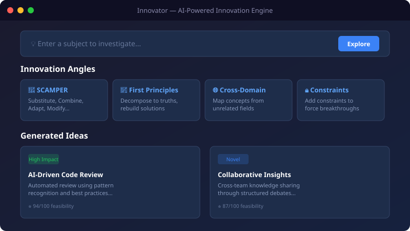

# 💡 Innovator — AI-Powered Innovation Engine

[](https://github.com/josedab/innovator/actions/workflows/ci.yml)
[](LICENSE)
[](https://github.com/josedab/innovator/actions/workflows/ci.yml)
[](https://www.npmjs.com/package/create-innovator)

Explore any subject from multiple innovation angles using AI. Built with Next.js, the GitHub Copilot SDK, and TypeScript.

## Quick Install

```bash
# Scaffold a new project
npx create-innovator my-project

# Or use the CLI directly
npx innovator auto 'solar energy'
```

## Demo

<p align="center">
  
</p>

> 📸 _Run `npm run dev` and open http://localhost:3000 to try the investigate → angle select → results flow._

## Features

- **Subject Investigation** — AI analyzes your subject to identify key aspects, challenges, and opportunities
- **8 Innovation Angles** — Choose from SCAMPER, First Principles, Cross-Domain Analogy, Constraint Injection, Problem Inversion, Role-Based Perspectives, What-If Scenarios, and Trend Collision
- **Auto Mode** — Runs all angles automatically and synthesizes a strategic recommendation
- **Web App** — Beautiful UI with investigation → angle selection → results flow
- **CLI Tool** — Full-featured command-line interface with progress indicators
- **Copilot SDK** — Powered by your GitHub Copilot subscription (no separate API keys needed)

## Prerequisites

- Node.js 20+
- GitHub Copilot subscription
- GitHub CLI authenticated (`gh auth login`)

## Quick Start

> **💻 Using GitHub Codespaces or VS Code Dev Containers?** Open the repo in a dev container — Node.js 20, GitHub CLI, and extensions are pre-configured. See [Dev Container / Codespaces](#dev-container--codespaces).

```bash
# Use the correct Node.js version (see .nvmrc)
nvm use  # or fnm use

# Install dependencies
npm install

# Verify prerequisites (Node 20+, gh CLI, Copilot auth)
npm run doctor

# Start the web app (automatically builds core first)
npm run dev

# Open http://localhost:3000 (customize with PORT=3001)
```

> **Prefer `make`?** Run `make help` to see all available targets.

## CLI Usage

```bash
# List available angles
npx tsx apps/cli/src/index.ts angles

# Investigate a subject
npx tsx apps/cli/src/index.ts investigate "code review processes"

# Generate innovations for specific angles
npx tsx apps/cli/src/index.ts innovate "code review processes" --angles scamper,first-principles

# Run full auto pipeline (all angles + synthesis)
npx tsx apps/cli/src/index.ts auto "code review processes"

# Use a specific model
npx tsx apps/cli/src/index.ts auto "home automation" --model gpt-5

# Or via the root script shortcut:
npm run cli -- investigate "code review processes"
```

## Innovation Angles

| Angle                          | Description                                                              |
| ------------------------------ | ------------------------------------------------------------------------ |
| 🔄 **SCAMPER**                 | Substitute, Combine, Adapt, Modify, Put to other use, Eliminate, Reverse |
| 🧱 **First Principles**        | Decompose to fundamental truths, then rebuild novel solutions            |
| 🌐 **Cross-Domain Analogy**    | Map concepts from unrelated fields to spark unexpected ideas             |
| 🔒 **Constraint Injection**    | Add provocative constraints to force creative breakthroughs              |
| 🔃 **Problem Inversion**       | Flip the problem upside down, then reverse the insights                  |
| 👥 **Role-Based Perspectives** | View through different stakeholder lenses                                |
| 💭 **What-If Scenarios**       | Explore provocative hypotheticals to push boundaries                     |
| ⚡ **Trend Collision**         | Combine with emerging technology and social trends                       |

## Project Structure

```
innovator/
├── apps/
│   ├── web/          # Next.js web application
│   └── cli/          # Command-line interface
├── packages/
│   ├── core/         # Shared innovation engine
│   │   ├── copilot/  # GitHub Copilot SDK client wrapper
│   │   ├── innovation/ # Investigation, generation, pipeline
│   │   └── prompts/  # Prompt templates for each angle
│   ├── bot/          # Chat bot integration
│   ├── create-innovator/ # Project scaffolder (npx create-innovator)
│   └── mcp-server/   # MCP server for AI tool integration
└── package.json      # Workspace root
```

## MCP Server

The MCP (Model Context Protocol) server in `packages/mcp-server/` exposes Innovator's capabilities as tools callable by any MCP-compatible AI client — Claude Desktop, Cursor, Windsurf, VS Code, and others.

```bash
# stdio transport (default)
npx @innovator/mcp-server

# SSE transport (port 3100 by default, configurable via MCP_PORT)
npx @innovator/mcp-server --sse
```

Available tools: `investigate`, `innovate`, and `auto`. See the [MCP Server README](packages/mcp-server/README.md) for client configuration examples.

## Examples

Runnable example scripts live in the [`examples/`](examples/) directory. Each script demonstrates a specific workflow:

```bash
npx tsx examples/basic-usage.ts
```

See the [Feature Module Catalog](website/docs/guides/feature-catalog.md) for a comprehensive list of all available modules.

## How It Works

1. **Investigate** — The AI analyzes your subject, identifying key aspects, state of the art, challenges, and opportunities
2. **Select Angles** — Choose which innovation frameworks to apply (or use Auto Mode for all)
3. **Generate** — Each angle applies a unique creative framework to generate specific, actionable ideas
4. **Synthesize** (Auto Mode) — Cross-references all ideas, identifies themes, ranks by feasibility, and provides a strategic recommendation

## Configuration

Copy `.env.local.example` to `.env.local` to customize:

```bash
# Default model (optional, defaults to gpt-4.1)
INNOVATOR_DEFAULT_MODEL=gpt-4.1
```

Supported models include `gpt-4.1`, `gpt-5`, `claude-sonnet-4.5`, and others available through your Copilot subscription.

### Environment Variables

| Variable                   | Description                                                         | Default                  | Required |
| -------------------------- | ------------------------------------------------------------------- | ------------------------ | -------- |
| `INNOVATOR_DEFAULT_MODEL`  | LLM model used when none is specified at runtime                    | `gpt-4.1`                | No       |
| `INNOVATOR_API_KEY`        | API key to protect web routes (`X-API-Key` header)                  | _unset_                  | No       |
| `INNOVATOR_API_KEYS`       | Comma-separated API keys for multi-key auth (`X-API-Key`/Bearer)    | _unset_                  | No       |
| `INNOVATOR_LLM_TIMEOUT_MS` | Timeout for LLM requests in milliseconds                            | `90000`                  | No       |
| `INNOVATOR_EXTRA_MODELS`   | Comma-separated list of additional model IDs                        | _unset_                  | No       |
| `INNOVATOR_EMBED_ORIGINS`  | Comma-separated CORS origins for `/api/embed` widget endpoint       | `*`                      | No       |
| `OPENAI_API_KEY`           | OpenAI API key for direct OpenAI provider (non-Copilot usage)       | _unset_                  | No       |
| `ANTHROPIC_API_KEY`        | Anthropic API key for direct Anthropic provider (non-Copilot usage) | _unset_                  | No       |
| `OLLAMA_BASE_URL`          | Base URL for local Ollama instance                                  | `http://localhost:11434` | No       |
| `PORT`                     | Dev server port                                                     | `3000`                   | No       |

## Dev Container / Codespaces

This repository includes a [dev container](.devcontainer/devcontainer.json) configuration for **GitHub Codespaces** and **VS Code Dev Containers**. It provides:

- **Node.js 20** runtime
- **GitHub CLI** pre-installed
- **ESLint & Prettier** VS Code extensions with format-on-save enabled
- **Port 3000** forwarded automatically

To get started, click **"Code → Codespaces → New codespace"** on GitHub, or open the repo in VS Code and select **"Reopen in Container"**. Dependencies install automatically via the `postCreateCommand`.

## Troubleshooting

| Issue                                | Solution                                                                                                                                                                 |
| ------------------------------------ | ------------------------------------------------------------------------------------------------------------------------------------------------------------------------ |
| **`gh auth` / Copilot token errors** | Run `gh auth login` and ensure your GitHub account has an active Copilot subscription. In CI, set the `GH_TOKEN` env var.                                                |
| **Model not available**              | Check model availability with your provider. Use `INNOVATOR_EXTRA_MODELS` to allowlist custom model IDs, or switch providers via `OPENAI_API_KEY` / `ANTHROPIC_API_KEY`. |
| **Port 3000 already in use**         | Set `PORT=3001` in `.env.local` or kill the existing process on port 3000.                                                                                               |
| **Build failures after upgrade**     | Run `npm run clean:all && rm -rf node_modules && npm install && npm run build` for a clean rebuild.                                                                      |
| **LLM request timeouts**             | Increase `INNOVATOR_LLM_TIMEOUT_MS` (default: 90000). Complex subjects or slower models may need 120000+.                                                                |

For the full troubleshooting guide, see the [documentation site](https://josedab.github.io/innovator/docs/guides/troubleshooting).

## Contributing

Contributions are welcome! See [CONTRIBUTING.md](CONTRIBUTING.md) for setup instructions, coding standards, and PR guidelines.

## Community

Have a question or idea? Join the conversation on [GitHub Discussions](https://github.com/josedab/innovator/discussions):

- **💡 [Ideas](https://github.com/josedab/innovator/discussions/categories/ideas)** — Propose new features, angles, or improvements
- **❓ [Q&A](https://github.com/josedab/innovator/discussions/categories/q-a)** — Ask questions about setup, usage, or troubleshooting

## Security

To report a vulnerability, please follow the instructions in [SECURITY.md](.github/SECURITY.md). **Do not open a public issue for security vulnerabilities.** We aim to acknowledge reports within 48 hours.

## Tech Stack

- **Next.js 16** — Full-stack React framework
- **@github/copilot-sdk** — AI via GitHub Copilot subscription
- **TypeScript** — End-to-end type safety
- **Tailwind CSS** — Utility-first styling
- **Zod** — Runtime validation of AI outputs
- **Commander.js** — CLI framework

## Architecture Decision Records

Significant architectural decisions are documented as ADRs in [`docs/adr/`](docs/adr/). See the [ADR index](docs/adr/README.md) for a summary of all decisions.
