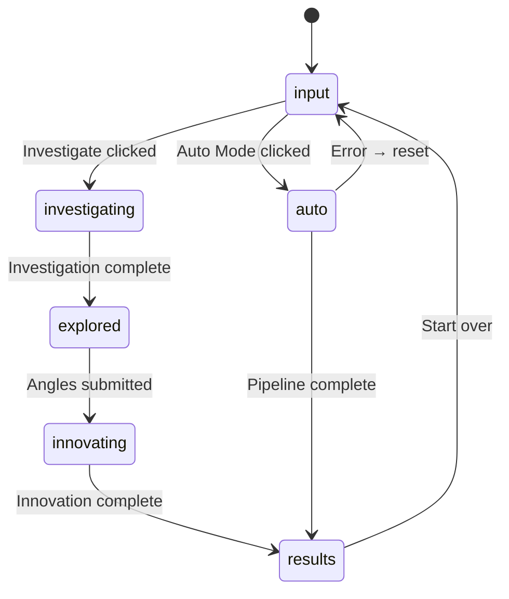

# Innovator Web App

The Next.js 16 web frontend for the Innovator AI-Powered Innovation Engine.

## App Flow

The main page (`page.tsx`) manages a state machine that controls which component renders:



### Component by Stage

| Stage           | Component                             | Description                                    |
| --------------- | ------------------------------------- | ---------------------------------------------- |
| `input`         | `SubjectInput`                        | Text input + Investigate/Auto Mode buttons     |
| `investigating` | _(loading state)_                     | Waiting for `/api/investigate` response        |
| `explored`      | `InvestigationView` + `AngleSelector` | Shows investigation, user picks angles         |
| `innovating`    | _(loading state)_                     | Waiting for `/api/innovate` response           |
| `results`       | `InnovationResults`                   | Angle results + optional synthesis display     |
| `auto`          | `AutoModePanel`                       | SSE-powered progress UI for full auto pipeline |

## API Routes

The web app exposes 161 API route files. Below is the complete reference organized by category.

### Core Innovation Pipeline

| Route                       | Method            | Description                                                              |
| --------------------------- | ----------------- | ------------------------------------------------------------------------ |
| `/api/investigate`          | POST              | Subject investigation — analyze landscape, challenges, and opportunities |
| `/api/innovate`             | POST              | Single-angle idea generation for a given subject and angle               |
| `/api/auto`                 | POST              | Full auto-mode pipeline with SSE progress streaming                      |
| `/api/pipeline`             | POST              | Natural language pipeline with SSE progress streaming                    |
| `/api/pipeline-dag`         | POST              | DAG-based pipeline workflow definition and execution                     |
| `/api/nl-innovate`          | POST              | Natural language innovation — free-form text to structured pipeline      |
| `/api/nl`                   | POST              | Natural language command processing for innovation workflows             |
| `/api/compare`              | POST              | Multi-subject parallel investigation and comparison                      |
| `/api/refine`               | POST              | Iterative idea refinement with LLM feedback                              |
| `/api/refinement-loop`      | POST              | Multi-step refinement loop for progressive idea improvement              |
| `/api/recommend-angles`     | POST, PUT         | AI-powered angle recommendation based on subject analysis                |
| `/api/angles`               | GET, POST, DELETE | CRUD operations for innovation angles including custom angles            |
| `/api/presets`              | GET               | List available innovation presets (pre-configured angle combinations)    |
| `/api/validate`             | POST              | Input validation endpoint for subjects and models                        |
| `/api/swarm`                | POST              | Swarm intelligence — parallel multi-agent idea generation                |
| `/api/combinatorial`        | POST              | Combinatorial synthesis — cross-angle idea combinations                  |
| `/api/intersection`         | POST              | Intersection analysis across domain overlaps                             |
| `/api/autonomous-agent`     | POST              | Autonomous AI agent for self-directed innovation exploration             |
| `/api/adaptive`             | GET, POST         | Adaptive innovation pipeline with dynamic angle selection                |
| `/api/adaptive-methodology` | POST              | Adaptive methodology selection based on project characteristics          |
| `/api/adaptive-scaling`     | POST              | Adaptive complexity scaling with execution plan generation               |

### Moonshot Modules

| Route                           | Method    | Description                                                              |
| ------------------------------- | --------- | ------------------------------------------------------------------------ |
| `/api/gauntlet`                 | POST      | Adversarial Idea Gauntlet — stress-test ideas against adversary personas |
| `/api/genome-sequencer`         | GET, POST | Idea Genome Sequencer — decompose ideas into traits and recombine        |
| `/api/genome`                   | GET, POST | Innovation genome — DNA-like trait mapping for ideas                     |
| `/api/sentinel`                 | GET, POST | Sentinel — always-on signal monitoring agent with daily briefs           |
| `/api/temporal-memory`          | GET, POST | Temporal Innovation Memory — ingest sessions, query knowledge graph      |
| `/api/provenance`               | GET, POST | Innovation Provenance Ledger — query, verify, and export audit trail     |
| `/api/provenance-visualization` | POST      | Data provenance visualization for innovation lineage                     |
| `/api/federation-dp`            | GET, POST | Federation DP — differential privacy pattern sharing                     |
| `/api/federation`               | GET, POST | Federated innovation across multiple organizations                       |

### Analysis & Intelligence

| Route                     | Method    | Description                                                     |
| ------------------------- | --------- | --------------------------------------------------------------- |
| `/api/debate`             | POST, GET | Structured multi-perspective debate on innovation ideas         |
| `/api/benchmark`          | POST, GET | Pipeline benchmarking and performance tracking                  |
| `/api/bias`               | POST, GET | Cognitive bias detection and mitigation                         |
| `/api/competitive-radar`  | POST, GET | Competitive landscape radar analysis                            |
| `/api/novelty`            | POST, GET | Novelty scoring and prior art detection                         |
| `/api/health-score`       | POST      | Multi-axis health score evaluation for ideas                    |
| `/api/patent-scanner`     | POST      | Patent landscape scanning for innovation clearance              |
| `/api/persona-evaluation` | POST, GET | Persona-based evaluation — AI personas score and critique ideas |
| `/api/stakeholders`       | POST      | Stakeholder simulation — model how roles evaluate innovations   |
| `/api/impact-tracker`     | POST, GET | Innovation impact measurement and ROI tracking                  |
| `/api/effort-estimate`    | POST      | Effort estimation for implementing innovation ideas             |
| `/api/monte-carlo`        | POST      | Monte Carlo simulation for innovation outcome probability       |
| `/api/diffusion`          | POST      | Innovation diffusion simulation across adoption curves          |
| `/api/market-validation`  | POST      | Market validation analysis for innovation feasibility           |
| `/api/market-test`        | POST      | Market testing simulation for innovation ideas                  |
| `/api/timing`             | POST      | Optimal timing analysis for innovation implementation           |
| `/api/climate`            | POST, GET | Climate and sustainability impact analysis                      |
| `/api/regulatory`         | POST, GET | Regulatory compliance analysis for innovations                  |
| `/api/supply-chain`       | POST      | Supply chain innovation analysis and optimization               |
| `/api/wargaming`          | POST      | Innovation wargaming — competitive scenario simulation          |
| `/api/digital-twin`       | POST, GET | Digital twin simulation for innovation scenarios                |
| `/api/dependency-graph`   | POST      | Idea dependency graph generation and analysis                   |
| `/api/inverse-decoder`    | POST      | Inverse decoding — reverse-engineer innovations from outcomes   |
| `/api/negotiate`          | POST      | Negotiation simulation for stakeholder alignment                |
| `/api/hypothesis`         | POST      | Hypothesis-driven innovation framing                            |

### Data & Knowledge

| Route                     | Method    | Description                                                     |
| ------------------------- | --------- | --------------------------------------------------------------- |
| `/api/knowledge-graph`    | POST      | Knowledge Graph Explorer — query, search, expand, and extract   |
| `/api/memory-graph`       | POST, GET | Knowledge memory graph for cross-session concept relationships  |
| `/api/memory`             | POST      | Session memory persistence and retrieval                        |
| `/api/innovation-memory`  | POST      | Innovation memory — query memories, recommendations, and nudges |
| `/api/idea-search`        | POST      | Semantic search across innovation ideas                         |
| `/api/embedding-explorer` | POST      | Semantic embedding space visualization for idea relationships   |
| `/api/graph-database`     | GET, POST | Knowledge graph database operations                             |
| `/api/search`             | POST      | Full-text search across innovation sessions and ideas           |
| `/api/web-search`         | POST      | Web search integration for real-time context enrichment         |
| `/api/citations`          | POST      | Source citation management for generated ideas                  |
| `/api/distillation`       | POST, GET | Knowledge distillation — compress results into key insights     |
| `/api/learning-loop`      | POST, GET | Continuous learning loop for improving innovation quality       |
| `/api/process-mining`     | POST      | Process mining — extract workflow patterns from sessions        |
| `/api/taxonomy`           | POST      | Innovation taxonomy management and categorization               |

### Output & Export

| Route                   | Method    | Description                                                   |
| ----------------------- | --------- | ------------------------------------------------------------- |
| `/api/artifacts`        | POST      | Artifact generation (PRD, tech spec, pitch deck) from results |
| `/api/export`           | POST, GET | Export sessions to various formats (JSON, CSV, markdown)      |
| `/api/content`          | POST      | Content generation from innovation insights                   |
| `/api/visual`           | POST      | Visual output generation — diagrams, idea maps, charts        |
| `/api/nl-visualization` | POST      | Natural language to visualization generation                  |
| `/api/scaffold`         | POST      | Idea-to-code scaffold generation                              |
| `/api/iac`              | POST      | Infrastructure-as-code generation from technical innovations  |
| `/api/idea-to-pr`       | POST      | Convert innovation ideas into GitHub pull request drafts      |
| `/api/cinematics`       | POST      | Cinematic narrative generation from innovation results        |

### Collaboration & Sessions

| Route                         | Method                   | Description                                               |
| ----------------------------- | ------------------------ | --------------------------------------------------------- |
| `/api/collaborate`            | GET, POST                | Real-time collaborative innovation sessions               |
| `/api/rooms`                  | POST                     | Innovation rooms — create, join, presence, ideas, voting  |
| `/api/realtime`               | GET, POST                | Real-time collaboration with SSE-based presence streaming |
| `/api/canvas`                 | GET, POST                | Collaborative canvas for multi-user brainstorming         |
| `/api/share`                  | POST, GET                | Share session creation and link generation                |
| `/api/share/[slug]`           | GET, POST                | Public shared session retrieval by slug                   |
| `/api/session-compare`        | POST                     | Side-by-side session comparison and diff                  |
| `/api/session-handoff`        | POST, GET                | Session handoff between users or teams                    |
| `/api/session-templates`      | POST, GET                | Reusable session templates for common workflows           |
| `/api/history`                | GET, POST, DELETE, PATCH | Innovation session history CRUD operations                |
| `/api/idea-graph/[sessionId]` | GET                      | Session-specific idea relationship graph                  |
| `/api/idea-version`           | POST                     | Idea version tracking and comparison                      |
| `/api/diff-merge`             | POST                     | Diff and merge operations for session versions            |
| `/api/replay`                 | GET, POST                | Session replay — step-through visualization               |
| `/api/replay-decisions`       | POST, GET                | Decision replay — revisit alternative innovation paths    |
| `/api/idea-exchange`          | POST, GET                | Idea marketplace — share and discover across teams        |
| `/api/bridge`                 | POST                     | Cross-system innovation data exchange                     |
| `/api/social`                 | POST, GET                | Social sharing and collaboration features                 |
| `/api/flow-state`             | POST, GET                | Flow state assessment and intervention selection          |

### Platform & Administration

| Route                     | Method    | Description                                               |
| ------------------------- | --------- | --------------------------------------------------------- |
| `/api/health`             | GET       | Health check with component-level status report           |
| `/api/metrics`            | GET       | Prometheus-format metrics endpoint                        |
| `/api/analytics`          | GET, POST | Innovation analytics — session stats, angle usage, trends |
| `/api/observatory`        | GET       | Innovation observatory — cross-team trend monitoring      |
| `/api/admin`              | GET, POST | Administrative operations for system management           |
| `/api/notifications`      | GET, POST | User notification management                              |
| `/api/telemetry`          | POST      | Usage telemetry collection for product analytics          |
| `/api/monitor`            | POST, GET | System monitoring and health check dashboard data         |
| `/api/cost-report`        | GET       | Cost analysis and reporting for pipeline usage            |
| `/api/tracker`            | GET       | Idea fitness tracker dashboard                            |
| `/api/dashboard`          | POST      | Innovation Portfolio Dashboard metrics                    |
| `/api/portfolio`          | GET       | Portfolio analytics — dashboard data and theme clustering |
| `/api/portfolio-optimize` | POST      | Portfolio optimization — balance risk and impact          |
| `/api/projects`           | GET, POST | Project management for innovation initiatives             |
| `/api/workspaces`         | POST, GET | Team workspace management                                 |
| `/api/team-dna`           | POST      | Team DNA analysis — innovation style and strength mapping |
| `/api/team-metrics`       | POST      | Team innovation performance metrics                       |
| `/api/rubric`             | GET, POST | Custom evaluation rubric creation and management          |

### LLM & Prompt Engineering

| Route                   | Method    | Description                                                   |
| ----------------------- | --------- | ------------------------------------------------------------- |
| `/api/ab-testing`       | GET, POST | A/B testing for innovation experiments                        |
| `/api/prompt-lab`       | POST      | Prompt engineering lab for testing custom LLM prompts         |
| `/api/fine-tuning`      | POST      | LLM fine-tuning data collection from sessions                 |
| `/api/multimodal`       | POST      | Multimodal innovation — combine text, image, and audio inputs |
| `/api/copilot-agent`    | POST, GET | Innovation Copilot Agent — autonomous multi-step agent        |
| `/api/innovation-coach` | POST      | AI Innovation Coach with personalized learning paths          |
| `/api/coach`            | GET, POST | Innovation coaching — guided prompts and methodology          |
| `/api/coaching`         | GET, POST | Interactive coaching sessions with personalized feedback      |
| `/api/curriculum`       | POST, GET | Innovation learning curriculum and skill tracking             |

### Integrations & External

| Route                    | Method        | Description                                                   |
| ------------------------ | ------------- | ------------------------------------------------------------- |
| `/api/embed`             | OPTIONS, POST | Embeddable widget endpoint for third-party integration        |
| `/api/widget`            | GET           | Embeddable widget JavaScript source endpoint                  |
| `/api/oembed`            | GET           | oEmbed endpoint for rich embedding of innovation sessions     |
| `/api/webhooks`          | POST          | Webhook event delivery and management                         |
| `/api/integrations`      | POST, GET     | Third-party integration management (Slack, Jira, etc.)        |
| `/api/marketplace`       | GET, POST     | Plugin marketplace — search, install, publish, and review     |
| `/api/playground`        | GET, POST     | Hosted playground session management                          |
| `/api/playground/stream` | GET           | SSE stream for playground pipeline execution                  |
| `/api/api-playground`    | GET           | Interactive API playground for testing endpoints              |
| `/api/portal`            | POST, GET     | Innovation portal — public-facing innovation showcase         |
| `/api/automation`        | POST          | Innovation workflow automation and scheduling                 |
| `/api/workflow-builder`  | POST          | Visual workflow builder — validate, execute, browse templates |
| `/api/workflows`         | GET, POST     | Innovation workflow definition and execution                  |
| `/api/github-health`     | POST, GET     | GitHub repository health analysis                             |
| `/api/mobile`            | POST, GET     | Mobile-optimized innovation endpoints                         |
| `/api/upload`            | POST          | File upload handling for innovation context documents         |
| `/api/upload/process`    | POST, GET     | Multi-modal file upload processing                            |
| `/api/verticals`         | POST          | Vertical packs — domain-specific evaluation and compliance    |

### Feeds

| Route            | Method | Description                              |
| ---------------- | ------ | ---------------------------------------- |
| `/api/feed/rss`  | GET    | RSS feed for innovation session history  |
| `/api/feed/atom` | GET    | Atom feed for innovation session history |
| `/api/feed/opml` | GET    | OPML feed subscription file generation   |

### Authentication & Billing

| Route                   | Method    | Description                                       |
| ----------------------- | --------- | ------------------------------------------------- |
| `/api/auth/login`       | GET       | GitHub OAuth login initiation                     |
| `/api/auth/callback`    | GET       | GitHub OAuth callback handler                     |
| `/api/auth/logout`      | POST      | Session logout and token revocation               |
| `/api/auth/me`          | GET       | Current authenticated user profile                |
| `/api/billing`          | GET, POST | SaaS billing management — plans and subscriptions |
| `/api/billing/checkout` | POST      | Stripe Checkout session creation                  |
| `/api/metering`         | POST, GET | SaaS usage metering — sessions, API calls, tokens |
| `/api/scim/v2/Users`    | GET, POST | SCIM 2.0 user provisioning for enterprise SSO     |
| `/api/scim/v2/Groups`   | GET, POST | SCIM 2.0 group provisioning for enterprise SSO    |

### Authenticated API (v1)

| Route                 | Method            | Description                                                  |
| --------------------- | ----------------- | ------------------------------------------------------------ |
| `/api/v1/investigate` | POST              | Programmatic investigation with API key auth + rate limiting |
| `/api/v1/innovate`    | POST              | Generate ideas with API key auth + rate limiting             |
| `/api/v1/auto`        | POST              | Run full pipeline with optional streaming + auth             |
| `/api/v1/keys`        | GET, POST, DELETE | Manage API keys: list, create, or revoke                     |
| `/api/v1/webhooks`    | GET, POST, DELETE | Webhook subscription management                              |
| `/api/v1/plugins`     | GET               | List registered plugins with API key authentication          |
| `/api/v1/openapi`     | GET               | Serve OpenAPI specification in JSON format                   |

### Request Examples

```bash
# Investigate
curl -X POST http://localhost:3000/api/investigate \
  -H "Content-Type: application/json" \
  -d '{"subject": "code review processes"}'

# Innovate with specific angles
curl -X POST http://localhost:3000/api/innovate \
  -H "Content-Type: application/json" \
  -d '{"subject": "code review", "investigation": {...}, "angles": ["scamper"], "synthesize": true}'

# Auto mode (SSE stream)
curl -X POST http://localhost:3000/api/auto \
  -H "Content-Type: application/json" \
  -d '{"subject": "code review processes"}'
```

## Component Tree

```
app/
├── layout.tsx              # Root layout with header/footer
├── page.tsx                # Main page — manages app stage state machine
└── api/
    ├── investigate/route.ts
    ├── innovate/route.ts
    └── auto/route.ts

components/
├── SubjectInput.tsx        # Text input + Investigate/Auto Mode buttons
├── InvestigationView.tsx   # Displays investigation results
├── AngleSelector.tsx       # Grid of selectable innovation angles
├── InnovationResults.tsx   # Angle results + synthesis display
└── AutoModePanel.tsx       # SSE-powered progress UI for auto mode
```

## Local Development

```bash
# From the monorepo root:
npm run dev          # Builds core, then starts Next.js dev server

# Or run just the web app (requires core to be built first):
npm run dev --workspace=apps/web
```

The dev server runs at [http://localhost:3000](http://localhost:3000).

## Environment Variables

Copy `.env.local.example` from the monorepo root to `.env.local` and adjust as needed. See the [Deployment guide](../../website/docs/guides/deployment.md) for production settings.

| Variable                   | Required | Default           | Description                                                        |
| -------------------------- | -------- | ----------------- | ------------------------------------------------------------------ |
| `INNOVATOR_DEFAULT_MODEL`  | No       | `gpt-4.1`         | Default LLM model for all pipeline calls                           |
| `INNOVATOR_API_KEY`        | No       | —                 | Protects API routes (always set in production)                     |
| `INNOVATOR_API_KEYS`       | No       | —                 | Comma-separated multi-key auth (takes precedence over single key)  |
| `INNOVATOR_LLM_TIMEOUT_MS` | No       | `90000`           | LLM request timeout in milliseconds                                |
| `INNOVATOR_EXTRA_MODELS`   | No       | —                 | Additional model IDs to allow (comma-separated)                    |
| `INNOVATOR_EMBED_API_KEY`  | No       | —                 | API key for the `/api/embed` widget endpoint                       |
| `INNOVATOR_EMBED_ORIGINS`  | No       | `*`               | CORS origins for `/api/embed` (comma-separated)                    |
| `PORT`                     | No       | `3000`            | Dev server port                                                    |
| `GH_TOKEN`                 | No       | —                 | GitHub token for Copilot SDK auth when `gh` CLI is unavailable     |
| `OPENAI_API_KEY`           | No       | —                 | OpenAI API key for direct OpenAI provider (alternative to Copilot) |
| `ANTHROPIC_API_KEY`        | No       | —                 | Anthropic API key for direct Anthropic provider                    |
| `OLLAMA_BASE_URL`          | No       | `localhost:11434` | Base URL for local Ollama LLM inference                            |

Clients authenticate via `Authorization: Bearer <key>` or `X-API-Key: <key>` headers.

## Tech Stack

- **Next.js 16** with App Router and Turbopack
- **React 19** with client/server component separation
- **Tailwind CSS 4** for styling
- **@innovator/core** for types (client) and SDK logic (server API routes)
- **Zod** for request validation in API routes
