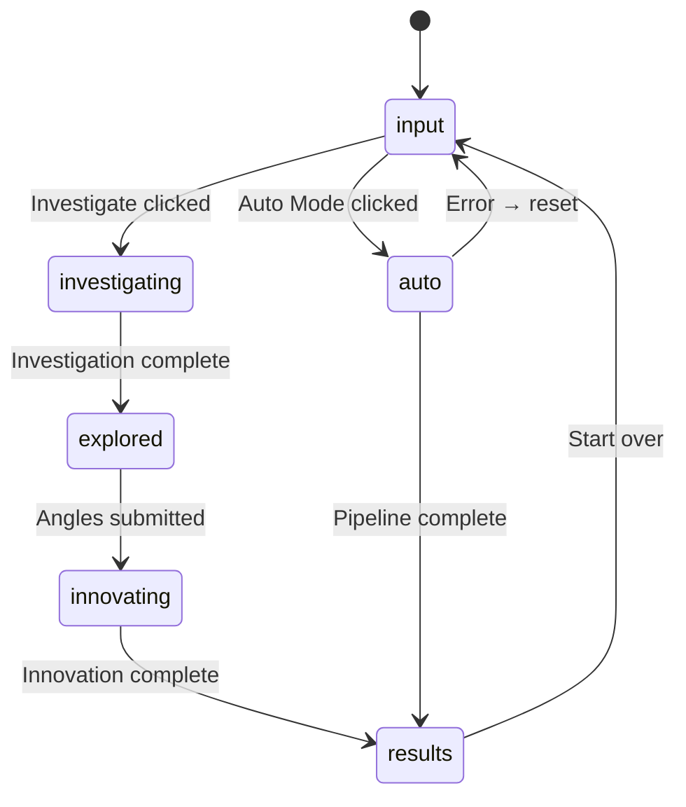

# Innovator Web App

The Next.js 16 web frontend for the Innovator AI-Powered Innovation Engine.

## App Flow

The main page (`page.tsx`) manages a state machine that controls which component renders:



### Component by Stage

| Stage           | Component                             | Description                                    |
| --------------- | ------------------------------------- | ---------------------------------------------- |
| `input`         | `SubjectInput`                        | Text input + Investigate/Auto Mode buttons     |
| `investigating` | _(loading state)_                     | Waiting for `/api/investigate` response        |
| `explored`      | `InvestigationView` + `AngleSelector` | Shows investigation, user picks angles         |
| `innovating`    | _(loading state)_                     | Waiting for `/api/innovate` response           |
| `results`       | `InnovationResults`                   | Angle results + optional synthesis display     |
| `auto`          | `AutoModePanel`                       | SSE-powered progress UI for full auto pipeline |

## API Routes

| Route              | Method                   | Description                                                      |
| ------------------ | ------------------------ | ---------------------------------------------------------------- |
| `/api/investigate` | POST                     | Analyze a subject and return structured investigation            |
| `/api/innovate`    | POST                     | Generate innovations for selected angles with optional synthesis |
| `/api/auto`        | POST                     | Run full pipeline (all angles + synthesis) as an SSE stream      |
| `/api/pipeline`    | POST                     | Parse natural language pipeline description and execute via SSE  |
| `/api/artifacts`   | POST                     | Generate structured artifacts (PRD, tech spec, user story, etc.) |
| `/api/collaborate` | GET, POST                | Create/join collaborative sessions, submit ideas, vote, comment  |
| `/api/embed`       | POST, OPTIONS            | Embeddable widget endpoint with CORS support                     |
| `/api/export`      | POST                     | Export innovation data (markdown, JSON, clipboard, GitHub issue) |
| `/api/refine`      | POST                     | Create refinement sessions or send follow-up messages            |
| `/api/share`       | GET, POST                | Create shareable links or list shared investigations             |
| `/api/validate`    | POST                     | Validate ideas against patent, market, and feasibility checks    |
| `/api/angles`      | GET, POST, DELETE        | List all angles, create custom angles, or delete by ID           |
| `/api/history`     | GET, POST, DELETE, PATCH | Query/save/delete sessions or update tags/notes                  |
| `/api/presets`     | GET                      | List pipeline presets, optionally filtered by category           |
| `/api/tracker`     | GET                      | Retrieve idea fitness tracker dashboard                          |
| `/api/analytics`   | GET, POST                | Get analytics summary/insights or track events                   |
| `/api/observatory` | GET                      | Get stats, timeline, or diff of LLM prompt calls for debugging   |
| `/api/health`      | GET                      | Health check endpoint returning status and version               |
| `/api/widget`      | GET                      | Serve innovator-widget web component JavaScript                  |

#### Authenticated API (v1)

| Route                 | Method            | Description                                                  |
| --------------------- | ----------------- | ------------------------------------------------------------ |
| `/api/v1/investigate` | POST              | Programmatic investigation with API key auth + rate limiting |
| `/api/v1/innovate`    | POST              | Generate ideas with API key auth + rate limiting             |
| `/api/v1/auto`        | POST              | Run full pipeline with optional streaming + auth             |
| `/api/v1/keys`        | GET, POST, DELETE | Manage API keys: list, create, or revoke                     |
| `/api/v1/openapi`     | GET               | Serve OpenAPI specification in JSON format                   |
| `/api/v1/plugins`     | GET               | List registered plugins with API key authentication          |

### Request Examples

```bash
# Investigate
curl -X POST http://localhost:3000/api/investigate \
  -H "Content-Type: application/json" \
  -d '{"subject": "code review processes"}'

# Innovate with specific angles
curl -X POST http://localhost:3000/api/innovate \
  -H "Content-Type: application/json" \
  -d '{"subject": "code review", "investigation": {...}, "angles": ["scamper"], "synthesize": true}'

# Auto mode (SSE stream)
curl -X POST http://localhost:3000/api/auto \
  -H "Content-Type: application/json" \
  -d '{"subject": "code review processes"}'
```

## Component Tree

```
app/
├── layout.tsx              # Root layout with header/footer
├── page.tsx                # Main page — manages app stage state machine
└── api/
    ├── investigate/route.ts
    ├── innovate/route.ts
    └── auto/route.ts

components/
├── SubjectInput.tsx        # Text input + Investigate/Auto Mode buttons
├── InvestigationView.tsx   # Displays investigation results
├── AngleSelector.tsx       # Grid of selectable innovation angles
├── InnovationResults.tsx   # Angle results + synthesis display
└── AutoModePanel.tsx       # SSE-powered progress UI for auto mode
```

## Local Development

```bash
# From the monorepo root:
npm run dev          # Builds core, then starts Next.js dev server

# Or run just the web app (requires core to be built first):
npm run dev --workspace=apps/web
```

The dev server runs at [http://localhost:3000](http://localhost:3000).

## Tech Stack

- **Next.js 16** with App Router and Turbopack
- **React 19** with client/server component separation
- **Tailwind CSS 4** for styling
- **@innovator/core** for types (client) and SDK logic (server API routes)
- **Zod** for request validation in API routes
