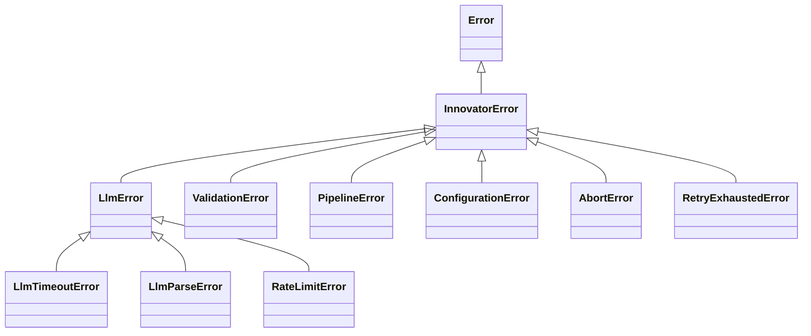

# API Reference — `@innovator/core`

Comprehensive API reference for the shared innovation engine. All consumers (`apps/web`, `apps/cli`, `packages/mcp-server`, `packages/bot`) depend on this package.

> **Client-safe imports:** For React/browser components that need only types and angle definitions (no Node.js dependencies), import from `@innovator/core/types` instead of `@innovator/core`.

> **See also:** [Developer Guide](./DEVELOPER_GUIDE.md) for practical recipes, environment setup, and step-by-step tutorials using these APIs.

---

## Table of Contents

- [Innovation Pipeline](#innovation-pipeline)
  - [`investigate()`](#investigate)
  - [`generateForAngle()`](#generateforangle)
  - [`runAutoPipeline()`](#runautopipeline)
- [Angles](#angles)
  - [`ANGLES`](#angles-constant)
  - [`getAngleById()`](#getanglebyid)
  - [Custom Angles](#custom-angles)
- [Copilot Client](#copilot-client)
  - [`generateText()`](#generatetext)
  - [`generateTextStream()`](#generatetextstream)
  - [`extractJson()`](#extractjson)
  - [`getCopilotClient()` / `stopCopilotClient()`](#getcopilotclient--stopcopilotclient)
- [LLM Providers](#llm-providers)
  - [`LLMProvider` Interface](#llmprovider-interface)
  - [Built-in Providers](#built-in-providers)
  - [Provider Registry](#provider-registry)
  - [Configuration](#provider-configuration)
- [Error Handling](#error-handling)
  - [Error Hierarchy](#error-hierarchy)
  - [`isInnovatorError()`](#isinnovatorerror)
- [Prompt Utilities](#prompt-utilities)
  - [`withRetry()`](#withretry)
  - [`RetryExhaustedError`](#retryexhaustederror)
  - [`withTimeout()`](#withtimeout)
- [Plugin System](#plugin-system)
- [Presets](#presets)
- [Session History](#session-history)
  - [Session Export Helpers](#session-export-helpers)
  - [`duplicateSession()`](#duplicatesession)
  - [`clearHistory()`](#clearhistory)
  - [`querySessionsPaginated()`](#querysessionspaginated)
  - [`getSessionStats()`](#getsessionstats)
  - [`compareSessions()`](#comparesessions)
- [Export](#export)
  - [Built-in Exporters](#built-in-exporters)
  - [Integration Adapters](#integration-adapters)
- [Scoring](#scoring)
  - [Priority Scoring](#priority-scoring)
  - [Quadrant Analysis](#quadrant-analysis)
  - [Configurable Scoring Engine](#configurable-scoring-engine)
- [Validation](#validation)
  - [Built-in Validators](#built-in-validators)
  - [Custom Validators](#custom-validators)
  - [Comprehensive Validation](#comprehensive-validation)
- [Futures Market](#futures-market)
  - [Market Operations](#market-operations)
  - [Trading](#trading)
  - [Analytics](#futures-analytics)
- [Collaborative Sessions](#collaborative-sessions)
- [Artifacts](#artifacts)
- [Knowledge Graph](#knowledge-graph)
- [Benchmark](#benchmark)
- [Adversarial Gauntlet](#adversarial-gauntlet)
- [Provenance Ledger](#provenance-ledger)
- [Temporal Memory](#temporal-memory)
- [Sentinel](#sentinel)
- [Genome Sequencer](#genome-sequencer)
- [Federation DP](#federation-dp)
- [Model Registry](#model-registry)
- [Visualization](#visualization)
- [Interactive Refinement](#interactive-refinement)
- [Comparative Pipeline](#comparative-pipeline)
- [Core Types](#core-types)
- [Zod Schemas](#zod-schemas)

---

## Innovation Pipeline

The core pipeline follows a three-stage flow: **Investigate → Generate → Synthesize**.

### `investigate()`

Analyze a subject using AI to identify key aspects, challenges, and opportunities.

```typescript
function investigate(subject: string, model?: string, signal?: AbortSignal): Promise<Investigation>;
```

**Parameters:**

| Name      | Type           | Description                                                            |
| --------- | -------------- | ---------------------------------------------------------------------- |
| `subject` | `string`       | The topic or domain to investigate                                     |
| `model`   | `string?`      | LLM model override (default: `INNOVATOR_DEFAULT_MODEL` or `"gpt-4.1"`) |
| `signal`  | `AbortSignal?` | Cancel the request early                                               |

**Returns:** A validated `Investigation` object.

**Example:**

```typescript
import { investigate } from "@innovator/core";

const result = await investigate("sustainable packaging");
console.log(result.summary);
console.log(result.keyAspects.map((a) => a.title));
console.log(result.challenges);
console.log(result.opportunities);
```

**Error handling:** Retries automatically on JSON parse failures (up to 3 attempts with exponential backoff). Throws if the LLM call fails or the response cannot be parsed after retries.

> 📖 **Tutorial:** See [Running the Pipeline Programmatically](./DEVELOPER_GUIDE.md#running-the-pipeline-programmatically) for complete usage examples with cancellation and model routing.

Generate innovation ideas for a subject using a specific creativity angle.

```typescript
function generateForAngle(
  subject: string,
  investigation: Investigation,
  angleId: AngleId | string,
  model?: string,
  signal?: AbortSignal
): Promise<AngleResult>;
```

**Parameters:**

| Name            | Type                | Description                                |
| --------------- | ------------------- | ------------------------------------------ |
| `subject`       | `string`            | The topic to innovate on                   |
| `investigation` | `Investigation`     | Previously generated investigation context |
| `angleId`       | `AngleId \| string` | Built-in or custom angle ID                |
| `model`         | `string?`           | LLM model override                         |
| `signal`        | `AbortSignal?`      | Cancel the request early                   |

**Returns:** A validated `AngleResult` with generated ideas and reasoning.

**Example:**

```typescript
import { investigate, generateForAngle } from "@innovator/core";

const investigation = await investigate("home automation");
const result = await generateForAngle("home automation", investigation, "scamper");

for (const idea of result.ideas) {
  console.log(`${idea.title}: ${idea.description}`);
  console.log(`  Impact: ${idea.potentialImpact}`);
  console.log(`  Hint: ${idea.implementationHint}`);
}
```

**Angle resolution:** Built-in angle IDs are matched first. If no match is found, the custom angle registry is consulted. Throws `Error` if the angle ID is unknown.

---

### `runAutoPipeline()`

Run the full innovation pipeline: investigate → generate for all angles → synthesize.

```typescript
function runAutoPipeline(
  subject: string,
  onProgress: (progress: PipelineProgress) => void,
  model?: string,
  angles?: AngleId[],
  signal?: AbortSignal,
  modelRouting?: ModelRouting
): Promise<PipelineProgress>;
```

**Parameters:**

| Name           | Type                                   | Description                          |
| -------------- | -------------------------------------- | ------------------------------------ |
| `subject`      | `string`                               | The topic to innovate on             |
| `onProgress`   | `(progress: PipelineProgress) => void` | Callback for each stage transition   |
| `model`        | `string?`                              | Default LLM model for all stages     |
| `angles`       | `AngleId[]?`                           | Subset of angles (defaults to all 8) |
| `signal`       | `AbortSignal?`                         | Cancel the pipeline early            |
| `modelRouting` | `ModelRouting?`                        | Per-stage model overrides            |

**Returns:** Final `PipelineProgress` including all angle results and synthesis.

**Concurrency:** Generates ideas for up to `MAX_CONCURRENCY` (2) angles in parallel. Individual angle failures are captured without aborting the pipeline.

**Example:**

```typescript
import { runAutoPipeline } from "@innovator/core";

const result = await runAutoPipeline(
  "code review processes",
  (progress) => {
    console.log(`Stage: ${progress.stage}`);
    console.log(`Completed: ${progress.completedAngles.length}/${progress.totalAngles}`);
  },
  "gpt-5",
  ["scamper", "first-principles", "inversion"]
);

if (result.synthesis) {
  console.log(
    "Top ideas:",
    result.synthesis.topIdeas.map((i) => i.title)
  );
  console.log("Recommendation:", result.synthesis.recommendation);
}
```

**Model routing example:**

```typescript
const result = await runAutoPipeline(
  "renewable energy",
  onProgress,
  undefined, // no default model
  undefined, // all angles
  undefined, // no abort signal
  {
    investigation: "gpt-5", // high-quality for investigation
    generation: "gpt-4.1-mini", // cost-effective for bulk generation
    synthesis: "gpt-5", // high-quality for synthesis
  }
);
```

---

## Angles

### `ANGLES` (constant)

The canonical array of all 8 built-in innovation angle definitions.

```typescript
const ANGLES: AngleDefinition[];
```

| ID                 | Name                    | Icon |
| ------------------ | ----------------------- | ---- |
| `scamper`          | SCAMPER                 | 🔄   |
| `first-principles` | First Principles        | 🧱   |
| `cross-domain`     | Cross-Domain Analogy    | 🌐   |
| `constraints`      | Constraint Injection    | 🔒   |
| `inversion`        | Problem Inversion       | 🔃   |
| `perspectives`     | Role-Based Perspectives | 👥   |
| `what-if`          | What-If Scenarios       | 💭   |
| `trend-collision`  | Trend Collision         | ⚡   |

### `getAngleById()`

```typescript
function getAngleById(id: string): AngleDefinition | undefined;
```

Look up an angle definition by its ID. Returns `undefined` if not found.

### Custom Angles

Register, manage, and use custom innovation angles beyond the built-in 8.

```typescript
// Manage custom angles
function loadCustomAngles(): CustomAngle[];
function addCustomAngle(angle: CustomAngle): void;
function removeCustomAngle(id: string): boolean;
function getCustomAngle(id: string): CustomAngle | undefined;
function updateCustomAngle(id: string, updates: Partial<CustomAngle>): void;

// Import/export angle packs
function exportAnglePack(angleIds: string[]): AnglePack;
function importAnglePack(pack: AnglePack): void;
function buildCustomAnglePrompt(angle: CustomAngle, subject: string, context: string): string;
```

Custom angle IDs must match `^[a-z0-9-]+$`. Prompt templates support `{{subject}}` and `{{investigation}}` placeholders.

> 📖 **Tutorial:** See [Creating Custom Angles](./DEVELOPER_GUIDE.md#creating-custom-angles) for step-by-step registration and angle pack examples.

const ethicsAngle: CustomAngle = {
id: "ethics-lens",
name: "Ethics Lens",
description: "Evaluate through ethical frameworks",
promptTemplate: `Analyze {{subject}} for ethical implications.
Context: {{investigation}}
Respond with JSON: { "angleId": "ethics-lens", "angleName": "Ethics Lens", "ideas": [...], "reasoning": "..." }`,
icon: "⚖️",
};

addCustomAngle(ethicsAngle);

const investigation = await investigate("facial recognition");
const result = await generateForAngle("facial recognition", investigation, "ethics-lens");

````

---

## Copilot Client

Low-level interface to the GitHub Copilot SDK. Used internally by the pipeline but also available for direct use.

### `generateText()`

Send a prompt and wait for the complete response.

```typescript
function generateText(options: GenerateOptions): Promise<string>;
````

### `generateTextStream()`

Send a prompt and stream response chunks via a callback.

```typescript
function generateTextStream(
  options: GenerateOptions,
  onChunk: (chunk: string) => void
): Promise<string>;
```

### `GenerateOptions`

```typescript
interface GenerateOptions {
  prompt: string;
  model?: string; // Default: INNOVATOR_DEFAULT_MODEL or "gpt-4.1"
  serverMode?: boolean; // Restrict to read-only permissions (for API routes)
  timeoutMs?: number; // Default: INNOVATOR_LLM_TIMEOUT_MS or 90000
  signal?: AbortSignal;
}
```

### `extractJson()`

Extract a JSON object or array from an LLM response that may contain markdown or extra text. Uses bracket-balanced extraction instead of greedy regex. Supports both `{...}` objects and `[...]` arrays — whichever appears first is extracted.

```typescript
function extractJson(raw: string): string;
```

Handles:

- Fenced JSON code blocks (` ```json ... ``` `)
- Embedded JSON objects (`{...}`) in free-form text
- Embedded JSON arrays (`[...]`) in free-form text
- When both `{` and `[` are present, extracts whichever appears first
- Throws `Error` if no JSON object or array is found, or brackets are unbalanced

**Example:**

````typescript
import { extractJson } from "@innovator/core";

// Extract object from markdown
const obj = extractJson('Here is the result: ```json\n{"key": "value"}\n```');

// Extract array from free-form text
const arr = extractJson('The items are: [{"id": 1}, {"id": 2}] — done.');
````

### `getCopilotClient()` / `stopCopilotClient()`

```typescript
function getCopilotClient(): Promise<CopilotClient>; // Lazy singleton
function stopCopilotClient(): Promise<void>; // Release resources
```

The client is lazily initialized on first call. Always call `stopCopilotClient()` for graceful shutdown in CLI/script contexts.

---

## LLM Providers

### `LLMProvider` Interface

All LLM providers implement this interface:

```typescript
interface LLMProvider {
  readonly id: string;
  readonly name: string;
  generateText(options: LLMGenerateOptions): Promise<string>;
  generateStream(options: LLMGenerateOptions, onChunk: (chunk: string) => void): Promise<string>;
  listModels(): Promise<LLMModelInfo[]>;
}

interface LLMGenerateOptions {
  prompt: string;
  model?: string;
  timeoutMs?: number;
  signal?: AbortSignal;
}
```

### Built-in Providers

| Class               | ID          | Env Variable        | Default Model              |
| ------------------- | ----------- | ------------------- | -------------------------- |
| `CopilotProvider`   | `copilot`   | _(uses `gh` CLI)_   | `gpt-4.1`                  |
| `OpenAIProvider`    | `openai`    | `OPENAI_API_KEY`    | `gpt-4.1`                  |
| `AnthropicProvider` | `anthropic` | `ANTHROPIC_API_KEY` | `claude-sonnet-4-20250514` |
| `OllamaProvider`    | `ollama`    | `OLLAMA_BASE_URL`   | `llama3`                   |

### Provider Registry

```typescript
function registerProvider(provider: LLMProvider): void;
function getProvider(id: string): LLMProvider | undefined;
function getActiveProvider(): LLMProvider; // Falls back to CopilotProvider
function setActiveProvider(id: string): void; // Throws if not registered
function listProviders(): LLMProvider[];
function initializeProviders(config?: InnovatorConfig): void;
function clearProviders(): void; // For testing
```

### Provider Configuration

Configuration is stored at `~/.innovator/config.json`:

```typescript
function loadConfig(): InnovatorConfig;
function saveConfig(config: InnovatorConfig): void;
```

```typescript
interface InnovatorConfig {
  defaultProvider: string; // Default: "copilot"
  providers?: Record<
    string,
    {
      enabled: boolean;
      apiKeyEnv?: string;
      baseUrl?: string;
      defaultModel?: string;
    }
  >;
  modelPreferences?: {
    investigation?: string;
    generation?: string;
    synthesis?: string;
  };
}
```

---

## Error Handling

All Innovator errors extend a common `InnovatorError` base class with a structured `code` property for programmatic error discrimination. Import error classes from `@innovator/core` or `@innovator/core/types` (client-safe).

### Error Hierarchy



| Error Class           | Code                  | When Thrown                                    | Extra Properties                          |
| --------------------- | --------------------- | ---------------------------------------------- | ----------------------------------------- |
| `InnovatorError`      | `ERR_INNOVATOR`       | Base class for all Innovator errors            | `code: InnovatorErrorCode`                |
| `LlmError`            | `ERR_LLM`             | LLM API call failures (network, unknown)       | `model?: string`                          |
| `LlmTimeoutError`     | `ERR_LLM_TIMEOUT`     | LLM request exceeds configured timeout         | `timeoutMs: number`, `model?: string`     |
| `LlmParseError`       | `ERR_LLM_PARSE`       | LLM output fails JSON parsing                  | `rawOutput: string` (truncated to 500c)   |
| `RateLimitError`      | `ERR_LLM_RATE_LIMIT`  | LLM API returns HTTP 429                       | `retryAfterMs?: number`, `model?: string` |
| `RetryExhaustedError` | `ERR_RETRY_EXHAUSTED` | All `withRetry()` attempts exhausted           | `cause: Error`, `attempts: number`        |
| `ValidationError`     | `ERR_VALIDATION`      | Data fails Zod schema validation               | `issues?: Array<{path, message}>`         |
| `PipelineError`       | `ERR_PIPELINE`        | A pipeline stage fails                         | `stage: string`                           |
| `ConfigurationError`  | `ERR_CONFIGURATION`   | Invalid config (missing env vars, bad options) | `configKey?: string`                      |
| `AbortError`          | `ERR_ABORT`           | Operation cancelled via `AbortSignal`          | —                                         |

All `InnovatorError` subclasses support `.toJSON()` for structured serialization in logging and API responses:

```typescript
const err = new LlmTimeoutError(90000, { model: "gpt-4.1" });
console.log(JSON.stringify(err));
// → {"name":"LlmTimeoutError","code":"ERR_LLM_TIMEOUT","message":"LLM request timed out after 90s"}
```

**Example:**

```typescript
import { investigate, LlmTimeoutError, RateLimitError, isInnovatorError } from "@innovator/core";

try {
  await investigate("renewable energy");
} catch (err) {
  if (err instanceof LlmTimeoutError) {
    console.error(`Timed out after ${err.timeoutMs}ms (model: ${err.model})`);
  } else if (err instanceof RateLimitError) {
    console.error(`Rate limited — retry after ${err.retryAfterMs}ms`);
  } else if (isInnovatorError(err)) {
    console.error(`[${err.code}] ${err.message}`);
  }
}
```

### `isInnovatorError()`

Type guard to check if an unknown value is any `InnovatorError` subclass.

```typescript
function isInnovatorError(err: unknown): err is InnovatorError;
```

---

## Prompt Utilities

```typescript
// Build prompts for pipeline stages
function buildInvestigationPrompt(subject: string): string;
function buildSynthesisPrompt(
  subject: string,
  investigation: Investigation,
  angleResults: string
): string;

// Defense against prompt injection
function sanitizeUserInput(input: string): string; // Strip injection patterns
function wrapUserInput(label: string, input: string): string; // Wrap with delimiters
function sanitizeLlmOutput(output: string): string; // Clean LLM responses

// Retry with exponential backoff
function withRetry<T>(fn: () => Promise<T>, options?: RetryOptions): Promise<T>;
```

### `withRetry()`

Retry an async function with exponential backoff on transient failures. All LLM calls in the pipeline are wrapped with `withRetry()`.

```typescript
function withRetry<T>(fn: () => Promise<T>, options?: RetryOptions): Promise<T>;
```

**Parameters:**

| Name                        | Type                          | Default                  | Description                                         |
| --------------------------- | ----------------------------- | ------------------------ | --------------------------------------------------- |
| `fn`                        | `() => Promise<T>`            | —                        | The async function to retry                         |
| `options.maxAttempts`       | `number`                      | `3`                      | Max attempts including the first (must be ≥ 1)      |
| `options.initialDelayMs`    | `number`                      | `1000`                   | Delay before first retry in ms                      |
| `options.backoffMultiplier` | `number`                      | `2`                      | Multiplier for delay after each retry (must be ≥ 1) |
| `options.maxDelayMs`        | `number`                      | `30000`                  | Maximum delay cap in ms                             |
| `options.isRetryable`       | `(error: unknown) => boolean` | Network/timeout detector | Predicate to decide if an error is retryable        |
| `options.signal`            | `AbortSignal?`                | —                        | Cancel retries early                                |

**Throws:** `RetryExhaustedError` when all attempts are exhausted (preserves the original error as `cause`).

**Input validation:** Throws immediately if `maxAttempts < 1`, `initialDelayMs < 0`, `backoffMultiplier < 1`, or `maxDelayMs < 0`, or if any of these are not finite numbers.

### `RetryExhaustedError`

Error class thrown when all retry attempts are exhausted. Extends `InnovatorError` with code `ERR_RETRY_EXHAUSTED`. Provides structured access to the underlying failure and attempt count.

```typescript
class RetryExhaustedError extends InnovatorError {
  readonly code: "ERR_RETRY_EXHAUSTED";
  readonly cause: Error; // The underlying error from the last attempt
  readonly attempts: number; // Total attempts made (including the first)

  /** Includes `attempts` in addition to standard InnovatorError fields. */
  toJSON(): Record<string, unknown>;
}
```

**Example:**

```typescript
import { withRetry, RetryExhaustedError, isInnovatorError } from "@innovator/core";

try {
  const result = await withRetry(() => fetchData(), { maxAttempts: 3 });
} catch (error) {
  if (error instanceof RetryExhaustedError) {
    console.error(`Failed after ${error.attempts} attempts: ${error.cause.message}`);
    // Structured logging
    console.log(JSON.stringify(error));
    // → {"name":"RetryExhaustedError","code":"ERR_RETRY_EXHAUSTED","message":"All 3 retry attempts exhausted: ...","cause":"...","attempts":3}
  }
  // Also works with the generic type guard
  if (isInnovatorError(error)) {
    console.error(`[${error.code}] ${error.message}`);
  }
}
```

---

### `withTimeout()`

Race a promise against a timeout, throwing `LlmTimeoutError` if the timeout fires first. Consolidates the `Promise.race` + `setTimeout` pattern used throughout the LLM client into a single utility.

```typescript
function withTimeout<T>(
  promise: Promise<T>,
  timeoutMs: number,
  options?: { model?: string }
): Promise<T>;
```

**Parameters:**

| Name            | Type      | Description                                          |
| --------------- | --------- | ---------------------------------------------------- |
| `promise`       | `Promise` | The promise to race against the timeout              |
| `timeoutMs`     | `number`  | Maximum time in ms to wait (must be positive finite) |
| `options.model` | `string?` | Model name for error context                         |

**Throws:** `LlmTimeoutError` if the timeout fires before the promise resolves. Throws `Error` if `timeoutMs` is not a positive finite number.

**Example:**

```typescript
import { withTimeout, generateText, LlmTimeoutError } from "@innovator/core";

try {
  const result = await withTimeout(
    generateText({ prompt: "Analyze this topic", model: "gpt-4.1" }),
    90_000,
    { model: "gpt-4.1" }
  );
} catch (err) {
  if (err instanceof LlmTimeoutError) {
    console.error(`Request timed out after ${err.timeoutMs / 1000}s`);
  }
}
```

---

## Plugin System

Register custom angle, exporter, or visualizer plugins:

```typescript
function registerPlugin(plugin: InnovatorPlugin): void;
function unregisterPlugin(id: string): void;
function getPlugin(id: string): InnovatorPlugin | undefined;
function listPlugins(): InnovatorPlugin[];
function getPluginsByType(type: "angle" | "exporter" | "visualizer"): InnovatorPlugin[];
function loadPlugin(manifest: PluginManifest): Promise<InnovatorPlugin>;
function clearPlugins(): void;
```

**Plugin types:**

| Type         | Interface          | Purpose                      |
| ------------ | ------------------ | ---------------------------- |
| `angle`      | `AnglePlugin`      | Custom innovation angles     |
| `exporter`   | `ExporterPlugin`   | Output format converters     |
| `visualizer` | `VisualizerPlugin` | Data visualization renderers |

Plugin IDs must match `^[a-z0-9-]+$` (may include dots for namespacing, e.g. `myorg.custom-angles`).

> 📖 **Tutorial:** See [Writing a Plugin](./DEVELOPER_GUIDE.md#writing-a-plugin) for a complete plugin example.

Pre-configured angle sets for common innovation domains:

```typescript
function getPresets(): Preset[];
function getPresetById(id: string): Preset | undefined;
function getPresetsByCategory(category: string): Preset[];
function getPresetsByTag(tag: string): Preset[];

const BUILT_IN_PRESETS: Preset[];
```

---

## Session History

Persist and query innovation sessions:

```typescript
// CRUD
function saveSession(session: SessionRecord): void;
function getSession(id: string): SessionRecord | undefined;
function updateSession(id: string, updates: Partial<SessionRecord>): void;
function deleteSession(id: string): boolean;
function listSessions(limit?: number, offset?: number): SessionRecord[];

// Search & pagination
function querySessions(query: HistoryQuery): SessionRecord[];
function querySessionsPaginated(query: HistoryQuery): PaginatedSessionResult;

// Comparison & analytics
function compareSessions(id1: string, id2: string): CompareResult | undefined;
function getSessionStats(): SessionStats;

// Export helpers
function exportSessionAsMarkdown(session: SessionRecord): string;
function exportSessionAsJson(session: SessionRecord): string;
function exportSessionAsCsv(session: SessionRecord): string;

// Session management
function duplicateSession(id: string): string | undefined;
function clearHistory(): number;
```

### Session Export Helpers

Export individual session records directly from the history module (distinct from the `export/` module which exports `ExportData` objects).

#### `exportSessionAsMarkdown()`

Export a session record as a structured Markdown document with investigation, ideas, and synthesis.

```typescript
function exportSessionAsMarkdown(session: SessionRecord): string;
```

#### `exportSessionAsJson()`

Export a session record as a pretty-printed JSON string.

```typescript
function exportSessionAsJson(session: SessionRecord): string;
```

#### `exportSessionAsCsv()`

Export a session's ideas as CSV rows for spreadsheet import. Includes CSV formula injection protection (dangerous leading characters like `=`, `+`, `-`, `@` are prefixed with a single quote).

```typescript
function exportSessionAsCsv(session: SessionRecord): string;
```

**CSV columns:** `Subject`, `Angle`, `Idea Title`, `Description`, `Impact`, `Implementation Hint`

**Example:**

```typescript
import { getSession, exportSessionAsMarkdown, exportSessionAsCsv } from "@innovator/core";

const session = getSession("sess-abc")!;

// Markdown for documentation
const md = exportSessionAsMarkdown(session);
writeFileSync(`session-${session.id}.md`, md);

// CSV for spreadsheet analysis
const csv = exportSessionAsCsv(session);
writeFileSync(`session-${session.id}.csv`, csv);
```

### `duplicateSession()`

Duplicate an existing session, creating a new copy with a fresh ID and timestamps. Useful for re-analysis workflows.

```typescript
function duplicateSession(id: string): string | undefined;
```

**Returns:** The new session ID, or `undefined` if the source session was not found.

**Example:**

```typescript
import { duplicateSession, getSession } from "@innovator/core";

const newId = duplicateSession("sess-abc");
if (newId) {
  const copy = getSession(newId);
  console.log(`Duplicated to ${newId}, created at ${copy?.createdAt}`);
}
```

### `clearHistory()`

Delete all sessions from history. Useful for development and testing cleanup.

```typescript
function clearHistory(): number;
```

**Returns:** The number of sessions deleted.

### Pagination

`querySessions()` supports offset-based pagination via the `HistoryQuery` interface. For UIs that need a total count (e.g., to render page numbers), use `querySessionsPaginated()` instead.

```typescript
interface HistoryQuery {
  search?: string; // Full-text search across subject and summary
  tags?: string[]; // Filter by tags
  fromDate?: string; // ISO 8601 date range start
  toDate?: string; // ISO 8601 date range end
  angleId?: string; // Filter by innovation angle
  limit?: number; // Items per page (default: 50)
  offset?: number; // Starting position (default: 0)
}
```

**Example:**

```typescript
import { querySessions } from "@innovator/core";

// Page 1 (first 20 items)
const page1 = querySessions({ limit: 20, offset: 0, tags: ["ai"] });

// Page 2 (next 20 items)
const page2 = querySessions({ limit: 20, offset: 20, tags: ["ai"] });
```

### `querySessionsPaginated()`

Like `querySessions()`, but returns the total matching count alongside the page results. Use this when building pagination UIs that need to know the total number of pages.

```typescript
function querySessionsPaginated(query: HistoryQuery): PaginatedSessionResult;
```

**Returns:**

```typescript
interface PaginatedSessionResult {
  sessions: SessionRecord[]; // Sessions for the current page (sliced by offset/limit)
  totalCount: number; // Total matching sessions before pagination
}
```

**Example:**

```typescript
import { querySessionsPaginated } from "@innovator/core";

const { sessions, totalCount } = querySessionsPaginated({
  limit: 20,
  offset: 0,
  tags: ["ai"],
});

const totalPages = Math.ceil(totalCount / 20);
console.log(`Showing page 1 of ${totalPages} (${totalCount} total results)`);
```

**HTTP API (`GET /api/history`):**

```
GET /api/history?limit=20&offset=0&search=packaging&tags=sustainability&from=2025-01-01
```

**Response envelope:**

```json
{
  "data": [
    { "id": "sess-1", "subject": "...", "createdAt": "...", ... },
    { "id": "sess-2", "subject": "...", "createdAt": "...", ... }
  ],
  "total": 42
}
```

| Field   | Type              | Description                                        |
| ------- | ----------------- | -------------------------------------------------- |
| `data`  | `SessionRecord[]` | Array of sessions for the current page             |
| `total` | `number`          | Total matching sessions (for computing page count) |

### `getSessionStats()`

Compute aggregate statistics across all stored sessions. Useful for dashboards and analytics.

```typescript
function getSessionStats(): SessionStats;
```

**Returns:**

```typescript
interface SessionStats {
  totalSessions: number; // Total number of sessions
  tagFrequency: Record<string, number>; // Frequency count for each tag
  angleFrequency: Record<string, number>; // Frequency count for each angle
  totalIdeas: number; // Total ideas generated across all sessions
  earliestSession?: string; // ISO 8601 timestamp of first session
  latestSession?: string; // ISO 8601 timestamp of most recent session
}
```

**Example:**

```typescript
import { getSessionStats } from "@innovator/core";

const stats = getSessionStats();
console.log(`${stats.totalSessions} sessions, ${stats.totalIdeas} ideas generated`);
console.log(
  "Most used angles:",
  Object.entries(stats.angleFrequency)
    .sort((a, b) => b[1] - a[1])
    .map(([angle, count]) => `${angle}: ${count}`)
    .join(", ")
);
```

### `compareSessions()`

Compare two sessions side-by-side, identifying shared themes and angle coverage differences.

```typescript
function compareSessions(
  id1: string,
  id2: string
):
  | {
      session1: SessionRecord;
      session2: SessionRecord;
      sharedThemes: string[];
      sharedAngles: string[];
      uniqueAngles1: string[];
      uniqueAngles2: string[];
    }
  | undefined;
```

**Returns:** `undefined` if either session is not found. Otherwise returns both sessions, shared synthesis themes, shared angles, and angles unique to each session.

**Example:**

```typescript
import { compareSessions } from "@innovator/core";

const comparison = compareSessions("sess-abc", "sess-xyz");
if (comparison) {
  console.log("Shared themes:", comparison.sharedThemes);
  console.log("Shared angles:", comparison.sharedAngles);
  console.log("Only in session 1:", comparison.uniqueAngles1);
  console.log("Only in session 2:", comparison.uniqueAngles2);
}
```

## Export

Export innovation results to multiple output formats. All exporters accept an `ExportData` object and return an `ExportResult` with the formatted content, MIME type, and filename.

### Built-in Exporters

| Function                    | Format            | MIME Type          | Extension       |
| --------------------------- | ----------------- | ------------------ | --------------- |
| `exportToMarkdown()`        | Markdown          | `text/markdown`    | `.md`           |
| `exportToJson()`            | JSON              | `application/json` | `.json`         |
| `exportToHtml()`            | HTML (standalone) | `text/html`        | `.html`         |
| `exportToCsv()`             | CSV (RFC 4180)    | `text/csv`         | `.csv`          |
| `exportToPowerPoint()`      | PPTX (JSON)       | `application/json` | `.pptx.json`    |
| `exportToGoogleSlides()`    | Google Slides     | `application/json` | `.gslides.json` |
| `generateGitHubIssueBody()` | GitHub Issue      | `text/markdown`    | —               |
| `exportToClipboard()`       | Markdown (copy)   | —                  | —               |

**Example:**

```typescript
import { exportToHtml, exportToCsv, exportToMarkdown } from "@innovator/core";

const data: ExportData = { subject, investigation, angleResults, synthesis };

// Self-contained HTML report
const html = exportToHtml(data);
writeFileSync(html.filename, html.content);

// CSV for spreadsheet analysis
const csv = exportToCsv(data);
writeFileSync(csv.filename, csv.content);

// Markdown for documentation
const md = exportToMarkdown(data);
console.log(md.content);
```

### Integration Adapters

Third-party integrations export via the `IntegrationAdapter` interface:

```typescript
function exportToJira(data: ExportData): Promise<ExportResult>;
function exportToConfluence(data: ExportData): Promise<ExportResult>;
function exportToNotion(data: ExportData): Promise<ExportResult>;
```

**`ExportResult` type:**

```typescript
interface ExportResult {
  content: string; // The formatted output
  mimeType: string; // MIME type for Content-Type headers
  extension: string; // File extension (e.g., ".html")
  filename: string; // Suggested filename (e.g., "innovation-solar-energy.html")
}
```

---

## Scoring

AI-powered multi-dimensional scoring of generated ideas across feasibility, impact, novelty, and time-to-implement dimensions.

### `scoreIdeas()`

Score innovation ideas using LLM evaluation.

```typescript
function scoreIdeas(
  angleResults: AngleResult[],
  model?: string,
  investigation?: Investigation,
  signal?: AbortSignal
): Promise<ScoringResult>;
```

**Returns:** A `ScoringResult` containing an array of `IdeaScore` objects.

### Priority Scoring

```typescript
// Default composite score (impact: 35%, feasibility: 30%, novelty: 20%, speed: 15%)
function computePriorityScore(score: IdeaScore): number;

// Custom weights
function computeWeightedPriorityScore(score: IdeaScore, weights?: PriorityWeights): number;

// Sort by composite priority (descending)
function rankIdeas(scores: IdeaScore[]): IdeaScore[];

// Get top N ideas by a single dimension
function getTopByDimension(
  scores: IdeaScore[],
  dimension: "feasibility" | "impact" | "novelty",
  limit?: number // default: 5
): IdeaScore[];
```

**`PriorityWeights` interface:**

```typescript
interface PriorityWeights {
  impact?: number; // default: 0.35
  feasibility?: number; // default: 0.3
  novelty?: number; // default: 0.2
  speed?: number; // default: 0.15
}
```

### Quadrant Analysis

Ideas are classified into four quadrants based on their feasibility and impact scores:

| Quadrant            | Criteria                      | Meaning                                  |
| ------------------- | ----------------------------- | ---------------------------------------- |
| `quick-wins`        | High feasibility, high impact | Easy to implement, high value — do first |
| `strategic-bets`    | Low feasibility, high impact  | Hard but transformative — plan carefully |
| `low-hanging-fruit` | High feasibility, low impact  | Easy wins for incremental gains          |
| `reconsider`        | Low feasibility, low impact   | Not worth pursuing now                   |

```typescript
function getQuadrant(score: IdeaScore): Quadrant;
function filterIdeasByQuadrant(scores: IdeaScore[], quadrants: Quadrant[]): IdeaScore[];
function getIdeaSummaryStats(scores: IdeaScore[]): IdeaSummaryStats;
```

**`IdeaSummaryStats` type:**

```typescript
interface IdeaSummaryStats {
  total: number;
  averageFeasibility: number;
  averageImpact: number;
  averageNovelty: number;
  quadrantCounts: Record<Quadrant, number>;
  topPriorityTitle: string | undefined;
}
```

**Example:**

```typescript
import { scoreIdeas, filterIdeasByQuadrant, getIdeaSummaryStats, rankIdeas } from "@innovator/core";

const scored = await scoreIdeas(pipeline.angleResults, "gpt-4.1", pipeline.investigation);

// Focus on quick wins
const quickWins = filterIdeasByQuadrant(scored.scores, ["quick-wins"]);
console.log(`${quickWins.length} quick wins found`);

// Get summary statistics
const stats = getIdeaSummaryStats(scored.scores);
console.log(`Average impact: ${stats.averageImpact}, Top idea: ${stats.topPriorityTitle}`);

// Rank all ideas by composite priority
const ranked = rankIdeas(scored.scores);
```

### Configurable Scoring Engine

For advanced use cases, define custom scoring dimensions with quality gates and calibration:

```typescript
function scoreWithEngine(
  ideas: InnovationIdea[],
  config: ScoringEngineConfig,
  model?: string,
  signal?: AbortSignal
): Promise<MultiDimensionalScore[]>;
```

**`ScoringEngineConfig` type:**

```typescript
interface ScoringEngineConfig {
  id: string;
  name: string;
  dimensions: ScoringDimension[]; // 1–20 custom dimensions
  qualityGates?: Array<{
    type: "min-score" | "min-ideas" | "min-dimensions" | "max-risk";
    dimension?: string;
    threshold: number;
    action: "warn" | "block" | "flag";
    message: string;
  }>;
  calibration?: {
    enabled?: boolean; // default: false
    feedbackWeight?: number; // 0–1, default: 0.3
    minCalibrationSamples?: number; // default: 5
  };
}
```

**Calibration feedback:**

```typescript
// Record human feedback to calibrate future scoring
function recordCalibrationFeedback(
  ideaTitle: string,
  dimensionId: string,
  humanScore: number
): void;

// Reset calibration data
function clearCalibration(): void;
```

---

## Validation

Validate generated ideas against real-world data including patent databases, market reports, competitor analysis, and technical feasibility. Produces a validation scorecard per idea.

### Built-in Validators

| Validator               | Category      | What It Checks                             |
| ----------------------- | ------------- | ------------------------------------------ |
| `PatentValidator`       | `patent`      | Patent landscape similarity risk           |
| `MarketValidator`       | `market`      | Market viability and competitive landscape |
| `FeasibilityValidator`  | `feasibility` | Technical implementation feasibility       |
| `MarketSizingValidator` | `market`      | TAM/SAM/SOM market sizing analysis         |
| `RegulatoryValidator`   | `regulatory`  | Regulatory compliance risk assessment      |

### `validateIdea()` / `validateIdeas()`

```typescript
function validateIdea(
  idea: InnovationIdea,
  domain: string,
  model?: string,
  signal?: AbortSignal
): Promise<ValidationResult>;

function validateIdeas(
  ideas: InnovationIdea[],
  domain: string,
  model?: string,
  signal?: AbortSignal
): Promise<ValidationScorecard>;
```

**`ValidationResult` type:**

```typescript
interface ValidationResult {
  ideaTitle: string;
  overallScore: number; // 0 = invalid, 100 = highly validated
  overallStatus: "validated" | "caution" | "risky" | "insufficient-data";
  checks: ValidationCheck[]; // Individual check results
  recommendation: string;
  validatedAt: string; // ISO 8601
}

interface ValidationCheck {
  source: string; // e.g., "Google Patents"
  category: "patent" | "market" | "competitor" | "feasibility" | "regulatory";
  status: "pass" | "warn" | "fail" | "unknown";
  score: number; // 0 = no risk, 100 = high risk
  summary: string;
  details?: string;
  references?: string[];
}
```

**Example:**

```typescript
import { validateIdeas } from "@innovator/core";

const scorecard = await validateIdeas(
  pipeline.angleResults.flatMap((ar) => ar.ideas),
  "renewable energy",
  "gpt-4.1"
);

for (const result of scorecard.results) {
  console.log(`${result.ideaTitle}: ${result.overallStatus} (${result.overallScore}/100)`);
  for (const check of result.checks.filter((c) => c.status === "fail")) {
    console.warn(`  ⚠️ ${check.source}: ${check.summary}`);
  }
}
```

### Custom Validators

Register pluggable validators that check ideas against custom data sources:

```typescript
interface IdeaValidator {
  id: string;
  name: string;
  category: ValidationCheck["category"];
  validate(idea: InnovationIdea, domain: string, signal?: AbortSignal): Promise<ValidationCheck>;
}

function registerValidator(validator: IdeaValidator): void;
function unregisterValidator(id: string): boolean;
function listValidators(): IdeaValidator[];
function clearValidators(): void;
```

### Comprehensive Validation

Run all registered validators and produce a comprehensive report:

```typescript
function validateComprehensive(
  idea: InnovationIdea,
  investigation: Investigation,
  model?: string,
  signal?: AbortSignal
): Promise<ComprehensiveValidation>;
```

---

## Futures Market

Internal prediction market where team members bet virtual tokens on which ideas will succeed. Uses a Logarithmic Market Scoring Rule (LMSR) for automated market making with a continuous double auction order book.

### Market Operations

```typescript
function createMarket(
  ideaId: string,
  ideaTitle: string,
  description: string,
  config?: MarketConfig
): Market;

function getMarketPrice(marketId: string): number;

function getOrderBook(marketId: string): {
  market: Market;
  openOrders: Order[];
  recentTrades: Trade[];
};
```

**`MarketConfig` type:**

```typescript
interface MarketConfig {
  startingBalance?: number; // Virtual tokens for new traders (default: 1000)
  liquidityParameter?: number; // LMSR b parameter (default: 100, higher = less price impact)
  maxPositionSize?: number; // Max shares per trader per market (default: 500)
}
```

### Trading

```typescript
// Place a limit order at a specific price
function placeLimitOrder(
  marketId: string,
  traderId: string,
  side: "yes" | "no",
  quantity: number,
  limitPrice: number, // 0–1 (probability)
  displayName?: string
): Order;

// Place a market order (fills immediately at LMSR price)
function placeMarketOrder(
  marketId: string,
  traderId: string,
  side: "yes" | "no",
  quantity: number,
  displayName?: string
): Order;

// Get a trader's portfolio
function getTraderPortfolio(traderId: string): TraderPortfolio | undefined;
```

**Example:**

```typescript
import {
  createMarket,
  placeMarketOrder,
  getMarketPrice,
  getMarketAnalytics,
} from "@innovator/core";

// Create a market for an idea
const market = createMarket("idea-123", "AI-powered code reviews", "Will this idea succeed?");

// Team members place bets
placeMarketOrder(market.id, "alice", "yes", 50, "Alice");
placeMarketOrder(market.id, "bob", "no", 30, "Bob");

// Check the crowd's implied probability
const price = getMarketPrice(market.id); // 0.0–1.0
console.log(`Crowd thinks ${(price * 100).toFixed(1)}% chance of success`);

// Get full analytics with leaderboard and sentiment
const analytics = getMarketAnalytics(market.id);
console.log(`Sentiment: ${analytics.sentiment}, Volatility: ${analytics.volatility}`);
```

### Futures Analytics

```typescript
function getMarketAnalytics(marketId: string): MarketAnalytics;
```

**`MarketAnalytics` type:**

```typescript
interface MarketAnalytics {
  marketId: string;
  priceHistory: Array<{ timestamp: string; price: number; volume: number }>;
  impliedProbability: number; // Current price as probability (0–1)
  leaderboard: Array<{
    traderId: string;
    displayName: string;
    pnL: number;
    accuracy: number;
    tradeCount: number;
  }>;
  sentiment: "bullish" | "bearish" | "neutral";
  volatility: number;
}
```

---

## Collaborative Sessions

Real-time multi-user brainstorming sessions:

```typescript
function createCollaborativeSession(subject: string, hostUserId: string): CollaborativeSession;
function joinSession(sessionId: string, userId: string, displayName: string): void;
function submitIdea(sessionId: string, idea: Partial<CollaborativeIdea>): void;
function voteForIdea(sessionId: string, ideaId: string, userId: string): void;
function mergeIdeas(sessionId: string, sourceIds: string[], mergedTitle: string): CollaborativeIdea;
function onSessionEvent(
  sessionId: string,
  handler: (event: CollaborativeEvent) => void
): () => void;
```

---

## Artifacts

Generate structured documents from innovation ideas:

```typescript
function generateArtifact(context: ArtifactContext): Promise<Artifact>;
function generateArtifactStream(
  context: ArtifactContext,
  onChunk: (chunk: string) => void
): Promise<Artifact>;
function artifactToMarkdown(artifact: Artifact): string;
function artifactToGitHubIssue(artifact: Artifact): string;
```

Artifact types: `prd`, `tech-spec`, `user-story`, `pitch-deck`, `design-brief`, `test-plan`.

---

## Knowledge Graph

Build a persistent graph of concepts and relationships across investigations:

```typescript
function ingestInvestigation(subject: string, investigation: Investigation): void;
function queryRelatedSubjects(subject: string, maxResults?: number): EntityNode[];
function getKnowledgeGraph(): KnowledgeGraph;
function getGraphStats(): { nodes: number; edges: number };
function clearKnowledgeGraph(): void;
```

---

## Benchmark

Evaluate and compare innovation quality across LLM models:

```typescript
function runBenchmark(models: string[], subject?: string): Promise<BenchmarkReport>;
function evaluateAngleResult(result: AngleResult): Promise<IdeaEvaluation>;
function benchmarkToMarkdown(report: BenchmarkReport): string;
function runBenchmarkSuite(models: string[]): Promise<BenchmarkSuiteResult>;
```

---

## Core Types

### `Investigation`

```typescript
interface Investigation {
  summary: string; // max 5000 chars
  keyAspects: { title: string; description: string }[]; // max 20 items
  currentState: string; // max 5000 chars
  challenges: string[]; // max 20 items
  opportunities: string[]; // max 20 items
}
```

### `AngleResult`

```typescript
interface AngleResult {
  angleId: string;
  angleName: string;
  ideas: InnovationIdea[]; // max 50
  reasoning: string; // how the angle was applied
}
```

### `InnovationIdea`

```typescript
interface InnovationIdea {
  title: string;
  description: string;
  potentialImpact: string;
  implementationHint: string;
}
```

### `Synthesis`

```typescript
interface Synthesis {
  topIdeas: {
    title: string;
    description: string;
    sourceAngle: string;
    potentialImpact: string;
    feasibility: "low" | "medium" | "high";
  }[]; // max 50
  themes: string[]; // max 30
  recommendation: string; // max 5000 chars
}
```

### `PipelineProgress`

```typescript
interface PipelineProgress {
  stage: PipelineStage; // "investigating" | "generating" | "synthesizing" | "complete" | "error"
  currentAngle?: string;
  completedAngles: string[];
  totalAngles: number;
  investigation?: Investigation;
  angleResults: AngleResult[];
  failedAngles?: { angleId: string; error: string }[];
  synthesis?: Synthesis;
  error?: string;
  partialIdea?: {
    angleId: string;
    angleName: string;
    ideaIndex: number;
    content: string;
    complete: boolean;
  };
  stoppedEarly?: boolean;
}
```

### `ModelRouting`

```typescript
interface ModelRouting {
  investigation?: string;
  generation?: string;
  synthesis?: string;
}
```

### `CustomAngle`

```typescript
interface CustomAngle {
  id: string; // ^[a-z0-9-]+$
  name: string;
  description: string;
  promptTemplate: string; // supports {{subject}} and {{investigation}}
  icon?: string;
  author?: string;
  version?: string;
  tags?: string[];
}
```

---

## Zod Schemas

All core types have corresponding Zod schemas for runtime validation of LLM output:

| Schema                        | Validates               |
| ----------------------------- | ----------------------- |
| `InvestigationSchema`         | `Investigation`         |
| `InnovationIdeaSchema`        | `InnovationIdea`        |
| `AngleResultSchema`           | `AngleResult`           |
| `SynthesisSchema`             | `Synthesis`             |
| `CustomAngleSchema`           | `CustomAngle`           |
| `AnglePackSchema`             | `AnglePack`             |
| `IdeaScoreSchema`             | `IdeaScore`             |
| `ScoringResultSchema`         | `ScoringResult`         |
| `ScoringDimensionSchema`      | `ScoringDimension`      |
| `ScoringEngineConfigSchema`   | `ScoringEngineConfig`   |
| `MultiDimensionalScoreSchema` | `MultiDimensionalScore` |
| `ValidationCheckSchema`       | `ValidationCheck`       |
| `ValidationResultSchema`      | `ValidationResult`      |
| `ValidationScorecardSchema`   | `ValidationScorecard`   |
| `MarketSchema`                | `Market`                |
| `OrderSchema`                 | `Order`                 |
| `TradeSchema`                 | `Trade`                 |
| `TraderPortfolioSchema`       | `TraderPortfolio`       |
| `MarketAnalyticsSchema`       | `MarketAnalytics`       |

Import schemas directly for custom validation:

```typescript
import { InvestigationSchema } from "@innovator/core";

const parsed = InvestigationSchema.safeParse(untrustedData);
if (!parsed.success) {
  console.error("Validation failed:", parsed.error.issues);
}
```

---

## Adversarial Gauntlet

Stress-test innovation ideas with specialized adversary agents. See [ADR-0016](adr/ADR-0016-llm-as-judge-evaluation.md).

### `runGauntlet()`

Run the full gauntlet against an idea.

```typescript
function runGauntlet(
  idea: InnovationIdea,
  config?: GauntletConfig,
  onProgress?: (progress: GauntletProgress) => void
): Promise<GauntletResult>;
```

**Parameters:**

| Name         | Type                 | Description                                   |
| ------------ | -------------------- | --------------------------------------------- |
| `idea`       | `InnovationIdea`     | The idea to stress-test                       |
| `config`     | `GauntletConfig`     | Optional: adversaries, model, strengthen mode |
| `onProgress` | `(progress) => void` | Optional SSE-style progress callback          |

**Config options:**

| Field               | Type              | Default | Description                                    |
| ------------------- | ----------------- | ------- | ---------------------------------------------- |
| `adversaries`       | `AdversaryRole[]` | All 5   | Which adversary personas to run                |
| `strengthen`        | `boolean`         | `false` | Generate a revised idea addressing top attacks |
| `model`             | `string`          | —       | LLM model override                             |
| `customAdversaries` | `object[]`        | —       | Add custom adversary personas                  |

> 📖 **Tutorial:** See [Stress-Testing Ideas with the Gauntlet](./DEVELOPER_GUIDE.md#stress-testing-ideas-with-the-gauntlet) for usage recipes.

**Example:**

```typescript
import { runGauntlet, gauntletToMarkdown } from "@innovator/core";

const result = await runGauntlet(
  {
    title: "AI Nutritionist",
    description: "Personalized meal plans via AI",
    potentialImpact: "Health outcomes",
    implementationHint: "Start with dietary guidelines API",
  },
  { strengthen: true }
);

console.log(`Survivability: ${result.survivabilityIndex}/100`);
console.log(`Attacks: ${result.attacks.length}`);
console.log(gauntletToMarkdown(result));
```

### `computeSurvivabilityIndex()`

Compute the weighted survivability score from a set of attacks.

```typescript
function computeSurvivabilityIndex(attacks: Attack[]): number; // 0–100
```

---

## Provenance Ledger

Tamper-evident audit trail for AI-assisted innovation decisions. See [ADR-0017](adr/ADR-0017-append-only-hash-chained-ledger.md).

### `appendEntry()`

Append a new entry to the hash-chained ledger.

```typescript
function appendEntry(
  params: {
    type: LedgerEntryType;
    sessionId: string;
    actor: string; // "system" for AI, user identifier for humans
    action: string;
    subject: string;
    model?: string;
    promptHash?: string;
    reasoning?: string;
    alternatives?: string[];
  },
  config?: LedgerConfig
): LedgerEntry;
```

### Convenience Recorders

```typescript
recordInvestigation(sessionId, subject, model, promptHash, config?)
recordGeneration(sessionId, subject, angleId, model, promptHash, ideaCount, config?)
recordGauntlet(sessionId, ideaTitle, survivabilityIndex, attackCount, config?)
recordHumanDecision(sessionId, actor, type, subject, reasoning, alternatives?, config?)
```

### `verifyLedger()`

Verify hash-chain integrity. Returns `{ valid: boolean, brokenChainAt?: number }`.

```typescript
function verifyLedger(config?: LedgerConfig): LedgerVerification;
```

### GDPR Functions

```typescript
exportForActor(actor: string, config?): GdprExport;  // Art. 15 right of access
redactActor(actor: string, config?): number;           // Art. 17 right to erasure
```

---

## Temporal Memory

Persistent temporal knowledge graph for innovation memory. See [ADR-0019](adr/ADR-0019-temporal-knowledge-graph.md).

### `ingestSession()`

Ingest a completed innovation session, extracting entities and relationships.

```typescript
function ingestSession(
  session: SessionIngestion,
  dir?: string
): { nodesCreated: number; edgesCreated: number; recurrences: ConceptRecurrence[] };
```

### `queryTemporalMemory()`

Answer a natural-language temporal query using LLM + graph context.

```typescript
function queryTemporalMemory(
  query: TemporalQuery,
  options?: { model?: string; signal?: AbortSignal; dir?: string }
): Promise<TemporalQueryResult>;
```

### `computeVelocity()`

Compute innovation velocity metrics for a time period.

```typescript
function computeVelocity(graph: TemporalGraph, periodMonths?: number): InnovationVelocity;
// Returns: { ideasPerMonth, conceptEvolutionRate, outcomeLeadTimeDays, activeConcepts, ... }
```

### Other Functions

```typescript
detectRecurrences(graph, minOccurrences?)     // Find concepts recurring across sessions
searchNodes(graph, query, options?)            // Text search with time/type filters
getConceptTimeline(graph, conceptLabel)        // Evolution timeline for a concept
getNeighbors(graph, nodeId, maxHops?)          // Graph traversal
deleteSessionData(sessionId, dir?)             // GDPR deletion
```

---

## Sentinel

Always-on innovation signal monitoring agent.

### `runSentinel()`

Execute a monitoring run: collect signals → filter → investigate → generate brief.

```typescript
function runSentinel(
  config: SentinelConfig,
  onProgress?: (progress: SentinelProgress) => void
): Promise<DailyBrief>;
```

**Config:**

| Field                | Type             | Default                           | Description                        |
| -------------------- | ---------------- | --------------------------------- | ---------------------------------- |
| `sources`            | `SignalSource[]` | —                                 | RSS/URL sources to monitor         |
| `topics`             | `string[]`       | —                                 | Topics for relevance filtering     |
| `relevanceThreshold` | `number`         | `0.5`                             | Minimum score to process a signal  |
| `maxSignalsPerRun`   | `number`         | `5`                               | Max signals to investigate per run |
| `dailyCostBudget`    | `number`         | —                                 | Max daily LLM cost in USD          |
| `model`              | `string`         | —                                 | LLM model override                 |
| `angles`             | `string[]`       | `["cross-domain", "constraints"]` | Angles for idea generation         |

---

## Genome Sequencer

Decomposes ideas into fundamental traits for similarity search and recombination.

### `sequenceIdea()`

Decompose an idea into 7 genome traits via LLM.

```typescript
function sequenceIdea(
  idea: InnovationIdea,
  options?: { sessionId?: string; angleId?: string; model?: string; signal?: AbortSignal }
): Promise<IdeaGenome>;
```

**Trait types:** `problem-space`, `solution-mechanism`, `value-proposition`, `target-audience`, `enabling-technology`, `risk-profile`, `competitive-differentiation`

### `findSimilar()`

Find the most similar genomes in the library.

```typescript
function findSimilar(
  genome: IdeaGenome,
  topN?: number,
  dir?: string
): Array<GenomeSimilarity & { ideaTitle: string }>;
```

### `recombine()`

Generate a novel idea by combining the best traits from two genomes.

```typescript
function recombine(
  genomeA: IdeaGenome,
  genomeB: IdeaGenome,
  options?: { model?: string; signal?: AbortSignal }
): Promise<RecombinantIdea>;
```

---

## Federation DP

Differential privacy layer for cross-organization pattern sharing. See [ADR-0018](adr/ADR-0018-differential-privacy-federation.md).

### `extractAnonymizedPatterns()`

Extract patterns from local data with Laplace noise.

```typescript
function extractAnonymizedPatterns(
  localData: LocalUsageRecord[],
  config: DPConfig,
  dir?: string
): AnonymizedPattern[];
```

### `generateRecommendations()`

Generate angle recommendations from federation patterns.

```typescript
function generateRecommendations(
  userTopics: string[],
  userAngles: string[],
  patterns: AnonymizedPattern[]
): PatternRecommendation[];
```

### Privacy Budget

```typescript
loadPrivacyBudget(dir?)           // Get current budget state
spendBudget(epsilon, queryType, dir?)  // Spend ε, returns false if exhausted
getRemainingBudget(dir?)          // Remaining ε before exhaustion
```

---

## Rate Limiting

API routes enforce per-IP rate limits via middleware (`apps/web/src/middleware.ts`) and a sliding-window limiter (`apps/web/src/lib/rate-limit.ts`).

### Rate Limits by Endpoint

| Endpoint               | Limit      | Window | Notes                             |
| ---------------------- | ---------- | ------ | --------------------------------- |
| Global (all routes)    | 10 req/min | 60 s   | Per-IP sliding window             |
| `/api/auto`            | 3 req/min  | 60 s   | Stricter — triggers full pipeline |
| `/api/innovate`        | 5 req/min  | 60 s   | Triggers up to 9 LLM calls        |
| Concurrent SSE streams | 2 max      | —      | Per-IP simultaneous connections   |

### Response Headers

Every API response includes rate-limit headers:

| Header                  | Description                                  | Example                    |
| ----------------------- | -------------------------------------------- | -------------------------- |
| `X-RateLimit-Limit`     | Total requests allowed in the current window | `60`                       |
| `X-RateLimit-Remaining` | Requests remaining before throttling         | `57`                       |
| `X-RateLimit-Reset`     | ISO 8601 timestamp when the window resets    | `2025-05-10T12:01:00.000Z` |
| `X-Request-ID`          | Unique request UUID for tracing              | `a1b2c3d4-...`             |

### Throttled Responses (429)

When rate-limited, the API returns `429 Too Many Requests` with:

| Header             | Description                                  | Example        |
| ------------------ | -------------------------------------------- | -------------- |
| `Retry-After`      | Seconds until the rate limit window resets   | `45`           |
| `X-Request-ID`     | Request UUID for debugging                   | `a1b2c3d4-...` |
| `X-Quota-Exceeded` | Quota type exceeded (`"burst"` or `"daily"`) | `"burst"`      |

```json
{
  "error": "Rate limit exceeded",
  "retryAfter": 45
}
```

### Tier-Based Quotas

When `INNOVATOR_API_KEY` or `INNOVATOR_API_KEYS` is configured, requests are tiered:

| Tier       | Daily Limit         |
| ---------- | ------------------- |
| Free       | 100 requests/day    |
| Pro        | 10,000 requests/day |
| Enterprise | Unlimited           |

> **Note:** The rate limiter uses an in-memory store. For multi-instance deployments, replace with a shared store (e.g., Redis).

---

## Model Registry

Manage LLM model capabilities, smart routing, and model comparison. Imported from `packages/core/src/models/`.

### `getModelRegistry()`

Return the full model registry (built-in + custom models).

```typescript
function getModelRegistry(): ModelCapability[];
```

**Returns:** Array of all registered `ModelCapability` entries. Built-in models include GPT-5, GPT-5-Mini, GPT-4.1, GPT-4.1-Mini, Claude Sonnet 4.5, and Claude Sonnet 4.

**Example:**

```typescript
import { getModelRegistry } from "@innovator/core";

const models = getModelRegistry();
models.forEach((m) => console.log(`${m.displayName} — cost: ${m.costTier}, speed: ${m.speedTier}`));
```

### `registerModel()`

Register a custom model definition at runtime.

```typescript
function registerModel(model: ModelCapability): void;
```

**Parameters:**

| Name    | Type              | Description                                                      |
| ------- | ----------------- | ---------------------------------------------------------------- |
| `model` | `ModelCapability` | Model metadata including ID, tiers, and pipeline stage strengths |

**Example:**

```typescript
import { registerModel } from "@innovator/core";

registerModel({
  modelId: "my-org/custom-llm",
  displayName: "Custom LLM",
  strengths: ["investigation", "synthesis"],
  costTier: "low",
  speedTier: "fast",
  qualityTier: "high",
});
```

### `getModelCapability()`

Query a model's capabilities by ID.

```typescript
function getModelCapability(modelId: string): ModelCapability | undefined;
```

### `getSmartRouting()`

Get the recommended model for each pipeline stage based on a routing preference.

```typescript
function getSmartRouting(preference?: "quality" | "speed" | "cost"): ModelRouting;
```

**Parameters:**

| Name         | Type                             | Description                                  |
| ------------ | -------------------------------- | -------------------------------------------- |
| `preference` | `"quality" \| "speed" \| "cost"` | Optimization strategy (default: `"quality"`) |

**Returns:** A `ModelRouting` object mapping each pipeline stage to a recommended model ID.

**Example:**

```typescript
import { getSmartRouting } from "@innovator/core";

const routing = getSmartRouting("speed");
console.log(routing.investigation); // fastest model for investigation
console.log(routing.generation); // fastest model for generation
console.log(routing.synthesis); // fastest model for synthesis
```

### `compareModels()`

Compare two or more models by running the same angle on the same subject.

```typescript
async function compareModels(
  models: string[],
  subject: string,
  investigation: Investigation,
  angleId: AngleId | string,
  generateFn: GenerateFn,
  signal?: AbortSignal
): Promise<ModelComparisonResult>;
```

**Returns:** A `ModelComparisonResult` with per-model angle results and timing data.

### `clearCustomModels()`

Remove all user-registered custom models, restoring only built-in models.

```typescript
function clearCustomModels(): void;
```

### Model Registry Types

```typescript
interface ModelCapability {
  modelId: string;
  displayName: string;
  strengths: PipelineModelStage[]; // "investigation" | "generation" | "synthesis"
  costTier: "low" | "medium" | "high";
  speedTier: "fast" | "medium" | "slow";
  qualityTier: "standard" | "high" | "premium";
}

interface ModelRouting {
  investigation?: string;
  generation?: string;
  synthesis?: string;
}

interface ModelComparisonResult {
  angleId: string;
  results: Array<{ model: string; angleResult: AngleResult; durationMs: number }>;
}
```

---

## Visualization

Build idea relationship graphs from angle results. Imported from `packages/core/src/visualization/`.

### `buildIdeaGraph()`

Build a graph of idea nodes and edges from angle results, clustering by angle and connecting ideas that share keywords.

```typescript
function buildIdeaGraph(
  angleResults: AngleResult[],
  synthesis?: Synthesis,
  similarityThreshold?: number
): IdeaGraph;
```

**Parameters:**

| Name                  | Type            | Description                                                   |
| --------------------- | --------------- | ------------------------------------------------------------- |
| `angleResults`        | `AngleResult[]` | Array of angle results to graph                               |
| `synthesis`           | `Synthesis?`    | Optional synthesis to highlight top ideas                     |
| `similarityThreshold` | `number?`       | Minimum Jaccard similarity to create an edge (default: `0.2`) |

**Returns:** An `IdeaGraph` with nodes, edges, and clusters.

**Example:**

```typescript
import { buildIdeaGraph } from "@innovator/core";

const graph = buildIdeaGraph(pipeline.angleResults, pipeline.synthesis);
console.log(`${graph.nodes.length} ideas, ${graph.edges.length} connections`);
graph.clusters.forEach((c) => console.log(`Cluster: ${c.label} (${c.nodeIds.length} ideas)`));
```

### `getAngleColor()`

Get the display color associated with a given angle ID for consistent visualization theming.

```typescript
function getAngleColor(angleId: string): string;
```

**Returns:** A hex color string (e.g., `"#4285f4"`).

### Visualization Types

```typescript
interface IdeaNode {
  id: string;
  label: string;
  description: string;
  angleId: string;
  angleName: string;
  impactScore: number;
  group: string;
}

interface IdeaEdge {
  source: string;
  target: string;
  weight: number;
  sharedKeywords: string[];
}

interface IdeaGraph {
  nodes: IdeaNode[];
  edges: IdeaEdge[];
  clusters: Array<{ angleId: string; label: string; nodeIds: string[] }>;
}
```

---

## Interactive Refinement

Iterative deepening conversations and branching exploration trees. Imported from `packages/core/src/conversation/`.

### `createConversation()`

Start a new refinement conversation for an idea or topic.

```typescript
function createConversation(params: {
  subject: string;
  investigation: Investigation;
  angleResults: AngleResult[];
  synthesis?: Synthesis;
  selectedIdeas?: string[];
}): ConversationContext;
```

**Returns:** A `ConversationContext` with a unique `sessionId`.

**Example:**

```typescript
import { createConversation, refineConversation } from "@innovator/core";

const ctx = createConversation({
  subject: "sustainable packaging",
  investigation: result.investigation,
  angleResults: result.angleResults,
  synthesis: result.synthesis,
  selectedIdeas: ["Biodegradable smart labels"],
});

const response = await refineConversation(ctx.sessionId, "How would we prototype this?");
console.log(response.response);
console.log(response.suggestions); // follow-up prompts
```

### `refineConversation()`

Send a follow-up message to deepen or redirect a conversation.

```typescript
async function refineConversation(
  sessionId: string,
  message: string,
  model?: string,
  signal?: AbortSignal
): Promise<RefinementResponse>;
```

**Parameters:**

| Name        | Type           | Description                     |
| ----------- | -------------- | ------------------------------- |
| `sessionId` | `string`       | ID from `createConversation()`  |
| `message`   | `string`       | Follow-up question or direction |
| `model`     | `string?`      | LLM model override              |
| `signal`    | `AbortSignal?` | Cancellation signal             |

**Returns:** `RefinementResponse` with the LLM response, updated ideas, and follow-up suggestions.

### `getConversation()` / `deleteConversation()` / `listConversations()` / `clearConversations()`

CRUD operations for conversation contexts.

```typescript
function getConversation(sessionId: string): ConversationContext | undefined;
function deleteConversation(sessionId: string): boolean;
function listConversations(): ConversationContext[];
function clearConversations(): void;
```

### Exploration Trees

Exploration trees enable branching investigations — drill into any idea node to spawn sub-investigations.

### `createExplorationTree()`

Create a branching exploration tree rooted at a conversation's current state.

```typescript
function createExplorationTree(sessionId: string): ExplorationTree | null;
```

### `drillDown()`

Expand a node in the exploration tree with a deeper investigation.

```typescript
async function drillDown(
  sessionId: string,
  parentNodeId: string,
  query: string,
  model?: string,
  signal?: AbortSignal
): Promise<ExplorationNode>;
```

### `getExplorationPath()` / `getNodeBranches()`

Navigate the exploration tree.

```typescript
function getExplorationPath(sessionId: string, nodeId: string): ExplorationNode[];
function getNodeBranches(sessionId: string, nodeId: string): ExplorationNode[];
```

### Interactive Refinement Types

```typescript
interface ConversationMessage {
  role: "user" | "assistant";
  content: string;
  timestamp: string;
}

interface RefinementResponse {
  response: string;
  updatedIdeas: Array<{ title: string; description: string; refinementNote: string }>;
  suggestions: string[];
}

interface ConversationContext {
  sessionId: string;
  subject: string;
  investigation: Investigation;
  angleResults: AngleResult[];
  synthesis?: Synthesis;
  selectedIdeas: string[];
  messages: ConversationMessage[];
  createdAt: string;
  updatedAt: string;
}

interface ExplorationNode {
  id: string;
  parentId: string | null;
  query: string;
  response: RefinementResponse;
  depth: number;
  createdAt: string;
  children: string[];
}

interface ExplorationTree {
  sessionId: string;
  rootNodeId: string;
  nodes: Record<string, ExplorationNode>;
  createdAt: string;
}
```

---

## Comparative Pipeline

Run the same innovation pipeline across multiple subjects and synthesize cross-subject insights. Imported from `packages/core/src/innovation/comparative.ts`.

### `runComparativePipeline()`

Process 2–5 subjects through the full innovation pipeline sequentially, then perform cross-subject comparative synthesis.

```typescript
async function runComparativePipeline(
  subjects: string[],
  onProgress: (progress: ComparativeProgress) => void,
  model?: string,
  signal?: AbortSignal
): Promise<ComparativeProgress>;
```

**Parameters:**

| Name         | Type                                      | Description                               |
| ------------ | ----------------------------------------- | ----------------------------------------- |
| `subjects`   | `string[]`                                | 2–5 subject strings to compare            |
| `onProgress` | `(progress: ComparativeProgress) => void` | Callback invoked on each stage transition |
| `model`      | `string?`                                 | LLM model override                        |
| `signal`     | `AbortSignal?`                            | Cancellation signal                       |

**Returns:** Final `ComparativeProgress` with per-subject results and comparative synthesis.

**Throws:** If fewer than 2 or more than 5 subjects are provided.

**Example:**

```typescript
import { runComparativePipeline } from "@innovator/core";

const result = await runComparativePipeline(
  ["electric vehicles", "hydrogen fuel cells", "biofuels"],
  (progress) => {
    console.log(
      `[${progress.stage}] Subject ${progress.currentSubjectIndex}/${progress.totalSubjects}: ${progress.currentSubject}`
    );
  }
);

console.log("Synergies:", result.comparativeSynthesis?.synergies);
console.log("Trade-offs:", result.comparativeSynthesis?.tradeoffs);
console.log("Combined opportunities:", result.comparativeSynthesis?.combinedOpportunities);
```

### `runParallelInvestigation()`

Investigate 2–10 subjects and produce cross-subject synthesis with optional competitive mapping.

```typescript
async function runParallelInvestigation(
  subjects: string[],
  options?: {
    model?: string;
    signal?: AbortSignal;
    includeCompetitiveMap?: boolean;
    onProgress?: (completed: number, total: number) => void;
  }
): Promise<ParallelInvestigationResult>;
```

**Parameters:**

| Name                            | Type                         | Description                              |
| ------------------------------- | ---------------------------- | ---------------------------------------- |
| `subjects`                      | `string[]`                   | 2–10 subject strings to investigate      |
| `options.model`                 | `string?`                    | LLM model override                       |
| `options.signal`                | `AbortSignal?`               | Cancellation signal                      |
| `options.includeCompetitiveMap` | `boolean?`                   | Include competitive positioning analysis |
| `options.onProgress`            | `(completed, total) => void` | Progress callback                        |

**Returns:** `ParallelInvestigationResult` with per-subject investigations and optional competitive map.

### `buildComparativeSynthesisPrompt()`

Build the LLM prompt for cross-subject comparative synthesis. Useful for customizing the synthesis step.

```typescript
function buildComparativeSynthesisPrompt(
  subjects: string[],
  results: Array<{ subject: string; investigation: Investigation; synthesis?: Synthesis }>
): string;
```

### Comparative Pipeline Types

```typescript
interface ComparativeProgress {
  currentSubjectIndex: number;
  totalSubjects: number;
  currentSubject: string;
  subjectProgress: Map<string, PipelineProgress>;
  comparativeSynthesis?: ComparativeSynthesis;
  stage: "processing" | "synthesizing" | "complete" | "error";
  error?: string;
}

interface ComparativeSynthesis {
  synergies: Array<{ subjects: string[]; description: string; potentialImpact: string }>;
  tradeoffs: Array<{ subjects: string[]; description: string }>;
  combinedOpportunities: Array<{ title: string; description: string; relatedSubjects: string[] }>;
  recommendation: string;
}

interface ParallelInvestigationResult {
  subjects: string[];
  investigations: Array<{
    subject: string;
    investigation: Investigation;
    status: "completed" | "failed";
    error?: string;
  }>;
  crossSubjectSynthesis?: ComparativeSynthesis;
  competitiveMap?: CompetitiveMap;
  stage: "completed" | "partial" | "failed";
}

interface CompetitiveMap {
  subjects: Array<{
    subject: string;
    strengths: string[];
    weaknesses: string[];
    uniqueAngles: string[];
  }>;
  overlapAreas: string[];
  differentiators: Array<{ subject: string; differentiator: string }>;
  recommendation: string;
}
```
