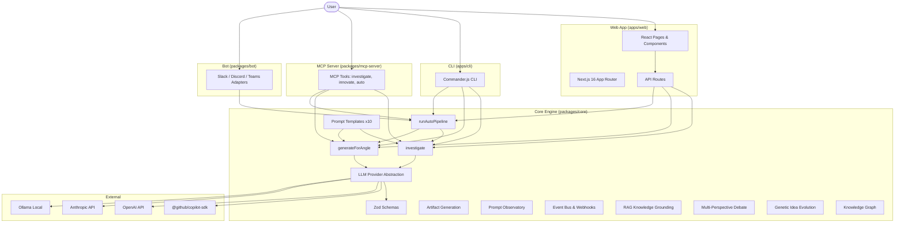
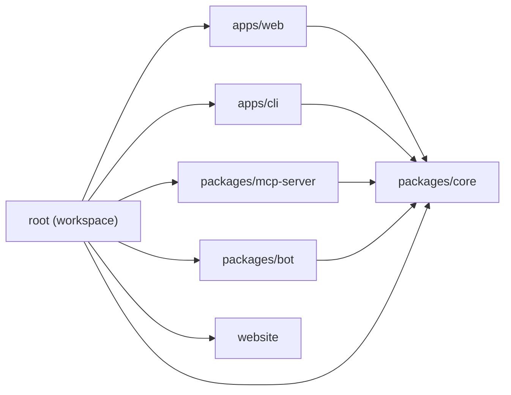

# Architecture

This page explains the technical architecture, key design decisions, and data flow of Innovator.

## System Overview



## Monorepo Structure

### Workspace Dependency Graph



The project uses **npm workspaces** with four packages:

| Package               | Purpose                                 | Dependencies                                   |
| --------------------- | --------------------------------------- | ---------------------------------------------- |
| `packages/core`       | Shared innovation engine                | `@github/copilot-sdk`, `zod`                   |
| `packages/mcp-server` | MCP server for AI tool integration      | `@innovator/core`, `@modelcontextprotocol/sdk` |
| `packages/bot`        | Chat platform bot (Slack/Discord/Teams) | `@innovator/core`                              |
| `apps/web`            | Next.js web application                 | `@innovator/core`, `next`, `react`, `zod`      |
| `apps/cli`            | Command-line interface                  | `@innovator/core`, `commander`, `chalk`, `ora` |

The core package is built with `tsc` and consumed by both apps. The web app uses `transpilePackages` in `next.config.ts` for seamless workspace resolution.

### Dependency Rules

The npm workspaces setup enforces an implicit dependency hierarchy:

- **`packages/core` must remain app-agnostic** — it must not depend on any app package (`apps/web`, `apps/cli`). It contains only the shared innovation engine, types, and Copilot SDK integration.
- **`apps/web` and `apps/cli` depend on `packages/core`** — they import types, functions, and constants from the core package.
- **Client components** (`"use client"`) must import from `@innovator/core/types` (browser-safe, no Node.js dependencies).
- **Server components and API routes** can import from `@innovator/core` (full API including Node.js-only Copilot SDK).

Violating these rules will cause build failures — for example, importing `@innovator/core` in a client component pulls in Node.js dependencies that don't exist in the browser.

## LLM Provider Abstraction

Innovator supports multiple LLM providers through a unified `LLMProvider` interface (`packages/core/src/providers/`). Each provider implements `generateText()`, `generateStream()`, and `listModels()`.

| Provider      | Env Variable        | Default                  | Notes                           |
| ------------- | ------------------- | ------------------------ | ------------------------------- |
| **Copilot**   | _(none, uses `gh`)_ | —                        | Default provider via GitHub CLI |
| **OpenAI**    | `OPENAI_API_KEY`    | —                        | Direct OpenAI API access        |
| **Anthropic** | `ANTHROPIC_API_KEY` | —                        | Direct Anthropic API access     |
| **Ollama**    | `OLLAMA_BASE_URL`   | `http://localhost:11434` | Local LLM inference             |

The Copilot provider is the default and requires no API keys — it uses the authenticated GitHub CLI (`gh auth login`). Alternative providers are available for environments without Copilot access.

## MCP Server

The MCP (Model Context Protocol) server (`packages/mcp-server/`) exposes Innovator as tools for AI clients.

```
AI Client (Claude Desktop / Cursor / VS Code)
  ↕ stdio or SSE
MCP Server → @innovator/core → LLM Provider → LLM
```

**Architecture:**

- `src/index.ts` — Server entry point, transport selection (stdio default, SSE via `--sse`)
- `src/handlers.ts` — Tool implementations wrapping core functions (`handleInvestigate`, `handleGenerate`, `handleAutoPipeline`)
- `src/schemas.ts` — Zod validation schemas for tool inputs

**Exposed tools:** `investigate`, `innovate`, `auto`

## Bot

The bot package (`packages/bot/`) connects Innovator to chat platforms via platform adapters.

```
Chat Platform (Slack / Discord / Teams)
  ↕ platform SDK
Bot Adapter → InnovatorBot → @innovator/core → LLM Provider → LLM
```

Users send `/innovate <subject>` and receive streamed progress updates and a final innovation report.

## Advanced Core Modules

The core engine includes several advanced modules beyond the base pipeline:

| Module                                | Purpose                                                                 |
| ------------------------------------- | ----------------------------------------------------------------------- |
| `packages/core/src/artifacts/`        | Structured artifact generation (PRD, tech spec, user story, pitch, OKR) |
| `packages/core/src/observatory/`      | Prompt capture, token tracking, quality scoring, A/B comparison         |
| `packages/core/src/events/`           | Event bus (pub/sub) and webhook delivery                                |
| `packages/core/src/rag/`              | RAG knowledge grounding                                                 |
| `packages/core/src/debate/`           | Multi-perspective structured debate                                     |
| `packages/core/src/evolution/`        | Genetic-algorithm idea evolution                                        |
| `packages/core/src/knowledge-graph/`  | Persistent concept knowledge graph                                      |
| `packages/core/src/collaboration/`    | Collaborative sessions with voting and commenting                       |
| `packages/core/src/research/`         | Deep research agent for extended investigations                         |
| `packages/core/src/pipeline-builder/` | Natural language pipeline builder                                       |
| `packages/core/src/analytics/`        | Innovation analytics and insights                                       |
| `packages/core/src/cost/`             | LLM cost tracking and budget management                                 |

## Copilot SDK Client

The client is a **singleton with promise caching**:

```
First call:   Creates CopilotClient → starts → caches Promise
Second call:  Returns cached Promise (already resolved)
Failed start: Clears cache → next call retries
Shutdown:     Awaits Promise → stops client → clears cache
```

This prevents race conditions when multiple API requests arrive simultaneously during cold start.

### Permission Model

Two permission handlers exist:

- **`approveAll`** — used by the CLI (user is present and in control)
- **`serverPermissionHandler`** — used by API routes (only allows `read`, denies `shell`/`write`/`custom-tool`)

## Prompt Architecture

Each prompt template follows a composition pattern:

```
[System role] + [Investigation context] + [Angle-specific instructions] + [JSON output schema]
```

The **investigation context** is shared across all angles via a helper function, ensuring consistent grounding. Each angle then adds its unique creative framework.

All prompts request **JSON-only output** with a specified schema. The response is parsed using a **brace-balanced extractor** (not regex) that handles:

- Raw JSON responses
- JSON wrapped in markdown fenced blocks
- JSON with trailing text or commentary

Extracted JSON is then validated with **Zod schemas** for runtime type safety.

## Concurrency Model

The pipeline uses **bounded concurrency** with a pool of 2:

```mermaid
gantt
    title Auto Mode Timeline (8 angles, concurrency=2)
    dateFormat X
    axisFormat %s

    section Pipeline
    Investigate       :0, 1
    Angle 1 + 2       :1, 2
    Angle 3 + 4       :2, 3
    Angle 5 + 6       :3, 4
    Angle 7 + 8       :4, 5
    Synthesize        :5, 6
```



The `runWithConcurrency` function:

1. Launches tasks up to the concurrency limit
2. Waits for any task to finish before starting the next
3. Stores results by index to preserve **input order**
4. On failure, waits for all in-flight tasks to settle before throwing
5. Collects all errors and reports them together

## SSE Streaming (Auto Mode)

The `/api/auto` route uses `ReadableStream` with Server-Sent Events:

```
Client ←── SSE ←── ReadableStream ←── Pipeline.onProgress()
```

Safety guards:

- A `streamClosed` flag prevents writes after `controller.close()`
- The `cancel()` callback sets the flag when the client disconnects
- All `controller.enqueue()` calls are wrapped in try/catch
- The client detects premature EOF and shows a retry message

## Stateless Design

V1 is deliberately **stateless** — no database, no sessions, no persistence. All state lives in:

- The browser (React state during a session)
- The terminal (CLI output)

This simplifies deployment (no database to provision) but means results are lost when you close the browser tab. Persistence is planned for v2.

## Validation & Schemas

Innovator uses [Zod](https://zod.dev/) for runtime validation throughout the core library. This provides type-safe validation of LLM outputs, API inputs, configuration, and plugin data — catching malformed data at runtime rather than relying solely on compile-time types.

### Schema strategy

Every data structure that crosses a trust boundary has a corresponding Zod schema:

| Boundary                     | What's validated                                      | Example schema                                  |
| ---------------------------- | ----------------------------------------------------- | ----------------------------------------------- |
| **LLM output → application** | Parsed JSON from model responses                      | `InvestigationSchema`, `AngleResultSchema`      |
| **API request → handler**    | Request bodies from clients                           | `InvestigateRequestSchema`, `AutoRequestSchema` |
| **Plugin → registry**        | Plugin definitions and custom angles                  | `CustomAngleSchema`, `AnglePackSchema`          |
| **Config → runtime**         | Voice config, budget config, workspace settings       | `VoiceConfigSchema`, `TokenUsageSchema`         |
| **File → application**       | Persisted data loaded from disk (workspaces, presets) | `WorkspaceMemberSchema`, `ActivityEventSchema`  |

### How schemas map to types

Each schema has a corresponding TypeScript type derived via `z.infer<>`:

```typescript
// Schema definition (runtime validation)
export const TokenUsageSchema = z.object({
  id: z.string(),
  model: z.string(),
  inputTokens: z.number().int().nonnegative(),
  outputTokens: z.number().int().nonnegative(),
  costUsd: z.number().nonnegative(),
  latencyMs: z.number().nonnegative(),
  stage: z.string(),
  timestamp: z.string(),
});

// Type derived from schema (compile-time safety)
export type TokenUsage = z.infer<typeof TokenUsageSchema>;
```

This pattern ensures the runtime validation and compile-time types never drift apart. When you change a schema, the type updates automatically.

### Where schemas live

- **Core types** — `packages/core/src/types.ts` contains shared schemas and interfaces (plugin types, API payloads, angle definitions)
- **Module-specific** — Each module defines its own schemas alongside the code that uses them (e.g., `cost/types.ts`, `voice/index.ts`, `workspaces/index.ts`)

### Extending schemas for plugins

When building a plugin or custom integration, follow the same pattern:

```typescript
import { z } from "zod";

// Define your schema
const MyPluginConfigSchema = z.object({
  apiEndpoint: z.string().url(),
  maxResults: z.number().int().min(1).max(100).default(10),
  tags: z.array(z.string().max(50)).max(20).optional(),
});

// Derive the type
type MyPluginConfig = z.infer<typeof MyPluginConfigSchema>;

// Validate at runtime
function configure(raw: unknown): MyPluginConfig {
  return MyPluginConfigSchema.parse(raw);
}
```

For custom angles, use the built-in `CustomAngleSchema` which enforces ID format (`^[a-z0-9-]+$`), length limits, and required fields:

```typescript
import { CustomAngleSchema } from "@innovator/core/types";

// Validates at runtime — throws ZodError if invalid
const angle = CustomAngleSchema.parse({
  id: "my-angle",
  name: "My Angle",
  description: "A custom innovation angle",
  promptTemplate: "...",
});
```

### Validation conventions

- **Parse, don't validate** — Use `schema.parse(data)` to both validate and return typed data
- **Fail fast** — Validate at the boundary (API handler, plugin registration, file load) rather than deep in business logic
- **Descriptive constraints** — Use `.min()`, `.max()`, `.regex()` with clear limits rather than bare `.string()`
- **Defaults** — Use `.default()` for optional fields with sensible fallbacks (e.g., `speechRate: z.number().default(1.0)`)
