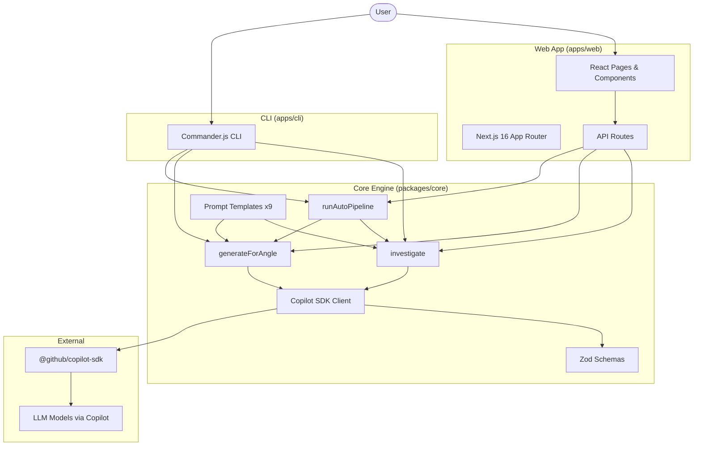
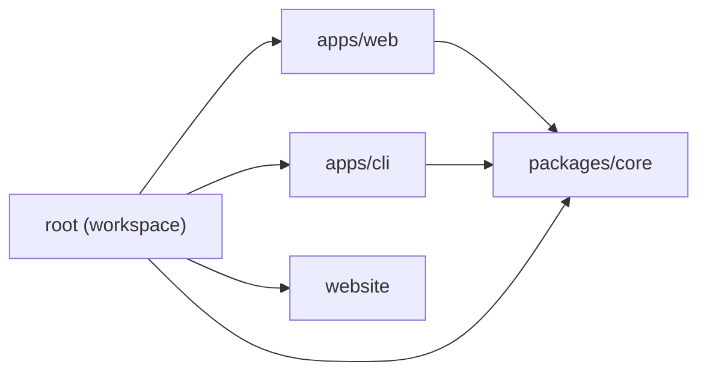

# Architecture

This page explains the technical architecture, key design decisions, and data flow of Innovator.

## System Overview



## Monorepo Structure

### Workspace Dependency Graph



The project uses **npm workspaces** with three packages:

| Package         | Purpose                  | Dependencies                                   |
| --------------- | ------------------------ | ---------------------------------------------- |
| `packages/core` | Shared innovation engine | `@github/copilot-sdk`, `zod`                   |
| `apps/web`      | Next.js web application  | `@innovator/core`, `next`, `react`, `zod`      |
| `apps/cli`      | Command-line interface   | `@innovator/core`, `commander`, `chalk`, `ora` |

The core package is built with `tsc` and consumed by both apps. The web app uses `transpilePackages` in `next.config.ts` for seamless workspace resolution.

## Copilot SDK Client

The client is a **singleton with promise caching**:

```
First call:   Creates CopilotClient → starts → caches Promise
Second call:  Returns cached Promise (already resolved)
Failed start: Clears cache → next call retries
Shutdown:     Awaits Promise → stops client → clears cache
```

This prevents race conditions when multiple API requests arrive simultaneously during cold start.

### Permission Model

Two permission handlers exist:

- **`approveAll`** — used by the CLI (user is present and in control)
- **`serverPermissionHandler`** — used by API routes (only allows `read`, denies `shell`/`write`/`custom-tool`)

## Prompt Architecture

Each prompt template follows a composition pattern:

```
[System role] + [Investigation context] + [Angle-specific instructions] + [JSON output schema]
```

The **investigation context** is shared across all angles via a helper function, ensuring consistent grounding. Each angle then adds its unique creative framework.

All prompts request **JSON-only output** with a specified schema. The response is parsed using a **brace-balanced extractor** (not regex) that handles:

- Raw JSON responses
- JSON wrapped in markdown fenced blocks
- JSON with trailing text or commentary

Extracted JSON is then validated with **Zod schemas** for runtime type safety.

## Concurrency Model

The pipeline uses **bounded concurrency** with a pool of 2:

```mermaid
gantt
    title Auto Mode Timeline (8 angles, concurrency=2)
    dateFormat X
    axisFormat %s

    section Pipeline
    Investigate       :0, 1
    Angle 1 + 2       :1, 2
    Angle 3 + 4       :2, 3
    Angle 5 + 6       :3, 4
    Angle 7 + 8       :4, 5
    Synthesize        :5, 6
```



The `runWithConcurrency` function:

1. Launches tasks up to the concurrency limit
2. Waits for any task to finish before starting the next
3. Stores results by index to preserve **input order**
4. On failure, waits for all in-flight tasks to settle before throwing
5. Collects all errors and reports them together

## SSE Streaming (Auto Mode)

The `/api/auto` route uses `ReadableStream` with Server-Sent Events:

```
Client ←── SSE ←── ReadableStream ←── Pipeline.onProgress()
```

Safety guards:

- A `streamClosed` flag prevents writes after `controller.close()`
- The `cancel()` callback sets the flag when the client disconnects
- All `controller.enqueue()` calls are wrapped in try/catch
- The client detects premature EOF and shows a retry message

## Stateless Design

V1 is deliberately **stateless** — no database, no sessions, no persistence. All state lives in:

- The browser (React state during a session)
- The terminal (CLI output)

This simplifies deployment (no database to provision) but means results are lost when you close the browser tab. Persistence is planned for v2.
