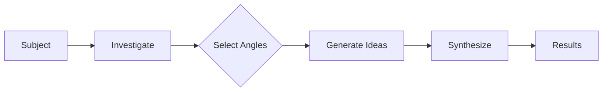
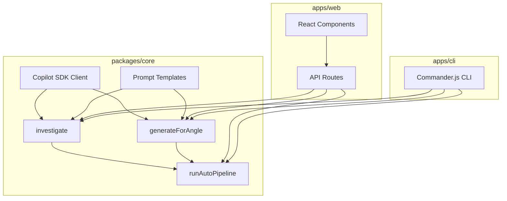

# Core Concepts

Understanding the mental model behind Innovator will help you get the most out of it.

## The Innovation Pipeline

Every innovation session follows a three-stage pipeline:



### Stage 1: Investigation

You provide a **subject** — any topic, technology, product, or process. The AI analyzes it and returns a structured investigation:

| Field             | Description                                |
| ----------------- | ------------------------------------------ |
| **Summary**       | A concise 2-3 sentence overview            |
| **Key Aspects**   | 4-6 important components or dimensions     |
| **Current State** | What the state of the art looks like today |
| **Challenges**    | 3-5 main pain points or obstacles          |
| **Opportunities** | 3-5 areas ripe for innovation              |

This investigation becomes the **shared context** for all subsequent angle prompts.

### Stage 2: Angle Selection

You choose which **innovation angles** to apply. Each angle is a proven creative framework that forces thinking in a specific direction.

### Stage 3: Generation & Synthesis

Each selected angle receives the investigation context and generates 3-5 **specific, actionable ideas**. In Auto Mode, a final **synthesis** step cross-references all ideas, identifies themes, and ranks by feasibility.

## Innovation Angles

Innovator ships with 8 built-in angles:

### 🔄 SCAMPER

The classic brainstorming acronym: **S**ubstitute, **C**ombine, **A**dapt, **M**odify, **P**ut to other use, **E**liminate, **R**everse. Each letter forces a different transformation on the subject.

### 🧱 First Principles

Strip away all assumptions and conventions. Decompose the subject to fundamental truths, then rebuild novel solutions from scratch. Inspired by Elon Musk's reasoning approach.

### 🌐 Cross-Domain Analogy

Map concepts from completely unrelated fields — biology, music, architecture, sports, cooking — onto your subject. The most unexpected analogies often produce the most innovative ideas.

### 🔒 Constraint Injection

Add provocative constraints: "What if the budget were $0?", "What if a 10-year-old had to use it?", "What if it had to work offline?" Constraints force creative breakthroughs.

### 🔃 Problem Inversion

Flip the problem: "How would you make this fail?" Analyze each failure mode, then reverse the insights into innovations. The contrast reveals hidden opportunities.

### 👥 Role-Based Perspectives

View the subject through different lenses: end user, competitor, child, historian, sci-fi author, regulator. Each perspective reveals insights invisible from your default viewpoint.

### 💭 What-If Scenarios

Push boundaries with hypotheticals: "What if this had to scale to 1 billion users?", "What if the primary technology disappeared?" Extremes force fundamentally different thinking.

### ⚡ Trend Collision

Combine the subject with emerging trends: AI/LLMs, spatial computing, sustainability, decentralization, biotech, edge computing. Not just "add AI" — genuine novel combinations.

## Idea Structure

Every generated idea includes four fields:

```typescript
interface InnovationIdea {
  title: string; // Short, descriptive name
  description: string; // Full explanation of the idea
  potentialImpact: string; // What difference it could make
  implementationHint: string; // How to begin implementing it
}
```

## Auto Mode Synthesis

When Auto Mode runs all angles, the synthesis step produces:

- **Top 5-7 Ideas** — ranked by feasibility (low/medium/high) with source angle attribution
- **Cross-Cutting Themes** — patterns that emerged across multiple angles
- **Strategic Recommendation** — an actionable summary of where to focus

## Architecture



The **core** package is the shared engine. Both the web app and CLI are thin adapters that call into it.

## Runtime Validation

LLM responses are inherently unstructured text. Innovator uses [Zod](https://zod.dev/) schemas to validate and parse the JSON output from the LLM before it reaches consumers. If the LLM returns malformed or unexpected data, validation fails fast with a descriptive error instead of propagating bad data downstream.

Four schemas are exported from `@innovator/core`:

| Schema                 | Validates                                             |
| ---------------------- | ----------------------------------------------------- |
| `InvestigationSchema`  | Investigation results (summary, aspects, challenges…) |
| `InnovationIdeaSchema` | A single idea (title, description, impact, hint)      |
| `AngleResultSchema`    | One angle's output (ideas array + reasoning)          |
| `SynthesisSchema`      | Final synthesis (top ideas, themes, recommendation)   |

Each schema enforces field presence, types, and maximum string lengths to guard against oversized or malformed LLM output. The corresponding TypeScript types (`Investigation`, `InnovationIdea`, `AngleResult`, `Synthesis`) are inferred directly from these schemas via `z.infer`, so runtime validation and compile-time types are always in sync.

## Beyond the Pipeline

The three-stage pipeline and 8 angles form the foundation, but Innovator includes several advanced systems that extend the core workflow.

### Workspaces & Collaboration

Multiple users can innovate together in real time through **collaborative sessions**. A host creates a session, shares a join code, and participants submit ideas, vote, and comment. Angles can be assigned to specific participants so the team covers different creative perspectives in parallel. When the session completes, ideas can be merged and exported.

Key concepts:

- **Session** — a shared workspace scoped to a single subject.
- **Participants** — users who join via a share code.
- **Voting & Comments** — lightweight prioritisation within the session.
- **Merge** — combine overlapping ideas from different participants into one.

### Memory & Learning System

Innovator can learn from your behaviour over time. The **memory system** records signals — which angles you select, which ideas you act on, which subjects you return to — and builds a **preference profile**. Future sessions use this profile to surface more relevant ideas.

Key concepts:

- **User Signals** — discrete events such as `angle_selected`, `idea_bookmarked`, or `session_completed`.
- **Preference Profile** — an aggregated view of angle affinity, topic interests, and engagement patterns.
- **A/B Testing** — the system can split users into `adapted` vs. `default` variants to measure whether personalisation improves outcomes.

### Innovation Sprints

For structured, multi-phase innovation work, **sprints** organise ideas through three phases:

| Phase        | Purpose                                     |
| ------------ | ------------------------------------------- |
| **Diverge**  | Generate as many ideas as possible          |
| **Converge** | Evaluate, score, and shortlist ideas        |
| **Refine**   | Deepen the best ideas into actionable plans |

Sprints are persistent — they can be paused, resumed, and reviewed later. A retrospective can be generated at the end to capture learnings.

### Portfolio Tracking

The **portfolio** tracks ideas across their full lifecycle: `ideation` → `evaluation` → `prototyping` → `shipped` (or `abandoned`). Each transition is recorded with timestamps, reasons, and optional user attribution.

Portfolio metrics include:

- **Conversion rates** between stages (e.g. ideation → evaluation).
- **Average time in stage** to identify bottlenecks.
- **Velocity** — ideas created per week.
- **Insights** — automated analysis that flags strengths, warnings, and opportunities.

### Compliance & IP Screening

Before pursuing an idea, the **compliance module** can screen it for potential intellectual property conflicts and regulatory constraints. Ideas are checked against a database of industry-specific regulations (healthcare, finance, etc.) and the results include risk levels and recommended next steps.

### Voice Interaction

Innovator supports **voice-driven workflows**. Users can speak commands like _"investigate solar energy"_ or _"next angle"_, and the system parses them into actions. Results can be narrated back via text-to-speech. Speech-to-text and text-to-speech providers are pluggable.

Built-in voice commands: `investigate`, `next-angle`, `previous-angle`, `score-this`, `refine`, `export`, `summarize`, `stop`, `help`.

### Plugin System

The **plugin registry** lets you extend Innovator with custom functionality. Three plugin types are supported:

| Type           | What it adds                                      |
| -------------- | ------------------------------------------------- |
| **Angle**      | A new innovation angle with a custom prompt       |
| **Exporter**   | A new export format (beyond Markdown/JSON/GitHub) |
| **Visualizer** | A custom visualisation for idea data              |

Plugins can be registered programmatically or loaded from external sources.

### Market Signals

The **market signals** module enriches innovation sessions with real-world data. Pluggable providers fetch signals from sources like Product Hunt, Hacker News, Google Trends, arXiv, and patent filings. The resulting signal report is injected into prompts to ground ideas in current market context.

### Dependency Graphs

After generating ideas across multiple angles, the **dependency graph** module analyses relationships between them. It identifies which ideas depend on, enable, or conflict with each other, producing a directed graph that helps prioritise implementation order.

### Angle Chaining

**Chains** run angles in a defined sequence where each angle's output feeds into the next. Built-in chains include:

| Chain                    | Angles in sequence                            |
| ------------------------ | --------------------------------------------- |
| **Deep Disruption**      | First Principles → Inversion → Constraints    |
| **Practical Innovation** | SCAMPER → Perspectives → What-If              |
| **Market Entry**         | Cross-Domain → Trend Collision → Perspectives |
| **Contrarian Path**      | Inversion → Constraints → First Principles    |
| **Full Spectrum**        | All 8 angles in optimised order               |

### Custom Angles

Beyond the 8 built-in angles, you can **create custom angles** with your own prompt templates. Custom angles are registered via the API and appear alongside built-in angles in the UI and CLI. They can be scoped to specific domains and tagged for discoverability.

### Ontology

The **ontology module** extracts entity-relationship graphs and taxonomies from investigations, enabling cross-investigation knowledge accumulation. Unlike the knowledge-graph module (which focuses on idea connections), ontology operates on the investigation text itself, identifying concepts, technologies, organizations, trends, and the relationships between them.

Key concepts:

- **Entities** — typed nodes (concept, technology, organization, person, market, regulation, trend, product) with attributes.
- **Relationships** — directed edges between entities with strength scores describing how strongly two entities are related.
- **Taxonomies** — hierarchical classification trees built from extracted entities.
- **Versioned Graphs** — each extraction is versioned, and ontologies from different investigations can be merged.

When a prior ontology exists for a subject, it is injected into the investigation prompt via `buildInvestigationPrompt`, enriching subsequent investigations with accumulated knowledge.

#### Ontology API

| Function                   | Description                                              |
| -------------------------- | -------------------------------------------------------- |
| `extractOntology`          | Extract an ontology graph from investigation text        |
| `getOntology`              | Retrieve a stored ontology by subject                    |
| `listOntologies`           | List all stored ontology subjects                        |
| `queryEntities`            | Query entities across all ontologies, optionally by type |
| `buildInvestigationPrompt` | Build an enriched prompt using a prior ontology          |
| `clearOntologies`          | Clear all stored ontologies                              |

The ontology module is architecturally distinct from the [knowledge-graph](#dependency-graphs) module: ontology operates on investigation text to extract domain knowledge, while the knowledge graph focuses on relationships between generated ideas.

### Decision Packets

The **decision module** generates executive-ready decision documents from pipeline results. A decision packet consolidates the investigation and synthesis into a structured format suitable for leadership review.

Each packet includes:

- **Options Matrix** — ranked alternatives with pros, cons, and confidence scores.
- **Risk Assessment** — identified risks with likelihood, impact, and mitigation strategies.
- **Resource Asks** — estimated resources, timeline, and budget for each option.
- **Success Criteria** — measurable outcomes for tracking progress.

Decision packets can be exported to Markdown or Google Slides JSON format via `decisionPacketToMarkdown` and `decisionPacketToSlidesJson`.

### Hypothesis-Driven Innovation

The **hypothesis module** provides an alternative workflow to the standard angle-based pipeline. Instead of divergent brainstorming, you start with a specific hypothesis and subject it to rigorous analysis.

Key concepts:

- **Parsed Hypothesis** — the hypothesis text is decomposed into structured components (claim, assumptions, variables).
- **Experiment Cards** — generated designs for testing the hypothesis, with metrics and success criteria.
- **Counter-Evidence** — the LLM actively searches for evidence that contradicts the hypothesis.
- **Alternative Hypotheses** — related but different hypotheses the LLM generates.
- **Pivot Suggestions** — if the hypothesis is invalidated, the module suggests pivot directions.
- **Sessions** — hypotheses are tracked through a lifecycle: `draft` → `analyzing` → `analyzed` → `testing` → `validated` / `invalidated` / `pivoted`.

See the [Hypothesis Guide](/docs/guides/hypothesis) for workflow examples.

### Playbook Generation

The **playbook module** generates polished innovation documents from pipeline results. A playbook is a comprehensive, presentation-ready artifact that packages the entire innovation session into an actionable format.

Each playbook includes:

- **Executive Summary** — a high-level overview suitable for stakeholders.
- **Implementation Roadmap** — a phased plan (typically 3–4 phases) with activities and deliverables per phase.
- **Risk Assessment** — identified risks with likelihood/impact matrices and mitigation strategies.
- **Next Steps** — immediate action items to move forward.

Playbooks can be rendered as Markdown or styled HTML via `generatePlaybook` or directly from pipeline results via `generatePlaybookFromPipeline`.

See the [Playbook Guide](/docs/guides/playbook) for usage details.

### Genealogy

The **genealogy module** tracks how ideas evolve across multiple investigation runs on the same subject. When you re-investigate a topic, genealogy compares the new results against previous runs and classifies each idea:

| Status        | Description                                             |
| ------------- | ------------------------------------------------------- |
| **Net-new**   | Idea has low similarity to any previous idea            |
| **Evolved**   | Same core idea but with meaningful changes              |
| **Converged** | Multiple angles now produce similar ideas (convergence) |
| **Extinct**   | A previously generated idea no longer appears           |

Similarity is computed via embeddings, and the result includes diff details showing what changed between runs.

### Angle Learning

The **angle-learning module** tracks how effective each angle is and adapts weights over time. It records user events — exports, ratings, dwell-time, selections, dismissals, bookmarks, and shares — and uses them to compute per-angle quality scores.

Key concepts:

- **Event Recording** — every user interaction with an angle's output is recorded as an event.
- **Effectiveness Scoring** — a quality score (0–100) is computed for each angle, with trend direction (improving, declining, stable).
- **Domain Affinity** — a matrix maps which angles perform best in which domains.
- **A/B Testing** — sessions can be assigned to `tuned` (weight-adapted) or `default` variants to measure whether personalisation improves outcomes.
- **Weighted Angles** — `getWeightedAngles` returns recommended angle weights based on accumulated data.

See the [Angle Learning A/B Testing](#angle-learning-ab-testing) section below for details on the A/B testing system.

### Confidence

The **confidence module** scores investigation quality before ideas are generated, acting as a quality gate. It evaluates the investigation across five dimensions:

| Dimension           | What it measures                                 |
| ------------------- | ------------------------------------------------ |
| **Specificity**     | How concrete and specific the investigation is   |
| **Domain Coverage** | How thoroughly the domain is explored            |
| **Recency**         | Whether the information reflects current state   |
| **Actionability**   | Whether the findings lead to actionable insights |
| **Depth**           | How deeply the subject is analyzed               |

The overall score (0–100) is accompanied by identified **knowledge gaps** — topics that should be investigated further, with importance levels and suggestions. Use `meetsConfidenceThreshold` to gate the pipeline on investigation quality.

## Angle Learning A/B Testing

The angle-learning module includes a built-in A/B testing system that measures whether personalised angle weights improve innovation outcomes compared to default weights.

### How It Works

1. **Variant Assignment** — each session is assigned to either the `tuned` variant (using learned weights) or the `default` variant (equal weights). Assignment is deterministic per session ID via `assignABVariant`.

2. **Event Collection** — as users interact with angle outputs (export, rate, bookmark, share, dismiss), events are recorded via `recordAngleEvent`. Each event includes the angle ID, event type, and optional metadata.

3. **Effectiveness Computation** — `computeAngleEffectiveness` aggregates events into a per-angle quality score (0–100) with a trend direction (improving, declining, stable). An optional domain parameter narrows the analysis.

4. **Weight Adaptation** — `getWeightedAngles` returns recommended angle weights based on accumulated effectiveness data. In `tuned` sessions, these weights influence angle selection and ordering.

5. **Results Comparison** — `getABTestResults` compares outcomes between `tuned` and `default` variants, showing whether personalisation improves ratings, exports, and engagement.

### API Reference

| Function                    | Description                                                       |
| --------------------------- | ----------------------------------------------------------------- |
| `recordAngleEvent`          | Record a user event (export, rating, dwell-time, selection, etc.) |
| `computeAngleEffectiveness` | Compute per-angle quality scores with trends                      |
| `getWeightedAngles`         | Get recommended angle weights, optionally filtered by domain      |
| `assignABVariant`           | Assign a session to `tuned` or `default` variant                  |
| `getABTestResults`          | Compare outcomes between A/B test variants                        |
| `getAngleEvents`            | Retrieve recorded events, optionally filtered by angle            |
| `buildAvoidanceHints`       | Generate hints for consistently low-performing angles             |

### Interpreting Results

Call `getABTestResults()` to see a comparison:

```typescript
import { getABTestResults } from "@innovator/core";

const results = getABTestResults();
// Compare tuned vs. default variant metrics:
// - Average rating per angle
// - Export rate
// - Engagement (dwell time, bookmarks, shares)
```

If the `tuned` variant consistently outperforms `default`, the learned weights are validated. If not, consider resetting learning data with `clearAngleLearning()` and adjusting the event recording strategy.

## Multi-Language Support (i18n)

Innovator supports generating investigations and innovations in multiple languages. The system detects the language of your input automatically and instructs the LLM to respond in that language.

### Supported Languages

| Code | Language   | Native Name |
| ---- | ---------- | ----------- |
| `en` | English    | English     |
| `es` | Spanish    | Español     |
| `ja` | Japanese   | 日本語      |
| `de` | German     | Deutsch     |
| `pt` | Portuguese | Português   |

### Language Detection

When you submit a subject, Innovator uses heuristic-based language detection:

- **Japanese** is detected via character sets (Hiragana, Katakana, CJK characters).
- **Spanish, German, and Portuguese** are detected via common word patterns and diacritical characters (e.g., `ñ`, `ü`, `ã`).
- **English** is the fallback when no strong signal is detected.

The detected language is applied to prompt templates so the LLM responds in the same language. JSON field names remain in English for programmatic compatibility — only values are localized.

### Using `--lang` in the CLI

You can explicitly set the output language with the `--lang` flag:

```bash
npx tsx apps/cli/src/index.ts investigate "energía solar" --lang es
npx tsx apps/cli/src/index.ts auto "再生可能エネルギー" --lang ja
```

If `--lang` is not specified, the language is auto-detected from the subject text.
