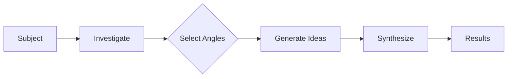
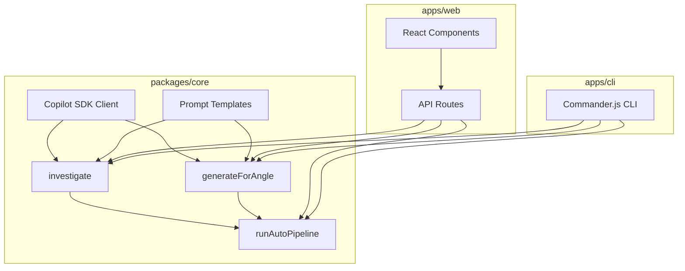

# Core Concepts

Understanding the mental model behind Innovator will help you get the most out of it.

## The Innovation Pipeline

Every innovation session follows a three-stage pipeline:



### Stage 1: Investigation

You provide a **subject** — any topic, technology, product, or process. The AI analyzes it and returns a structured investigation:

| Field | Description |
|-------|-------------|
| **Summary** | A concise 2-3 sentence overview |
| **Key Aspects** | 4-6 important components or dimensions |
| **Current State** | What the state of the art looks like today |
| **Challenges** | 3-5 main pain points or obstacles |
| **Opportunities** | 3-5 areas ripe for innovation |

This investigation becomes the **shared context** for all subsequent angle prompts.

### Stage 2: Angle Selection

You choose which **innovation angles** to apply. Each angle is a proven creative framework that forces thinking in a specific direction.

### Stage 3: Generation & Synthesis

Each selected angle receives the investigation context and generates 3-5 **specific, actionable ideas**. In Auto Mode, a final **synthesis** step cross-references all ideas, identifies themes, and ranks by feasibility.

## Innovation Angles

Innovator ships with 8 built-in angles:

### 🔄 SCAMPER
The classic brainstorming acronym: **S**ubstitute, **C**ombine, **A**dapt, **M**odify, **P**ut to other use, **E**liminate, **R**everse. Each letter forces a different transformation on the subject.

### 🧱 First Principles
Strip away all assumptions and conventions. Decompose the subject to fundamental truths, then rebuild novel solutions from scratch. Inspired by Elon Musk's reasoning approach.

### 🌐 Cross-Domain Analogy
Map concepts from completely unrelated fields — biology, music, architecture, sports, cooking — onto your subject. The most unexpected analogies often produce the most innovative ideas.

### 🔒 Constraint Injection
Add provocative constraints: "What if the budget were $0?", "What if a 10-year-old had to use it?", "What if it had to work offline?" Constraints force creative breakthroughs.

### 🔃 Problem Inversion
Flip the problem: "How would you make this fail?" Analyze each failure mode, then reverse the insights into innovations. The contrast reveals hidden opportunities.

### 👥 Role-Based Perspectives
View the subject through different lenses: end user, competitor, child, historian, sci-fi author, regulator. Each perspective reveals insights invisible from your default viewpoint.

### 💭 What-If Scenarios
Push boundaries with hypotheticals: "What if this had to scale to 1 billion users?", "What if the primary technology disappeared?" Extremes force fundamentally different thinking.

### ⚡ Trend Collision
Combine the subject with emerging trends: AI/LLMs, spatial computing, sustainability, decentralization, biotech, edge computing. Not just "add AI" — genuine novel combinations.

## Idea Structure

Every generated idea includes four fields:

```typescript
interface InnovationIdea {
  title: string;              // Short, descriptive name
  description: string;        // Full explanation of the idea
  potentialImpact: string;    // What difference it could make
  implementationHint: string; // How to begin implementing it
}
```

## Auto Mode Synthesis

When Auto Mode runs all angles, the synthesis step produces:

- **Top 5-7 Ideas** — ranked by feasibility (low/medium/high) with source angle attribution
- **Cross-Cutting Themes** — patterns that emerged across multiple angles
- **Strategic Recommendation** — an actionable summary of where to focus

## Architecture



The **core** package is the shared engine. Both the web app and CLI are thin adapters that call into it.
