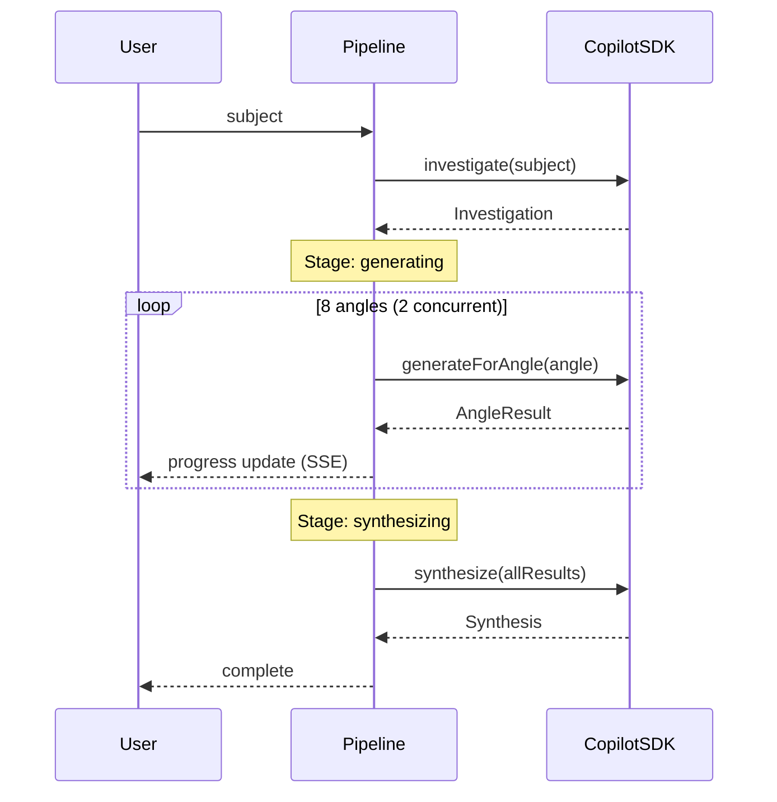

# Auto Mode

Auto Mode runs the complete innovation pipeline without manual intervention. It investigates your subject, applies all 8 angles, and synthesizes a strategic report.

## How it works



## Concurrency

Auto Mode runs **2 angles in parallel** to balance speed against LLM rate limits. Results are collected in the original angle order regardless of completion order.

This parallelism is controlled by the `MAX_CONCURRENCY` constant (exported from `@innovator/core/types`, default: `2`). Both the web API and CLI use this value to limit how many angles are processed simultaneously.

## Progress tracking

### Web App

The Auto Mode panel shows:

- Current pipeline stage with descriptive labels
- A progress bar (10% → 85% across angles → 90% for synthesis → 100%)
- The name of the angle currently being generated (via `currentAngle`)
- Green badges for completed angles
- Error messages with retry guidance

### Progress Event Fields

Each progress callback receives a `PipelineProgress` object. During the `generating` stage, the `currentAngle` field (`string | undefined`) indicates which angle is actively being generated. The web UI displays this to show real-time progress (e.g., "Generating: SCAMPER…"). The `failedAngles` field (`{ angleId: string; error: string }[] | undefined`) lists any angles that failed during generation — check this to detect partial failures.

### CLI

The CLI shows a spinner with real-time stage and count:

```
⠋ ⚡ Generating innovations... (5/8)
```

## Synthesis output

The synthesis step produces three outputs:

### Top Ideas (5-7)

Each idea is ranked with:

- **Feasibility**: low / medium / high
- **Source angle**: which framework generated it
- **Potential impact**: what difference it makes

### Cross-Cutting Themes (3-5)

Patterns that appeared across multiple angles — these are often the most valuable insights because they were independently validated.

### Strategic Recommendation

A single actionable paragraph summarizing where to focus first.

## Error handling

- If investigation fails, the pipeline stops immediately with a clear error
- If one angle fails, all in-flight angles are allowed to complete before the error is reported
- If synthesis fails, you still get the individual angle results
- In the web app, premature stream disconnection is detected and shown as a retry prompt
