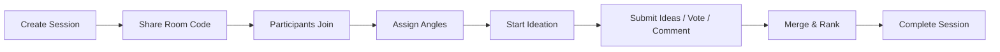

# Collaboration Sessions

Innovator supports real-time collaborative innovation sessions where multiple users brainstorm together on a shared subject. A host creates a session, shares a room code, and participants submit ideas, vote, comment, and merge overlapping ideas.

## Overview

A collaborative session follows this lifecycle:



## Setup

### Creating a Session

The host creates a session with a subject and their identity:

```typescript
import { createSession } from "@innovator/core";

const session = createSession("sustainable packaging solutions", "host-user-id", "Alice");

console.log(`Room code: ${session.roomCode}`);
// Share this code with participants
```

The returned session includes a unique `roomCode` that participants use to join.

### Joining a Session

Participants find the session by room code and join:

```typescript
import { findSessionByCode, joinSession } from "@innovator/core";

const session = findSessionByCode("ABC123");
if (session) {
  joinSession(session.id, "user-bob", "Bob");
}
```

### Assigning Angles

The host can assign specific innovation angles to participants so the team covers different creative perspectives in parallel:

```typescript
import { assignAngles } from "@innovator/core";

assignAngles(session.id, "user-bob", ["scamper", "constraints"]);
assignAngles(session.id, "user-carol", ["first-principles", "inversion"]);
```

## Usage

### Starting Ideation

Once participants have joined, the host starts the session:

```typescript
import { startSession } from "@innovator/core";

startSession(session.id, "host-user-id");
```

### Submitting Ideas

Participants submit ideas tagged with their assigned angle:

```typescript
import { submitIdea } from "@innovator/core";

submitIdea(
  session.id,
  "user-bob",
  "scamper",
  "Edible Packaging Film",
  "Replace plastic wrapping with edible seaweed-based film",
  "Eliminates waste entirely for single-use food packaging"
);
```

### Voting

Participants vote for ideas they find promising (one vote per user per idea):

```typescript
import { voteForIdea } from "@innovator/core";

voteForIdea(session.id, "idea-123", "user-carol");
```

### Commenting

Add comments to discuss or refine ideas:

```typescript
import { addComment } from "@innovator/core";

addComment(
  session.id,
  "idea-123",
  "user-carol",
  "Carol",
  "This could work well for snack foods — what about liquids?"
);
```

### Merging Ideas

When multiple participants generate overlapping ideas, merge them:

```typescript
import { mergeIdeas } from "@innovator/core";

mergeIdeas(
  session.id,
  ["idea-123", "idea-456"],
  "Bio-Degradable Smart Packaging",
  "Combine edible film with embedded freshness sensors",
  "host-user-id"
);
```

### Completing a Session

The host completes the session when ideation is finished:

```typescript
import { completeSession } from "@innovator/core";

completeSession(session.id, "host-user-id");
```

### Getting Ranked Results

Retrieve ideas sorted by vote count:

```typescript
import { getRankedIdeas } from "@innovator/core";

const ranked = getRankedIdeas(session.id);
ranked.forEach((idea, i) => {
  console.log(`${i + 1}. ${idea.title} (${idea.votes} votes)`);
});
```

## Events

Subscribe to real-time session events for building reactive UIs:

```typescript
import { onSessionEvent } from "@innovator/core";

onSessionEvent(session.id, (event) => {
  switch (event.type) {
    case "participant-joined":
      console.log(`${event.userId} joined`);
      break;
    case "idea-submitted":
      console.log(`New idea: ${event.ideaId}`);
      break;
    case "vote-cast":
      console.log(`Vote on ${event.ideaId}`);
      break;
  }
});
```

## API Reference

| Function            | Description                                     |
| ------------------- | ----------------------------------------------- |
| `createSession`     | Create a new collaborative session              |
| `findSessionByCode` | Look up a session by its room code              |
| `joinSession`       | Add a participant to a session                  |
| `leaveSession`      | Remove a participant from a session             |
| `assignAngles`      | Assign innovation angles to a participant       |
| `startSession`      | Begin the ideation phase (host only)            |
| `submitIdea`        | Submit an idea to the session                   |
| `voteForIdea`       | Cast a vote for an idea (one per user per idea) |
| `addComment`        | Add a comment to an idea                        |
| `mergeIdeas`        | Merge multiple overlapping ideas into one       |
| `completeSession`   | End the session (host only)                     |
| `getRankedIdeas`    | Get ideas sorted by vote count                  |
| `onSessionEvent`    | Subscribe to real-time session events           |

## Realtime Collaboration API

The realtime module provides a WebSocket-based transport layer for live collaboration. It handles room management, presence tracking, cursor synchronization, and live idea interactions.

### Getting the Room Manager

```typescript
import { getRealtimeManager } from "@innovator/core";

const manager = getRealtimeManager(); // Singleton instance
```

### Room Management

Rooms are created per collaborative session and automatically cleaned up when empty:

```typescript
// Create or get a room for a session
const room = manager.getOrCreateRoom("session-abc123");
console.log(`Room ID: ${room.id}`);

// Look up a room
const existing = manager.getRoom(room.id);

// Find which room a user is in
const userRoom = manager.getUserRoom("user-bob");
```

### Message Protocol

The realtime system uses a message-based protocol. Wire it to any WebSocket library (ws, Socket.io, Partykit):

```typescript
import type { RealtimeMessage, SendToUser, BroadcastToRoom } from "@innovator/core";

// Define transport callbacks
const sendToUser: SendToUser = (userId, message) => {
  // Send message to specific user's WebSocket connection
};

const broadcastToRoom: BroadcastToRoom = (roomId, message, excludeUserId?) => {
  // Broadcast to all users in room, optionally excluding sender
};

// Handle incoming messages
manager.handleMessage(incomingMessage, sendToUser, broadcastToRoom);

// Handle disconnects
manager.handleDisconnect("user-bob", broadcastToRoom);
```

### Message Types

| Type               | Direction       | Description                                |
| ------------------ | --------------- | ------------------------------------------ |
| `join`             | Client → Server | Join a room with display name              |
| `leave`            | Client → Server | Leave a room                               |
| `cursor_move`      | Client → Server | Update cursor position (`x`, `y`)          |
| `typing_start`     | Client → Server | Signal typing activity                     |
| `typing_stop`      | Client → Server | Signal typing stopped                      |
| `idea_submit`      | Client → Server | Submit an idea to the session              |
| `idea_vote`        | Client → Server | Vote for an idea                           |
| `idea_comment`     | Client → Server | Comment on an idea                         |
| `idea_merge`       | Client → Server | Merge overlapping ideas                    |
| `session_start`    | Client → Server | Start the ideation phase                   |
| `session_complete` | Client → Server | Complete the session                       |
| `angle_assign`     | Client → Server | Assign angles to a participant             |
| `presence_sync`    | Server → Client | Full presence state on join                |
| `presence_update`  | Server → Client | Presence change (join/leave/cursor/typing) |
| `broadcast`        | Server → Client | Collaborative event broadcast              |
| `ack`              | Server → Client | Message acknowledgment                     |
| `error`            | Server → Client | Error response                             |

### Presence Tracking

Get real-time presence information for a room:

```typescript
const users = manager.getPresence(room.id);
for (const user of users) {
  console.log(
    `${user.displayName}: cursor=(${user.cursor?.x}, ${user.cursor?.y}), typing=${user.isTyping}`
  );
}
```

### Types

```typescript
interface RealtimeUser {
  userId: string;
  displayName: string;
  connectedAt: string;
  cursor?: { x: number; y: number };
  isTyping: boolean;
  lastActivity: string;
}

interface RealtimeRoom {
  id: string;
  sessionId: string;
  users: Map<string, RealtimeUser>;
  createdAt: string;
}

interface RealtimeMessage {
  type: RealtimeMessageType;
  roomId: string;
  userId: string;
  payload: Record<string, unknown>;
  timestamp: string;
  messageId: string;
}
```
