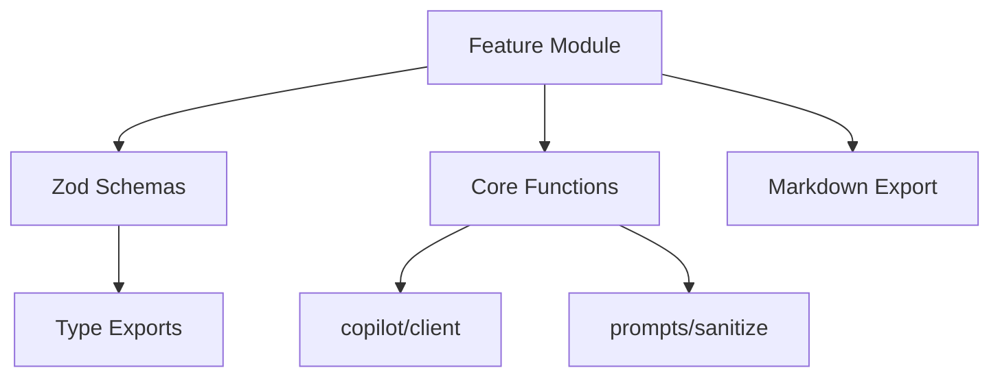

# Feature Module Catalog

Innovator ships with **135+ feature modules** in `@innovator/core`. This catalog organizes every module by category so you can discover capabilities and find the right tool for your workflow.

### Status Legend

| Icon | Status      | Description                                                   |
| ---- | ----------- | ------------------------------------------------------------- |
| ✅   | **Stable**  | Fully implemented, tested, and ready for production use       |
| 🚧   | **WIP**     | Work in progress — functional but may change or be incomplete |
| 📋   | **Planned** | Designed but not yet implemented                              |

> **Tip:** All modules are importable from `@innovator/core`. Some are also re-exported through higher-level APIs like the CLI, web app, and MCP server.

---

## Core Pipeline

The foundation of every innovation session.

| Module         | Description                                                                                                                       |
| -------------- | --------------------------------------------------------------------------------------------------------------------------------- |
| **innovation** | Pipeline orchestration — `investigate()`, `generateForAngle()`, `runAutoPipeline()`, and synthesis                                |
| **prompts**    | Prompt templates for each of the 8 innovation angles, plus sanitization and temporal/output modes                                 |
| **copilot**    | GitHub Copilot SDK client wrapper with singleton lifecycle, retry logic, and streaming                                            |
| **providers**  | LLM provider abstraction (Copilot, OpenAI, Anthropic, Ollama) with unified `generateText()` / `generateStream()` / `listModels()` |
| **types**      | Comprehensive Zod schemas and TypeScript types for the entire platform (50+ types)                                                |
| **depth**      | Investigation depth tiers (`shallow`, `standard`, `deep`) controlling LLM call count and token budget                             |
| **models**     | Model registry with capability metadata, comparison mode, and smart routing per pipeline stage                                    |

---

## Idea Quality & Evaluation

Tools for scoring, validating, and stress-testing generated ideas.

| Module               | Description                                                                                                                                      |
| -------------------- | ------------------------------------------------------------------------------------------------------------------------------------------------ |
| **scoring**          | AI-powered 4-axis scoring (feasibility, impact, novelty, time-to-implement) with priority matrix visualization                                   |
| **rubric**           | Custom Scoring Rubric Builder — define domain-specific evaluation dimensions beyond built-in axes                                                |
| **confidence**       | Investigation Confidence Scoring (0–100) based on specificity, domain coverage, recency; identifies knowledge gaps                               |
| **validation**       | Validates ideas against patent databases, market reports, competitor analysis, and technical feasibility checks                                  |
| **benchmark**        | Cross-model/angle quality comparison using LLM-as-judge with calibrated rubrics (diversity, specificity, actionability, novelty)                 |
| **quality-gate**     | Automatic LLM output quality checks — detects hallucinated statistics, self-contradictions, vague platitudes, and cross-angle duplication        |
| **redteam**          | Adversarial Red Team Mode — devil's advocate agent that attacks ideas to find fatal flaws, hidden assumptions, and edge cases                    |
| **stress-testing**   | Simulated scenario stress tests (regulatory change, market shift, tech breakthrough, economic downturn, competitor move) with resilience scoring |
| **bias-calibration** | Detects 8 cognitive biases from user patterns; auto-injects counter-prompts and builds bias dashboards                                           |

---

## Idea Refinement & Evolution

Mechanisms for iterating, combining, and improving ideas.

| Module            | Description                                                                                                                        |
| ----------------- | ---------------------------------------------------------------------------------------------------------------------------------- |
| **evolution**     | Genetic-algorithm idea evolution — mutation, crossover, and selection over generations                                             |
| **debate**        | Structured multi-perspective debate engine with configurable rounds and perspectives                                               |
| **negotiation**   | Interactive multi-turn negotiation dialogue (Opening → Interest Exploration → Option Generation → Criteria Evaluation → Agreement) |
| **consensus**     | Multi-model consensus — runs same angle across 2–3 LLMs, synthesizes agreements and novel divergences                              |
| **chaining**      | Angle chaining — compose multiple angles into a pipeline where output feeds as context into the next                               |
| **combinatorial** | Morphological analysis engine — combines ideas across angles to discover emergent innovations at intersections                     |
| **constraints**   | Constraint Satisfaction Optimizer — define hard/soft constraints, then re-rank and filter via structured LLM evaluation            |
| **deduplication** | Embedding-based idea deduplication and clustering with DBSCAN-like grouping and uniqueness scoring                                 |
| **enrichment**    | Evidence-based enrichment — auto-attach market data, competitive intelligence, and market sizing to each idea                      |
| **conversation**  | Iterative refinement via conversation mode with sliding-window token budget and session persistence                                |

---

## Analysis & Intelligence

Market research, competitive analysis, and pattern discovery.

| Module                   | Description                                                                                                                |
| ------------------------ | -------------------------------------------------------------------------------------------------------------------------- |
| **research**             | Deep research agent for extended, multi-step investigations                                                                |
| **competitive**          | Competitor analysis for differentiation strategies, gap identification, and flanking opportunities                         |
| **market-signals**       | Live market data integration (Product Hunt, Hacker News, arXiv, patents) via pluggable providers                           |
| **market-testing-arena** | Synthetic market tests — AI-generated personas (1000+) interact with ideas; segment adoption heatmaps, pricing sensitivity |
| **patent-scanner**       | Prior art detection and freedom-to-operate assessment using USPTO/EPO/WIPO databases                                       |
| **mining**               | Cross-investigation pattern mining with chi-squared and correlation analysis; AI-narrated insights                         |
| **process-mining**       | Alpha & Inductive mining algorithms on session data; bottleneck detection and process map visualization                    |
| **codebase-analysis**    | AST-based TypeScript/JavaScript analysis to extract patterns, dependencies, and auto-generate innovation subjects          |
| **inverse-decoder**      | Reverse-engineers successful products to reveal which innovation angles, prompts, and thinking patterns generated them     |
| **timing**               | Predictive Innovation Timing — analyzes market signals and tech maturity to predict optimal execution windows              |

---

## Simulation & Modeling

Forward-looking impact modeling and scenario planning.

| Module                   | Description                                                                                                    |
| ------------------------ | -------------------------------------------------------------------------------------------------------------- |
| **impact-simulator**     | 12-month rollout simulation with adoption curves, milestones, and Monte Carlo uncertainty modeling             |
| **diffusion-simulator**  | Bass diffusion + Monte Carlo for modeling idea spread through organizations and markets                        |
| **digital-twin**         | Virtual org model — simulate strategies against team capacity, budget, and competitive landscape               |
| **simulation**           | Stakeholder Reaction Simulation and Micro-Simulation for scenario modeling                                     |
| **wargaming**            | Competitive wargaming — adversarial LLM agents play competitor roles with move/counter-move sequences          |
| **regulatory-simulator** | Multi-jurisdiction regulatory simulation (EU AI Act, GDPR, HIPAA, CCPA, SOX, PCI DSS) across 15+ jurisdictions |

---

## Collaboration & Social

Multi-user, multi-team, and cross-org features.

| Module                   | Description                                                                                                                |
| ------------------------ | -------------------------------------------------------------------------------------------------------------------------- |
| **collaboration**        | Collaborative sessions with real-time voting, commenting, and team coordination                                            |
| **realtime**             | WebSocket-based real-time transport with room multiplexing, presence tracking, live voting, and typing indicators          |
| **workspaces**           | Team workspaces with shared history, member roles (`admin`, `contributor`, `viewer`), and activity tracking                |
| **social**               | Innovation social network — follow, like, share, trending, threaded discussions, and innovation stories                    |
| **idea-exchange**        | Cross-org innovation marketplace — publish, browse, license, and trade ideas with anonymization                            |
| **federation**           | Federated Innovation Networks — share anonymized patterns and cross-pollinate ideas across Innovator instances             |
| **cross-org-benchmark**  | Anonymous innovation metrics comparison across organizations                                                               |
| **team-dna**             | Team Innovation DNA Profiler — analyze innovation patterns, cognitive diversity index, and blind spots via Shannon entropy |
| **meeting-intelligence** | Extract innovation signals from Zoom/Teams/Google Meet transcripts; auto-create investigation subjects                     |
| **gallery**              | Community Gallery — browse, fork, remix shared investigations with upvoting, commenting, and trending                      |

---

## Lifecycle & Tracking

Managing ideas from spark to shipped.

| Module                  | Description                                                                                                                        |
| ----------------------- | ---------------------------------------------------------------------------------------------------------------------------------- |
| **lifecycle**           | Formal stage-gate process (Spark → Concept → Validated → Planned → In Progress → Shipped → Measured) with Kanban visualization     |
| **portfolio**           | Idea lifecycle management with conversion rates, velocity metrics, and angle effectiveness tracking                                |
| **portfolio-optimizer** | Markowitz portfolio theory applied to idea selection — efficient frontier computation via Monte Carlo                              |
| **tracker**             | Maps exported ideas to external issue trackers (GitHub Issues, Linear, Jira) and tracks status                                     |
| **outcome-tracking**    | ROI Dashboard — tracks ideas from generation through implementation to business outcome; computes ROI per angle, session, and team |
| **genealogy**           | Idea evolution tracking — classifies ideas as net-new, evolved, converged, or extinct across investigation runs                    |
| **versioning**          | Semantic Idea Version Control — immutable snapshots with branch/merge, parent-child relationships, and LLM-powered merge           |
| **provenance**          | Idea Provenance Chain — traces every idea to its originating prompt, model, angle config, and investigation context                |
| **retrospective**       | Auto-generates retrospectives after shipping; analyzes success patterns, failure modes, and velocity trends                        |
| **history**             | File-based session persistence in `~/.innovator/history/` with CRUD, full-text search, and filtering                               |

---

## Output & Visualization

Transforming results into consumable formats.

| Module                 | Description                                                                                                             |
| ---------------------- | ----------------------------------------------------------------------------------------------------------------------- |
| **artifacts**          | Structured artifact generation — PRD, tech spec, user story from innovation results                                     |
| **canvas**             | Spatial idea arrangement as nodes with edges, clusters, and annotations; includes layout algorithms and SVG export      |
| **visualization**      | Idea relationship graphs using keyword extraction and Jaccard similarity                                                |
| **nl-visualization**   | Natural language → D3.js visualization builder; describe charts in plain English                                        |
| **radar**              | Scheduled Innovation Radar — cron-based watch subjects with diff-based change detection and multi-channel alerts        |
| **export**             | Export pipeline results to various formats                                                                              |
| **sharing**            | Shareable investigation links with snapshot storage, read-only viewing, and forking                                     |
| **content-pipeline**   | Transforms ideas into blog posts, Twitter/X threads, LinkedIn articles, pitch decks, internal memos, and press releases |
| **decision**           | Executive Decision Packet generator with options matrix, recommendation, risk assessment, and resource requirements     |
| **digest**             | AI-generated periodic summaries via email, Slack, and RSS                                                               |
| **session-cinematics** | Auto-generates narrated video walkthrough scripts with scene descriptions, voiceover, and timing data                   |
| **audience**           | Audience-adaptive output — executive summary, technical spec, pitch deck, or research brief                             |
| **scaffolding**        | Idea-to-Code pipeline — generates repo structure, README, architecture diagrams, and issue breakdowns                   |
| **innovation-pr**      | Full automation: take top idea → generate code → create branch → open PR                                                |
| **widget**             | Embeddable `<innovator-widget>` web component for third-party sites                                                     |

---

## AI & ML Capabilities

Advanced AI features beyond the core pipeline.

| Module                     | Description                                                                                                                            |
| -------------------------- | -------------------------------------------------------------------------------------------------------------------------------------- |
| **adaptive-scaling**       | Dynamically adjusts depth, model selection, and angle count based on complexity, expertise, and budget (targets 70% cost reduction)    |
| **autonomous-agent**       | Long-running agentic loop that self-directs exploration, branches investigations, and delivers curated portfolios                      |
| **angle-learning**         | Tracks per-angle quality scores, trend analysis, and domain-angle affinity; modifies selection weights from historical data            |
| **recommendation**         | Context-aware smart angle selection using heuristic classification and historical feedback                                             |
| **embeddings**             | Lightweight semantic search using TF-IDF (no external deps); indexes documents for similarity, clustering, and cross-session discovery |
| **embedding-explorer**     | Projects ideas into 3D space via TF-IDF + dimensionality reduction; identifies innovation white spaces                                 |
| **knowledge-distillation** | Compresses expensive GPT-4/Claude patterns into smaller models (Ollama-compatible) with LoRA workflows and complexity-based routing    |
| **memory**                 | Tracks user signals (ratings, exports, time-on-idea) to build preference profiles for personalized prompt injection                    |
| **rag**                    | RAG knowledge grounding module for context injection                                                                                   |
| **context-manager**        | Adaptive Context Window Manager — smart prompt compression with relevance scoring and budget allocation per stage                      |
| **serendipity**            | Cross-session serendipity engine — surfaces unexpected connections between past investigations                                         |
| **flow-state**             | Monitors cognitive load during sessions; intervenes with perspective shifts, breaks, or automatic angle switches                       |

---

## Infrastructure & Platform

System-level capabilities for reliability, security, and scale.

| Module               | Description                                                                                                  |
| -------------------- | ------------------------------------------------------------------------------------------------------------ |
| **self-healing**     | Circuit breakers, automatic provider switching, adaptive prompt adjustment — targets 99.5% reliability       |
| **api-gateway**      | Usage tracking, billing tiers (`free`, `pro`, `enterprise`), API key management, rate limiting, and webhooks |
| **orchestration**    | Declarative YAML/JSON workflow configuration with plan/apply/drift engine                                    |
| **pipeline-builder** | Natural Language Pipeline Builder — describe custom pipelines in plain English                               |
| **workflow**         | Innovation Sprints as Code — YAML-defined workflows with stages, angle sets, filters, and synthesis rules    |
| **events**           | Event bus and webhook delivery system                                                                        |
| **rbac**             | Role-Based Access Control with granular permissions beyond workspace roles                                   |
| **privacy**          | Privacy-preserving collaboration using differential privacy and encrypted matching                           |
| **compliance**       | IP guard rails — pre-screens ideas against patents, trademarks, and regulatory constraints                   |
| **storage**          | Global storage provider abstraction (defaults to in-memory; pluggable)                                       |
| **offline**          | Offline / local-first mode — auto-detects Ollama instances, checks network state                             |
| **telemetry**        | Usage telemetry and analytics infrastructure                                                                 |

---

## Domain-Specific Modules

Vertical-specific capabilities and industry packs.

| Module              | Description                                                                                                                                     |
| ------------------- | ----------------------------------------------------------------------------------------------------------------------------------------------- |
| **verticals**       | Industry Vertical Packs (HealthTech, FinTech, EdTech, CleanTech, GovTech) with domain-specific angles, regulatory context, and validation rules |
| **knowledge-packs** | Curated knowledge bases per vertical — ontologies, regulatory context, trend databases, expert personas, and scoring rubrics                    |
| **climate**         | 12-dimension organizational innovation culture diagnostic with AI analysis, benchmarking, and intervention playbooks                            |
| **sustainability**  | Ethical & Sustainability Impact Assessment — ESG scoring with traffic-light indicators and improvement suggestions                              |
| **supply-chain**    | Innovation Supply Chain Mapper — maps technologies, skills, partnerships, and resources needed; build/buy/partner classification                |
| **github-health**   | Innovation health scoring for GitHub repos — architecture freshness, dependency staleness, contribution diversity, issue velocity               |
| **sprint**          | Guided multi-session innovation workflow: Day 1 (diverge) → Day 2 (converge) → Day 3 (refine)                                                   |

---

## Experimentation & Testing

Tools for prompt experimentation and A/B testing.

| Module               | Description                                                                                                            |
| -------------------- | ---------------------------------------------------------------------------------------------------------------------- |
| **prompt-lab**       | Prompt A/B Testing Lab — experiment framework with Welch's t-test, git-like prompt versioning, and auto-promotion      |
| **replay**           | Prompt replay & comparison — records exact prompts/parameters, replays with modifications, semantic similarity scoring |
| **observatory**      | Prompt inspection and debugging tools                                                                                  |
| **output-contracts** | Structured Output Contracts — define custom Zod schemas for downstream data conformance                                |

---

## Engagement & Gamification

Features for team engagement and learning.

| Module           | Description                                                                                                           |
| ---------------- | --------------------------------------------------------------------------------------------------------------------- |
| **gamification** | Achievements, time-boxed challenges, team leaderboards, and activity feeds (opt-in, configurable)                     |
| **curriculum**   | Auto-generated personalized learning paths based on Team DNA profile weaknesses; adaptive difficulty and skill badges |
| **rituals**      | Scheduled recurring innovation sessions with cadence, subject backlog, angle rotation, and digest generation          |
| **coaching**     | Innovation coaching and guidance features                                                                             |

---

## Capture & Input

Getting innovation subjects into the system.

| Module               | Description                                                                                                             |
| -------------------- | ----------------------------------------------------------------------------------------------------------------------- |
| **ambient-capture**  | Browser extension logic for local-first capture of innovation signals; topic grouping and auto-investigation drafts     |
| **mobile-companion** | Mobile-first companion — voice-to-investigation (Whisper), camera-to-subject (OCR), offline queue, swipeable idea cards |
| **extractors**       | Content extractors for URLs, files, and code repos with token-budget-aware summarization                                |
| **voice**            | Voice interaction capabilities                                                                                          |

---

## Plugin & Extension System

Extensibility and marketplace.

| Module           | Description                                                                                           |
| ---------------- | ----------------------------------------------------------------------------------------------------- |
| **plugins**      | Plugin system infrastructure — angle plugins, exporter plugins, visualizer plugins                    |
| **marketplace**  | Plugin Marketplace & Registry — discover, install, publish, and manage community plugins              |
| **extension**    | Copilot Extension development support                                                                 |
| **presets**      | Pre-configured pipeline presets                                                                       |
| **angle-studio** | Visual pipeline editor for custom angle sequences with drag-and-drop, validation, and cycle detection |

---

## Customization & Branding

White-labeling and theming capabilities.

| Module          | Description                                                                                                        |
| --------------- | ------------------------------------------------------------------------------------------------------------------ |
| **white-label** | Full white-label deployment — tenant configuration, branding, terminology mapping, feature toggles, custom domains |
| **theming**     | Theme configuration via `.innovator.theme.json` with defaults fallback                                             |
| **i18n**        | Internationalization support                                                                                       |

---

## Utilities

Foundational utilities used across the platform.

| Module               | Description                                                                                               |
| -------------------- | --------------------------------------------------------------------------------------------------------- |
| **diff**             | Innovation Diff — before/after analyzer for comparing investigation snapshots                             |
| **fingerprint**      | Innovation genome — unique fingerprint per idea encoding novelty vector, domain blend, constraint profile |
| **dependency-graph** | Idea dependency graph with topological sort and impact-weighted implementation sequencing                 |
| **feedback**         | Idea rating system stored in `~/.innovator/feedback/`; aggregated scores improve prompt templates         |
| **cost**             | LLM cost tracking and budget management                                                                   |
| **cost-optimizer**   | Cost optimization strategies                                                                              |
| **analytics**        | Innovation analytics and insights                                                                         |

---

## Module Architecture Patterns

All feature modules follow consistent patterns:

- **Schema-first design** — Every data model defined with Zod for runtime validation
- **LLM integration** — Most modules call `generateText()` + `extractJson()` + `withRetry()` from `copilot/`
- **Input sanitization** — `sanitizeUserInput()` and `wrapUserInput()` protect against prompt injection
- **In-memory stores** — `Map`-based session state (no external database required)
- **Progress callbacks** — Async operations support `onProgress` for UI updates
- **Markdown export** — `*ToMarkdown()` helpers for human-readable output
- **File persistence** — Where needed, JSON files in `~/.innovator/` (designed for future SQLite migration)
