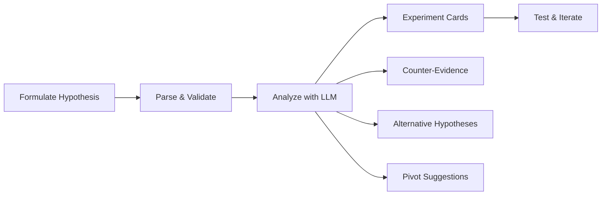

# Hypothesis-Driven Innovation

The hypothesis module provides an alternative workflow to the standard angle-based pipeline. Instead of divergent brainstorming across multiple angles, you start with a specific hypothesis and subject it to rigorous analysis — generating experiment cards, finding counter-evidence, and discovering pivot directions.

## When to Use

Use hypothesis-driven innovation when you:

- Have a specific belief you want to validate before investing resources.
- Need structured experiment designs rather than open-ended ideas.
- Want to actively search for reasons your idea might fail.
- Are evaluating a pivot and need alternative directions.

## Workflow



## Quick Start

### 1. Parse a Hypothesis

Start by parsing your hypothesis into structured components:

```typescript
import { parseHypothesis } from "@innovator/core";

const parsed = parseHypothesis(
  "If we add AI-powered code review suggestions, then developer productivity " +
    "will increase by 20% because automated feedback reduces context-switching time."
);

console.log(parsed.condition); // "we add AI-powered code review suggestions"
console.log(parsed.prediction); // "developer productivity will increase by 20%"
console.log(parsed.rationale); // "automated feedback reduces context-switching time"
```

Parsing is lightweight and runs locally — no LLM call required.

### 2. Analyze the Hypothesis

For deep analysis, call `analyzeHypothesis` which uses the LLM to generate experiments, counter-evidence, and alternatives:

```typescript
import { analyzeHypothesis } from "@innovator/core";

const analysis = await analyzeHypothesis(
  "If we add AI-powered code review suggestions, developer productivity increases by 20%",
  investigation, // optional: provide an existing investigation for richer context
  "gpt-4.1"
);

// Experiment cards with metrics and success criteria
analysis.experiments.forEach((exp) => {
  console.log(`Experiment: ${exp.name}`);
  console.log(`  Method: ${exp.method}`);
  console.log(`  Success criteria: ${exp.successCriteria}`);
});

// Evidence that contradicts the hypothesis
analysis.counterEvidence.forEach((ce) => {
  console.log(`Counter: ${ce.claim} — ${ce.source}`);
});

// Alternative hypotheses worth exploring
analysis.alternatives.forEach((alt) => {
  console.log(`Alternative: ${alt.hypothesis}`);
});
```

## Session Management

For multi-step hypothesis workflows, use sessions to track lifecycle state:

### Creating a Session

```typescript
import { createHypothesisSession } from "@innovator/core";

const session = createHypothesisSession(
  "If we migrate to edge computing, latency drops below 50ms for 95th percentile"
);

console.log(session.id); // unique session ID
console.log(session.status); // "draft"
```

### Lifecycle States

A hypothesis session progresses through these states:

| Status        | Description                                        |
| ------------- | -------------------------------------------------- |
| `draft`       | Hypothesis created, not yet analyzed               |
| `analyzing`   | LLM analysis in progress                           |
| `analyzed`    | Analysis complete, experiments generated           |
| `testing`     | Experiments are being executed                     |
| `validated`   | Hypothesis confirmed by test results               |
| `invalidated` | Hypothesis disproved by test results               |
| `pivoted`     | Hypothesis abandoned in favor of a pivot direction |

### Updating Status

```typescript
import { updateHypothesisStatus, attachAnalysis } from "@innovator/core";

// After running analyzeHypothesis:
attachAnalysis(session.id, analysis);

// As you run experiments:
updateHypothesisStatus(session.id, "testing");

// Based on results:
updateHypothesisStatus(session.id, "validated");
// or
updateHypothesisStatus(session.id, "invalidated");
```

### Listing Sessions

```typescript
import { listHypothesisSessions, getHypothesisSession } from "@innovator/core";

const sessions = listHypothesisSessions();
sessions.forEach((s) => {
  console.log(`${s.status}: ${s.hypothesisText}`);
});

const session = getHypothesisSession("session-id");
```

## Pivot Suggestions

When a hypothesis is invalidated, the analysis includes **pivot suggestions** — alternative directions informed by what was learned:

```typescript
analysis.pivotSuggestions.forEach((pivot) => {
  console.log(`Pivot: ${pivot.direction}`);
  console.log(`  Rationale: ${pivot.rationale}`);
});
```

You can create a new hypothesis session from a pivot suggestion and repeat the cycle.

## API Reference

| Function                  | Description                                                    |
| ------------------------- | -------------------------------------------------------------- |
| `parseHypothesis`         | Parse hypothesis text into structured components (local)       |
| `analyzeHypothesis`       | Full LLM analysis: experiments, counter-evidence, alternatives |
| `createHypothesisSession` | Create a new session to track hypothesis lifecycle             |
| `getHypothesisSession`    | Retrieve a session by ID                                       |
| `listHypothesisSessions`  | List all hypothesis sessions                                   |
| `updateHypothesisStatus`  | Update a session's lifecycle status                            |
| `attachAnalysis`          | Attach analysis results to a session                           |
| `clearHypothesisSessions` | Clear all stored sessions                                      |

## Comparison: Hypothesis vs. Angle-Based Pipeline

| Dimension          | Angle-Based Pipeline                   | Hypothesis-Driven                  |
| ------------------ | -------------------------------------- | ---------------------------------- |
| **Starting point** | Open-ended subject                     | Specific testable claim            |
| **Goal**           | Divergent idea generation              | Validation and experiment design   |
| **Output**         | Ideas ranked by feasibility            | Experiment cards, counter-evidence |
| **Best for**       | Exploration, brainstorming             | Validation, de-risking, pivoting   |
| **LLM calls**      | 1 investigation + N angles + synthesis | 1 analysis call                    |
